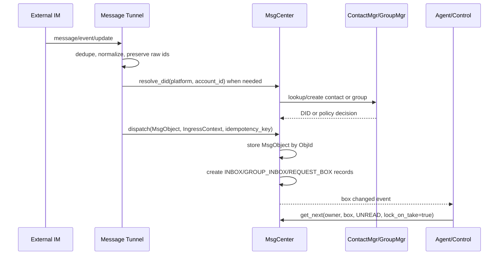
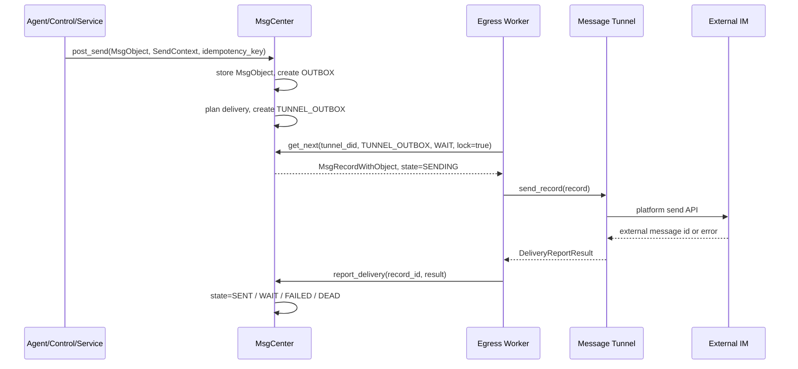

# Message Tunnel Design

本文档基于当前 `MsgCenter`、`RouteInfo`、`MsgObject`、`MsgRecord` 和 Telegram tunnel 的实现，定义一个理论上完整的 Message Tunnel。目标是给人类 review 设计边界，确认哪些能力已经能用现有对象组合表达，哪些能力未来可能需要扩展。

配套简版文档见 `doc/message_hub/Message Tunnel Minimal Spec.md`。

## 1. 设计定位

Message Tunnel 是外部 IM 系统和 BuckyOS MessageCenter 之间的通道。对外部 IM 来说，它表现为一个特定用户或机器人账号的收发通道；对 BuckyOS 来说，它是 `MsgCenter.dispatch()` 的入站生产者，也是 `TUNNEL_OUTBOX` 的出站消费者。

完整流程是：

1. Tunnel 从 IM 会话中获取文本、富文本、附件、引用、操作消息、会话状态、成员状态、已读、typing、平台私有事件等。
2. Tunnel 把可标准化的内容转换为 `MsgObject`，把来源上下文放入 `IngressContext`，调用 `MsgCenter.dispatch()`。
3. Agent、人操作的控制组件或其他系统服务从自己的 inbox 读取消息，处理后按规则保存或调用 `MsgCenter.post_send()` 生成响应消息。这一步不需要 Message Tunnel 参与。
4. MsgCenter 根据联系人绑定和发送上下文创建 `TUNNEL_OUTBOX` record。
5. Tunnel 从自己的 `TUNNEL_OUTBOX` 取出 record，转换为平台 API 调用，投递给原 IM 会话或其他被路由选中的外部会话。
6. Tunnel 返回 `DeliveryReportResult`，由 MsgCenter 更新 record 的投递状态、重试信息和外部 message id。

Message Tunnel 的最大功能集接近一个真实自然人在 IM 中能完成的行为：聊天、发附件、加入或退出会话、处理可操作消息、观察状态、按授权调用工具向其他渠道发送消息。具体平台限制，例如 Bot 无法主动私聊未授权用户、不能加入某些群、不能读取历史消息，必须在具体 Tunnel 子类中裁剪。

## 2. 当前实现基础

当前实现已经提供以下基础，不应重复设计：

- `ndn_lib::MsgObject`：不可变消息对象，`gen_obj_id()` 基于 canonical JSON 生成对象 id。
- `ndn_lib::MsgContent`：承载 `format/content/machine/refs`，可表达文本、结构化机器内容和附件引用。
- `ndn_lib::MsgObjKind`：包括 `Chat`、`GroupMsg`、`Deliver`、`Notify`、`Event`、`Operation`。
- `buckyos_api::IngressContext`：入站来源上下文，已有 `tunnel_did/platform/chat_id/source_account_id/context_id/contact_mgr_owner/extra`。
- `buckyos_api::SendContext`：出站偏好，已有 `context_id/contact_mgr_owner/preferred_tunnel/priority/extra`。
- `buckyos_api::RouteInfo`：record 级路由信息，已有 `tunnel_did/platform/account_id/address/chat_id/target_did/mode/priority/ext_ids/extra`。
- `buckyos_api::MsgRecord`：某个 owner 的 box 里对不可变 `MsgObject` 的可变视图，承载 `state/route/delivery/ui_session_id/sort_key/tags`。
- `buckyos_api::MsgCenterHandler`：已经包含 `dispatch/post_send/get_next/report_delivery/set_read_state/resolve_did/get_preferred_binding` 等核心 API。
- `msg_center::MsgTunnel`：已定义通用 `start/stop/send_record` 接口。
- `TgTunnel`：当前 Telegram 适配器已经实现入站、出站、typing/status line、附件引用、投递回报和绑定管理的主要模式。

因此本设计原则是：优先组合现有对象；只有当现有字段无法表达稳定语义，才提出新增概念。

## 3. 边界原则

### 3.1 外部 IM 对象不强制 DID 化

外部 IM 的 user id、chat id、message id、thread id、tenant id、频道 id、小程序 id、红包 id 等对象保持平台原始语义。它们可以被映射到 BuckyOS DID，也可以只是字符串。

必须映射为 DID 的情况：

- 需要作为 `MsgObject.from` 或 `MsgObject.to` 的系统内消息参与方。
- 需要被 ContactMgr、GroupMgr、RBAC 或 Agent owner scope 管理。
- 需要跨 Zone 寻址、长期验证或被其他 BuckyOS 服务引用。

不必映射为 DID 的情况：

- 仅用于回发到同一个外部会话，例如 Telegram `chat_id`、Email `Message-ID`。
- 仅用于幂等、诊断、平台 API 参数。
- 平台对象过于复杂，强行封装会损失原始语义或引入错误抽象。

推荐位置：

- 入站来源：`IngressContext.platform/chat_id/source_account_id/extra`。
- record 级投递：`RouteInfo.platform/account_id/address/chat_id/ext_ids/extra`。
- 消息展示或平台语义：`MsgObject.meta`。
- 机器可读操作：`MsgContent.machine`。

### 3.2 MsgObject 不承载可变投递状态

`MsgObject` 是消息语义本体，应保持不可变。已读、正在输入、投递重试、外部 message id、归档、删除、UI 会话归类等状态属于 `MsgRecord`、read receipt、UI session state 或新的状态对象。

### 3.3 Agent 不依赖具体平台

Agent 从 MessageCenter 读取标准化消息。除非业务明确需要平台细节，Agent 不应知道消息来自 Telegram、Lark、Email 还是 MessageHub。平台细节保留在 route/meta/machine 中，供诊断、工具调用或特定技能读取。

## 4. 消息能力集

Message Tunnel 理论上需要接收和发送以下消息或事件：

| 类型 | 推荐 MsgObject 表达 | 说明 |
|---|---|---|
| 普通文本、表情、符号 | `kind=Chat` 或 `GroupMsg`，`content.format=text/plain` | 表情可保持 Unicode 或平台 token |
| 富文本、Markdown、HTML | `content.format=text/markdown` 或 `text/html` | 平台不支持时降级为纯文本 |
| 引用/回复 | `thread.reply_to` 或 `meta.platform_reply_to` | 能解析为 `ObjId` 时使用 `reply_to` |
| 附件、图片、音视频、文件 | `content.refs` 指向 `DataObj` | 大对象不直接塞入 `content.content` |
| @、mention、特殊符号 | `content.content` 保留原文，结构化列表放 `machine.data.mentions` | 不同平台符号不统一 |
| 成员加入/退出、会话创建/关闭 | `kind=Event`，`machine.intent=session.member_changed` 等 | 变更前后状态放 `machine.data` |
| 上线/下线、禁言、屏蔽、授权 | `kind=Event` 或 `Notify` | 可影响 ContactMgr/RBAC 的事件由可信组件处理 |
| 已读、新消息、typing | `kind=Notify` 或 UI session state | 高频 typing 不建议永久化为普通聊天历史 |
| 红包、投票、小程序、审批卡片 | `kind=Operation` | 平台 payload 放 `machine.data.raw` 或 `meta` |
| 第三方应用消息 | `kind=Operation` 或 `Event` | 保留原始 app id 和 action |
| AI 流式消息 | 中间 `Notify/Event`，最终 `Chat/GroupMsg` | 保持 `MsgObject` 不可变 |
| 未知平台升级消息 | `kind=Event` 或 `Operation` + raw payload | 必须可保留、可忽略、不可 panic |

## 5. 会话模型

Message Tunnel 需要覆盖以下会话：

- 1v1 会话：外部 `chat_id` 通常对应一个外部用户和一个 tunnel 账号之间的上下文。
- 多人会话：外部群、频道、聊天室，推荐映射到 group DID；如果尚未创建 DID，可先通过 ContactMgr 自动推断。
- 群聊子群或议题线程：优先用 `MsgObject.thread.topic`、`thread.correlation_id`、`RouteInfo.chat_id` 或平台 thread id 表达，不强制创建新 group DID。
- 人与机器人混合会话：消息参与方既可以是自然人，也可以是 Agent DID；外部平台未识别身份只保留 account id。
- 机器人群聊：与普通群聊相同，但日志和可观察性更重要，避免机器人之间的行为不可感知。

当前 MessageCenter 的群消息语义是：`kind=GroupMsg`，`to.first()` 是 group DID，`from` 是发送者 DID。实现里仍保留旧数据 fallback：当 `to` 为空时可从 `from` 推断 group DID。新实现必须使用新语义。

## 6. Rust 风格关键对象

下面是设计视角的关键对象。已存在的基础类型只添加说明，不重新定义字段。

### 6.1 Tunnel 角色

```rust
#[derive(Debug, Clone, Serialize, Deserialize)]
#[serde(rename_all = "snake_case")]
pub enum MessageTunnelAccountKind {
    /// 平台机器人账号。能力受 Bot API 限制。
    Bot,
    /// 自然人账号或用户授权账号。理论上接近真实用户能力。
    User,
    /// BuckyOS 内部入口，例如 MessageHub。
    System,
}

#[derive(Debug, Clone, Serialize, Deserialize)]
pub struct MessageTunnelBinding {
    /// 该绑定服务的 BuckyOS owner/user/agent。
    pub owner_did: DID,
    /// Tunnel 实例 DID，也是 TUNNEL_OUTBOX 的 owner。
    pub tunnel_did: DID,
    /// 外部平台，例如 telegram/lark/email/messagehub。
    pub platform: String,
    /// 外部账号 id，保持原始字符串语义。
    pub account_id: String,
    /// 展示或投递地址，例如 email、open_id、chat_id。
    pub display_id: String,
    /// bot/user/system。
    pub account_kind: MessageTunnelAccountKind,
    /// 运行期和平台扩展字段。只能追加，旧版本忽略未知字段。
    pub extra: serde_json::Value,
}
```

当前 `Contact::bindings: Vec<AccountBinding>` 已能表达 `platform/account_id/display_id/tunnel_id/meta`。上面的 `MessageTunnelBinding` 是更完整的概念模型，不要求立即新增持久化结构。若未来需要区分 Bot/User/System，可在现有 binding `meta` 中追加 `account_kind`，或升级 `AccountBinding`。

### 6.2 入站信封

```rust
pub struct MessageTunnelIngress {
    /// 解析后的标准消息。
    pub msg: MsgObject,
    /// 入站上下文，供 MsgCenter 写入 record.route 和权限判断。
    pub ingress_ctx: IngressContext,
    /// 稳定幂等 key。重复提交同一平台事件必须得到同一 key。
    pub idempotency_key: String,
}
```

字段要求：

- `ingress_ctx.tunnel_did`：当前 tunnel DID。
- `ingress_ctx.platform`：平台名。
- `ingress_ctx.chat_id`：平台会话 id，不强制 DID 化。
- `ingress_ctx.source_account_id`：平台发送者账号 id。
- `ingress_ctx.context_id`：权限和会话上下文，推荐包含 platform、owner、chat_id。
- `ingress_ctx.contact_mgr_owner`：联系人范围 owner。
- `ingress_ctx.extra`：平台 message id、chat type、tenant id、thread id 等扩展。

### 6.3 出站信封

```rust
pub struct MessageTunnelEgress {
    /// MessageCenter record id。投递结果必须回报到这个 record。
    pub record_id: String,
    /// 标准消息对象。
    pub msg: MsgObject,
    /// record.route，包含 tunnel、平台账号、外部地址和扩展 id。
    pub route: RouteInfo,
}
```

字段要求：

- `route.tunnel_did`：必须是当前 tunnel DID。
- `route.platform`：平台名。
- `route.account_id`：发送账号或平台账号 id。
- `route.address`：外部目标地址，可为 email address、open_id、username 等。
- `route.chat_id`：目标会话 id。
- `route.target_did`：BuckyOS 逻辑目标 DID。
- `route.mode`：`direct/group/reply/broadcast/status/edit` 等投递模式。
- `route.ext_ids`：外部 message id、thread id、reply id 等可索引字符串。
- `route.extra`：平台复杂 payload。

### 6.4 平台能力声明

```rust
#[derive(Debug, Clone, Serialize, Deserialize, Default)]
pub struct MessageTunnelCapability {
    /// 是否能接收入站消息。
    pub ingress: bool,
    /// 是否能发送出站消息。
    pub egress: bool,
    /// 是否支持编辑已发送消息。
    pub edit_message: bool,
    /// 是否支持删除已发送消息。
    pub delete_message: bool,
    /// 是否支持 typing 或 processing 状态。
    pub typing: bool,
    /// 是否支持已读回执。
    pub read_receipt: bool,
    /// 是否支持主动发起到外部用户的会话。
    pub proactive_direct_message: bool,
    /// 是否支持附件上传。
    pub attachment_upload: bool,
    /// 是否支持平台操作消息，例如卡片、投票、审批。
    pub operation_message: bool,
    /// 未知或平台私有能力。
    pub extra: serde_json::Value,
}
```

当前 `MsgTunnel::supports_ingress()` 和 `supports_egress()` 只表达两个基础能力。未来如果管理界面或路由策略需要能力裁剪，可以把完整 capability 放入 tunnel 配置或 instance info，不需要改变 `MsgObject`。

## 7. 入站流程

### 7.1 自然语言流程

Tunnel 从外部 IM 拉取或接收事件后，先做平台层去重和顺序整理，再转换为标准 `MsgObject`。转换时，它可以通过 `MsgCenter.resolve_did()` 或 ContactMgr 把外部 sender/group 映射为 DID；如果不能映射，只保留外部 id，并把消息投递给配置目标 Agent 或 owner。

转换完成后，Tunnel 调用 `dispatch(msg, ingress_ctx, idempotency_key)`。MessageCenter 保存 `MsgObject`，根据 `kind` 和 `to` 写入 `INBOX`、`GROUP_INBOX` 或 `REQUEST_BOX`，并把 `IngressContext` 转换成 record 上的 `RouteInfo`。Agent pump 之后从 inbox 读取消息并处理。



### 7.2 伪代码

```rust
async fn handle_platform_update(update: PlatformUpdate) -> AnyResult<()> {
    let idempotency_key = build_ingress_key(&update);

    if local_seen_recently(&idempotency_key) {
        return Ok(());
    }

    let sender_did = resolve_or_infer_sender(&update).await?;
    let target = resolve_target_owner_or_group(&update).await?;

    let msg = MsgObject {
        from: sender_did,
        to: vec![target.did],
        kind: target.kind,
        created_at_ms: update.timestamp_ms,
        content: normalize_content(&update).await?,
        meta: preserve_platform_meta(&update),
        ..Default::default()
    };

    let ingress_ctx = IngressContext {
        tunnel_did: Some(self.tunnel_did()),
        platform: Some(self.platform().to_string()),
        chat_id: Some(update.chat_id.clone()),
        source_account_id: Some(update.sender_account_id.clone()),
        context_id: Some(format!("{}:{}:{}", self.platform(), self.owner_did, update.chat_id)),
        contact_mgr_owner: Some(self.owner_did.clone()),
        extra: Some(update.raw_context_json()),
    };

    msg_center
        .dispatch(msg, Some(ingress_ctx), Some(idempotency_key))
        .await?;

    Ok(())
}
```

## 8. 出站流程

### 8.1 自然语言流程

Agent 或系统服务生成响应时调用 `post_send()`，MessageCenter 先保存 sender 的 `OUTBOX` 记录，再根据 ContactMgr binding、`SendContext.preferred_tunnel` 和目标 DID 生成一个或多个 `TUNNEL_OUTBOX` record。后台 egress worker 遍历运行中的 tunnel，调用 `get_next(tunnel_did, TUNNEL_OUTBOX, WAIT, lock_on_take=true)` 抢占一条记录，随后调用 `MsgTunnel::send_record()`。

Tunnel 负责把 `MsgObject` 转为平台 API。成功或失败都返回 `DeliveryReportResult`，由 MessageCenter 的 `report_delivery()` 更新状态。可重试失败回到 `WAIT`，不可重试或超过次数进入 `DEAD`。



### 8.2 伪代码

```rust
async fn send_record(&self, record: MsgRecordWithObject) -> AnyResult<DeliveryReportResult> {
    let msg = record.get_msg().await?;
    let route = record
        .record
        .route
        .clone()
        .ok_or_else(|| anyhow!("missing route"))?;

    ensure!(route.tunnel_did.as_ref() == Some(&self.tunnel_did()));

    let request = convert_msg_to_platform_request(&msg, &route).await?;

    match platform_client.send(request).await {
        Ok(sent) => Ok(DeliveryReportResult {
            ok: true,
            external_msg_id: Some(sent.message_id),
            delivered_at_ms: Some(now_ms()),
            ..Default::default()
        }),
        Err(err) if err.retryable => Ok(DeliveryReportResult {
            ok: false,
            retryable: Some(true),
            retry_after_ms: err.retry_after_ms,
            error_code: Some(err.code),
            error_message: Some(err.message),
            ..Default::default()
        }),
        Err(err) => Ok(DeliveryReportResult {
            ok: false,
            retryable: Some(false),
            error_code: Some(err.code),
            error_message: Some(err.message),
            ..Default::default()
        }),
    }
}
```

## 9. 身份、路由和权限

### 9.1 入站身份

入站 sender 可按三层处理：

1. 已绑定 DID：外部账号通过 ContactMgr binding 映射到已有 DID。
2. 自动推断 DID：系统为陌生外部账号创建临时或自动联系人 DID。
3. 不映射 DID：消息投递给固定 Agent，外部 sender 只作为 `source_account_id` 和 meta 存在。

如果一个外部账号只是消息来源和回复地址，不需要在 BuckyOS 里拥有完整身份，不应强行创建长期 DID。若需要权限、屏蔽、审计、工具授权或群成员关系，则应创建或解析 DID。

### 9.2 出站路由

出站路由优先级：

1. `SendContext.preferred_tunnel`。
2. ContactMgr 中目标 DID 的 preferred binding。
3. 具体业务指定的 `RouteInfo` 或 `context_id` 关联历史。
4. 默认 tunnel fallback。

`RouteInfo` 是 record 级字段。同一 `MsgObject` 可以有多个 `TUNNEL_OUTBOX` record，分别指向不同 tunnel 或外部地址，不改变 `MsgObjectId`。

### 9.3 权限和授权

Tunnel 只做平台连接认证和基础过滤；BuckyOS 层权限由 MsgCenter、ContactMgr、GroupMgr、RBAC 和 Agent runtime 处理。

用户在配置会话里授予 Agent 工具能力，例如“关注 B 站主播更新后发 Email”或“加入 Telegram 好友群后用 Lark 通知我”，本质是 Agent 获得了读取某些 tunnel/context 的权限和调用某些 outbound tunnel/tool 的权限。Tunnel 应把这些行为记录到 MsgCenter record、Agent worklog 或审计日志，使机器人之间的通信可观察。

## 10. 顺序、去重和遗漏恢复

### 10.1 入站幂等

推荐入站幂等 key：

```text
{platform}:{tunnel_account_id}:{chat_id}:{external_message_id}
```

如果平台没有稳定 message id：

```text
{platform}:{tunnel_account_id}:{chat_id}:{event_timestamp}:{payload_hash}
```

要求：

- 同一平台事件重复上报必须生成同一 key。
- 幂等 key 不应包含重试次数、拉取批次或本地处理时间。
- 对可编辑消息，原始消息和编辑事件可以是不同 key，但应通过 `ext_ids.original_message_id` 或 `thread.reply_to` 关联。

### 10.2 出站幂等

出站由 MessageCenter 通过 `MsgObjectId`、目标 DID、tunnel DID、account id、mode 等生成稳定 record id。Tunnel 层还应处理平台 API 超时后的未知状态：

- 如果平台支持 client message id，应带上 BuckyOS record id 或 idempotency key。
- 如果无法确认发送结果，返回 retryable failure；重试前可尝试用外部幂等 token 查询。
- 如果重试可能造成重复，但平台不支持幂等，应在 `DeliveryInfo.last_error` 中记录风险，按策略进入 `FAILED/DEAD` 或等待人工确认。

### 10.3 顺序

Message Tunnel 只承诺同一外部会话内尽量按平台顺序提交。MessageCenter 的 `sort_key` 通常取 `MsgObject.created_at_ms`，但不应依赖它表达严格因果。需要严格线程关系时使用：

- `MsgObject.thread.reply_to`
- `MsgObject.thread.correlation_id`
- `RouteInfo.ext_ids`
- 平台原始 sequence/cursor

### 10.4 漏消息恢复

实时 webhook、stream、kevent 都只能作为加速信号，不能作为唯一真相。Tunnel 必须能通过以下方式恢复：

- 入站：平台 offset/cursor、last message id、时间窗口补拉。
- 出站：MessageCenter `TUNNEL_OUTBOX` 中 `WAIT/FAILED/SENDING` record 扫描。
- Agent：MessageCenter inbox sweep，当前 OpenDAN pump 已遵守“kevent 是加速，不是真相源”的规则。

## 11. 流式 AI 消息

流式 AI 输出和平台 typing/status/edit 能力存在冲突。通用规则：

- `MsgObject` 不可变，不能把一个对象不断改写成流式 token。
- 中间态用 `kind=Notify` 或 `kind=Event` 表示，`machine.intent` 可为 `ai.typing`、`ai.partial`、`ai.processing`。
- 中间态必须带同一 `thread.topic` 或 `ui_session_id`，并带 `turn_nonce` 或 `correlation_id`。
- 最终回复用完整 `kind=Chat` 或 `kind=GroupMsg`。
- 支持编辑的平台可以由 Tunnel 把 partial notify 合并为消息编辑；不支持编辑的平台可以只展示 typing 或只发送最终回复。

示例：

```rust
MsgObject {
    kind: MsgObjKind::Notify,
    content: MsgContent {
        format: Some(MsgContentFormat::TextPlain),
        content: "正在处理...".to_string(),
        machine: Some(MachineContent {
            intent: Some("ai.processing".to_string()),
            data: serde_json::json!({
                "turn_nonce": "...",
                "partial_seq": 3,
            }),
        }),
        ..Default::default()
    },
    ..Default::default()
}
```

## 12. 可操作和第三方应用消息

红包、投票、小程序、审批卡片等消息不能被简单当成文本。推荐表达：

- `kind=Operation`。
- `content.content` 放人类可读摘要。
- `content.machine.intent` 放稳定操作名，例如 `wechat.red_packet`、`lark.approval_card`、`poll.vote`。
- `content.machine.data` 放可安全理解的结构化字段。
- 原始平台 payload 放 `MsgObject.meta.platform_raw` 或 `machine.data.raw`。
- 需要用户或 Agent 执行动作时，动作必须经过授权检查，不能让 Tunnel 直接代替 Agent 执行高权限操作。

如果 BuckyOS 当前不能理解某类操作消息，Tunnel 仍应保留摘要和 raw payload，以便未来升级后重放、查看或迁移。

## 13. 可观察性

Message Tunnel 必须让以下行为可追踪：

- 外部事件接收、去重、转换、dispatch 结果。
- 出站 record 获取、平台 API 请求、成功、失败、重试、最终 dead。
- Agent 由哪条入站消息触发，生成了哪条出站消息。
- Agent 使用了哪些 tunnel、工具和授权上下文。
- 机器人之间通信时，每条消息的 owner、route、session、turn nonce 和外部 message id。

推荐落点：

- 服务日志：运行诊断。
- `MsgRecord.delivery`：投递尝试、错误码、外部 message id。
- `RouteInfo.ext_ids/extra`：平台 id。
- `ui_session_id` 和 `MsgObject.thread`：会话聚合。
- Agent worklog 或 task log：推理、工具调用和授权链路。

## 14. 典型 Tunnel

### 14.1 Telegram

当前实现已经是参考基线：

- Bot/User 绑定通过 tunnel 配置和 ContactMgr binding 表达。
- 入站消息转换为 `MsgObject`，`IngressContext.extra` 保存 `tg_message_id/chat_type`。
- 附件存对象后放 `content.refs`。
- 出站使用 `TUNNEL_OUTBOX` record 的 route 发送。
- 支持 typing/status line，并能把 status message 替换为最终消息。

主要平台裁剪：

- Bot 主动联系用户受限。
- 群、频道、私聊能力不同。
- 某些消息类型只能保留 raw payload。

### 14.2 Lark

Lark tunnel 应类似 Telegram，但需保留企业租户语义：

- `platform="lark"`。
- `RouteInfo.ext_ids` 保存 `tenant_key/open_id/user_id/chat_id/message_id`。
- Lark card、审批、投票等优先 `kind=Operation`。
- Bot/User tunnel 差异明显，必须在 capability 和 binding 中表达。

### 14.3 Email

Email 更像异步消息 tunnel：

- `account_id/display_id/address` 通常是 email address。
- `chat_id` 可使用 thread id、`Message-ID` 或 normalized subject thread。
- `reply_to`、`in-reply-to`、`references` 放 `RouteInfo.ext_ids` 或 `MsgObject.thread`。
- 不支持 typing，已读回执不可靠。
- 附件按对象引用；出站 MIME 构造由 Email tunnel 负责。

### 14.4 MessageHub

MessageHub 是 BuckyOS 原生通道：

- 可尽量无损传递 `MsgObject`。
- 外部 IM id 不存在或只是 UI session id。
- 权限由 BuckyOS DID、ContactMgr、GroupMgr 和 RBAC 处理。
- 适合承载用户控制组件和 Agent 配置会话。

## 15. 兼容性和升级

### 15.1 IM 平台升级

平台新增未知消息类型时：

- Tunnel 不得 panic 或退出主循环。
- 能转换为文本摘要就用 `Chat/GroupMsg`。
- 不能转换为文本但有操作语义就用 `Operation`。
- 纯状态变更用 `Event/Notify`。
- 原始 payload 放 `extra/raw`，并限制大小；过大内容写对象引用。

### 15.2 BuckyOS 新旧版本互通

规则：

- 新字段必须 optional 或有 default。
- 枚举扩展时旧系统可能无法反序列化；跨版本高风险枚举应优先用 string intent 或 `extra` 承载。
- `meta/extra/ext_ids` 只能追加，旧实现忽略未知 key。
- 不改变 `MsgObject` 已有字段语义，否则会改变 `ObjId` 和历史对象校验。
- `MsgRecord` 可做 additive schema 升级，但状态机语义必须保持兼容。

### 15.3 降级策略

当新能力不可用：

- 消息编辑降级为新消息或状态消息。
- typing 降级为无操作。
- read receipt 降级为本地 read state。
- operation 降级为文本摘要 + raw payload。
- 附件上传失败返回 retryable failure；不应静默丢弃。

## 16. 需要或可能需要的扩展

当前对象基本能表达 Message Tunnel 的完整主流程。建议扩展仅限以下场景：

1. **Tunnel capability**：用于管理界面、路由策略和平台裁剪。当前只有 `supports_ingress/egress`，不够表达 edit、typing、attachment、operation、proactive message 等能力。
2. **Account kind**：Bot/User/System 影响平台行为和权限边界。当前可先放 `AccountBinding.meta.account_kind`，未来需要强类型时再升级。
3. **流式消息约定**：不需要改 `MsgObject`，但需要约定 `machine.intent`、`turn_nonce`、`ui_session_id` 的使用方式。
4. **外部 raw payload 大对象化**：当平台 payload 很大时，需要明确存对象并以 `refs` 或 `meta.raw_obj_id` 引用，避免 record/meta 膨胀。

不建议的扩展：

- 为每个平台新增独立 message object。
- 把所有外部平台对象都封装成 DID。
- 在 `MsgObject` 中写入可变投递状态。
- 让 Agent 直接依赖 Telegram/Lark/Email 专用结构。

## 17. 验收标准

- 任一 Tunnel 能把入站消息转换为 `MsgObject + IngressContext + idempotency_key` 并 dispatch。
- Agent 能在不知道平台细节的情况下消费消息。
- Agent 或控制组件通过 `post_send()` 生成响应后，Tunnel 能从 `TUNNEL_OUTBOX` 投递回外部会话。
- 外部账号 id、chat id、message id 能保持平台原始语义，不被强制 DID 化。
- 群聊、1v1、子线程、机器人会话均有可表达路径。
- 文本、附件、状态、操作消息、未知消息、流式 AI 中间态均有降级策略。
- 重复入站、重复出站、服务重启不会造成不可控重复投递。
- 平台升级或 BuckyOS 新旧版本互通不会因未知字段导致宕机或数据损坏。
