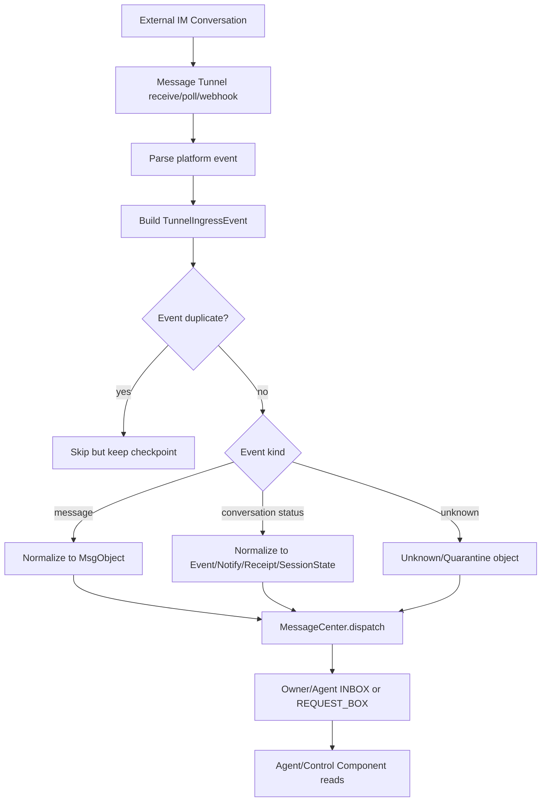
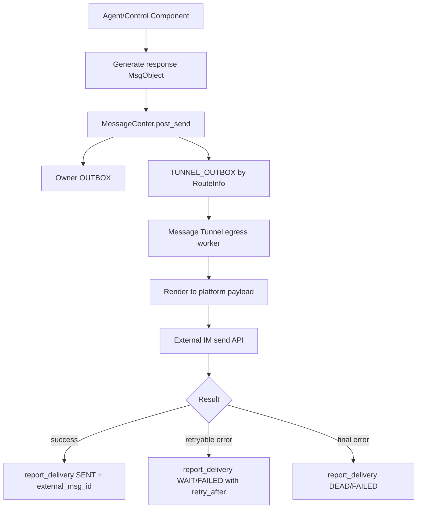

# Message Tunnel Design

## 1. 背景

Message Tunnel 是 BuckyOS MessageHub/MessageCenter 面向外部 IM、Email、原生 MessageHub 和未来社交平台的通用适配层。它把“某个平台上的一个账号收发消息”抽象为 BuckyOS 中一个可运行、可审计、可裁剪能力的通道。

从完整能力上看，如果某个 IM 平台允许机器人完成自然人在会话里能完成的一切行为，那么对应 Message Tunnel 应能把这些行为完整桥接给 BuckyOS Agent：读消息、发消息、参与 1v1、参与群聊、加入/退出、管理会话状态、处理附件、处理引用、处理交互消息、发送状态、使用外部工具入口，并能把 Agent 行为记录下来。实际平台通常会限制 bot 或 user 账号能力，因此每个具体 tunnel 必须声明能力并按平台规则裁剪。

本文定义理论上完整的 Message Tunnel。当前实现已经有 `MsgTunnel`、`TgTunnel`、`MsgTunnelInstanceMgr`、`MessageCenter.dispatch/post_send`、`TUNNEL_OUTBOX`、`IngressContext`、`RouteInfo`、`DeliveryReportResult` 等基础能力。本文不替代这些基础类型，只定义它们之上的完整语义边界和后续扩展方向。

## 2. 目标

Message Tunnel 的目标：

1. 让外部 IM 会话中的消息、会话事件和状态变化能进入 BuckyOS MessageCenter。
2. 让 Agent、人操作的控制组件或系统组件生成的响应能回到消息来源 IM 会话。
3. 保持外部 IM 对象的原始语义，不强制把所有平台账号、群、消息都封装成 BuckyOS DID。
4. 为 Agent 提供标准化消息视图，使 Agent 不必理解 Telegram、Lark、Email 等平台细节。
5. 为平台差异提供能力声明、降级策略和错误报告。
6. 支持去重、顺序、遗漏恢复、重试和幂等。
7. 支持日志、审计和可观测性，避免一组 Agent 或机器人互相通信时系统不可感知。
8. 面向未来平台升级保持兼容，未知内容不能导致宕机或数据损坏。

非目标：

1. Message Tunnel 不负责 Agent 的推理、记忆、工具调用或任务调度。
2. Message Tunnel 不负责替 MessageCenter 维护消息真相源。
3. Message Tunnel 不负责把所有外部身份注册到 BuckyOS DID 系统。
4. Message Tunnel 不负责绕过平台限制实现平台禁止的机器人行为。

## 3. 基础原则

### 3.1 外部对象保持外部语义

外部 IM 系统中的用户账号 ID、chat ID、message ID、thread ID、邮箱地址、Lark open_id、Telegram peer id 等，本质上都是平台侧标识。它们可以：

- 映射为 ContactMgr 中的联系人绑定。
- 绑定到某个 BuckyOS User/Agent DID。
- 仅作为消息来源、路由、回执和审计字段保存。
- 在没有必要时不映射成任何 BuckyOS 对象。

只有当某个外部对象需要成为 BuckyOS 内部权限主体、可管理实体、群实体或长期社交对象时，才考虑把它绑定或封装为 DID。

### 3.2 BuckyOS 基础类型不重复定义

本文复用 BuckyOS 现有基础类型：

- `DID`：BuckyOS 内部身份主体。
- `MsgObject`：标准消息对象，来自 `ndn_lib`。
- `MsgRecord`：某个 owner 在某个 box 中对 `MsgObject` 的视图。
- `BoxKind`：`INBOX`、`OUTBOX`、`GROUP_INBOX`、`TUNNEL_OUTBOX`、`REQUEST_BOX`。
- `IngressContext`：入站来源上下文。
- `SendContext`：出站发送上下文。
- `RouteInfo`：投递路由信息。
- `DeliveryInfo`/`DeliveryReportResult`：投递状态和回报。
- `MsgReceiptObj`：阅读和处理回执。

如果未来这些类型无法表达 Message Tunnel 必需语义，应优先 additive 扩展，例如新增 `extra`、新增可选字段、为 enum 增加未知兜底，而不是破坏旧字段语义。

### 3.3 MessageCenter 是消息域真相源

入站消息进入 BuckyOS 后，MessageCenter 负责保存 `MsgObject`、创建 box 记录、处理权限和通知。出站消息由 MessageCenter 生成 `TUNNEL_OUTBOX`，tunnel 只消费自己的出站队列并回报结果。

Message Tunnel 可以保存平台断点、session、access token、event 去重表、平台附件缓存和审计日志，但不能成为 BuckyOS 标准消息历史的唯一来源。

### 3.4 能力先声明，行为按能力裁剪

Bot 账号和自然人账号通常能力不同：

- Bot 可能不能主动给未互动用户发消息。
- Bot 可能不能读取历史消息或成员列表。
- User tunnel 可能能做更多自然人行为，但安全和平台合规风险更高。
- Email 没有在线、typing、群成员实时事件等 IM 语义。

因此每个 tunnel 实例都要声明能力。MessageCenter、UI、Agent runtime 和配置页只能使用它声明支持的能力。

## 4. 总体流程

### 4.1 入站到 Agent



自然语言说明：

1. Tunnel 从外部 IM 会话中接收各种消息和事件。
2. Tunnel 解析平台事件，构造一个包含原始平台上下文的 `TunnelIngressEvent`。
3. Tunnel 使用平台事件 ID、消息 ID、offset、timestamp 等做入站去重。
4. 可标准化内容转换为 `MsgObject`；状态事件转换为 `MsgObject.kind=event/notify`、`MsgReceiptObj` 或 `ui_session_states`。
5. Tunnel 调用 MessageCenter `dispatch`。
6. MessageCenter 根据目标 DID、群、联系人策略、请求箱策略和权限，把消息投递给 Agent、人操作组件或其他系统组件。

### 4.2 Agent 响应回外部会话



自然语言说明：

1. Agent 阅读消息后生成响应。响应如何保存或进入 MessageCenter 不是 Message Tunnel 的职责。
2. MessageCenter 根据 ContactMgr、`SendContext`、原入站 `RouteInfo` 或显式目标构造投递计划。
3. Tunnel 从自己的 `TUNNEL_OUTBOX` 拉取待投递记录。
4. Tunnel 把标准 `MsgObject` 渲染成平台 payload。
5. Tunnel 调用平台发送 API。
6. Tunnel 使用 `report_delivery` 把结果写回 MessageCenter。

## 5. 理论完整功能集

### 5.1 消息内容

Message Tunnel 应能表达或降级处理：

- 文本、符号、表情、reaction。
- 富文本、Markdown、HTML、平台专有富文本。
- 回复、引用、转发、thread/topic。
- 图片、音频、视频、文件、位置、联系人卡片等附件。
- 多段消息和组合消息。
- @mention、特殊命令符、平台特有触发符。
- 系统消息和通知。
- 可操作消息，例如红包、投票、审批卡片、按钮卡片。
- 依赖第三方应用的消息，例如小程序、Lark 卡片、外部 app payload。
- AI 流式消息，包括 delta、status、final、cancel。
- 未知平台消息。

处理原则：

- 能转换为标准 `MsgContent` 的内容直接转换。
- 附件优先导入对象存储并通过 `RefItem` 引用；不能导入时保留 `uri_hint` 和平台 file id。
- 平台私有对象使用 `PlatformObject` 或 `extra/raw` 保存。
- 未知内容要保留、降级展示或隔离，不得丢失已知字段。

### 5.2 会话

Message Tunnel 需要覆盖：

- 1v1 会话。
- 多人会话。
- 群聊。
- 群聊内 thread/topic/subgroup/sub-conversation。
- 频道、广播、邮件线程。
- 机器人与机器人会话。
- 自然人与机器人混合会话。
- 仅由系统组件操作的控制会话。

群聊里的子群不一定是 BuckyOS self-host group。外部平台 thread/topic 可以只是 `ExternalConversationRef.parent_conversation_id` 加 `MsgObject.thread`；只有当它需要成为 BuckyOS 可管理群实体时，才映射到 group DID。

### 5.3 会话状态和成员事件

Message Tunnel 应尽量表达：

- 加入/退出会话。
- 邀请、移除、成员角色变化。
- 成员上线/下线。
- 禁言、屏蔽、解除屏蔽。
- 会话授权、bot 被授予/撤销权限。
- 新消息、已投递、已读、撤回、编辑、删除。
- typing、recording、processing、status line。
- 平台 API 限流、会话不可达、用户已阻止 bot。

这些状态不都适合进入普通聊天时间线。建议：

- 与消息处理强相关的状态写 `MsgReceiptObj` 或 `MsgRecord.delivery`。
- 与 UI 会话运行态相关的状态写 `ui_session_states`。
- 对用户可见且需要留痕的状态写 `MsgObjKind::Notify/Event`。
- 对权限有影响的状态同步到 ContactMgr 或 GroupMgr。

### 5.4 Agent 行为

理论完整 Agent 作为 IM 用户时，应能在平台允许的范围内完成自然人能完成的行为：

- 阅读会话消息和上下文。
- 回复、引用、转发、编辑、撤回。
- 发送文本、富文本、附件、状态。
- 被 @ 后按规则响应。
- 参与群聊和子会话。
- 使用被授权的外部工具，例如发 Email、向其他会话发送消息、触发 Lark 通知。
- 识别需要人工确认的动作，向 MessageHub 或控制组件发确认请求。
- 记录自身行为日志，使 owner 能审计它为什么发了某条消息、用了哪个工具、触发了什么外部投递。

如果 IM 平台对机器人有限制，对应 tunnel 子类必须在能力声明和出站错误中体现限制。

## 6. 对象模型

### 6.1 TunnelPlatform

```rust
/// 外部消息平台。未知平台用 Custom，避免升级时旧系统无法解析。
pub enum TunnelPlatform {
    Telegram,
    Lark,
    Email,
    MessageHub,
    Custom(String),
}
```

属性说明：

- `Telegram`：Telegram bot 或 user session。
- `Lark`：Lark/飞书机器人、应用或用户授权通道。
- `Email`：邮箱账号、SMTP/IMAP/API 通道。
- `MessageHub`：BuckyOS 原生 MessageHub 跨 Zone 或内部 tunnel。
- `Custom(String)`：未来平台。

### 6.2 TunnelAccountKind

```rust
/// Tunnel 使用的平台账号类型。
pub enum TunnelAccountKind {
    Bot,    // 平台机器人账号，通常有 API 能力限制。
    User,   // 自然人账号授权通道，权限更大，安全要求也更高。
    System, // 系统级通道，例如 MessageHub native 或通知邮箱。
}
```

### 6.3 TunnelCapability

```rust
/// 运行时能力声明。调用方必须按能力裁剪行为。
pub struct TunnelCapability {
    pub ingress: bool,
    pub egress: bool,
    pub receive_history: bool,
    pub direct_chat: bool,
    pub group_chat: bool,
    pub sub_conversation: bool,
    pub channel: bool,
    pub attachments_in: bool,
    pub attachments_out: bool,
    pub rich_text_in: bool,
    pub rich_text_out: bool,
    pub mention: bool,
    pub reaction: bool,
    pub edit_message: bool,
    pub delete_message: bool,
    pub read_receipt_in: bool,
    pub read_receipt_out: bool,
    pub typing_in: bool,
    pub typing_out: bool,
    pub interactive_message: bool,
    pub app_dependent_message: bool,
    pub streaming_out: bool,
    pub proactive_send: bool,
}
```

方法建议：

```rust
impl TunnelCapability {
    /// 判断某种标准动作是否允许执行。
    pub fn allows(&self, action: TunnelAction) -> bool;

    /// 返回不支持时的降级策略。
    pub fn fallback_for(&self, action: TunnelAction) -> TunnelFallback;
}
```

### 6.4 ExternalAccountRef

```rust
/// 外部平台账号引用。它不是 DID。
pub struct ExternalAccountRef {
    pub platform: TunnelPlatform,
    pub account_id: String,
    pub display_id: Option<String>,
    pub display_name: Option<String>,
    pub account_kind: Option<TunnelAccountKind>,
    pub avatar_uri: Option<String>,
    pub extra: serde_json::Value,
}
```

字段说明：

- `account_id`：平台稳定账号 ID、open_id、邮箱地址等。
- `display_id`：用户可见 ID，例如 @handle、邮箱地址。
- `extra`：平台字段，不能作为跨平台核心逻辑依赖。

### 6.5 ExternalConversationRef

```rust
/// 外部平台会话引用。它不是 BuckyOS Group 的替代品。
pub struct ExternalConversationRef {
    pub platform: TunnelPlatform,
    pub conversation_id: String,
    pub parent_conversation_id: Option<String>,
    pub conversation_kind: ExternalConversationKind,
    pub title: Option<String>,
    pub extra: serde_json::Value,
}

pub enum ExternalConversationKind {
    Direct,
    Group,
    SubConversation,
    Channel,
    EmailThread,
    System,
    Unknown(String),
}
```

字段说明：

- `conversation_id`：平台原始会话 ID。
- `parent_conversation_id`：thread/topic/subgroup 所属父会话。
- `Unknown`：平台升级后旧系统仍可保留数据。

### 6.6 TunnelIngressEvent

```rust
/// 入站平台事件。是平台事件到 BuckyOS MsgObject 之间的中间层。
pub struct TunnelIngressEvent {
    pub event_id: String,
    pub tunnel_did: DID,
    pub platform: TunnelPlatform,
    pub account: ExternalAccountRef,
    pub conversation: ExternalConversationRef,
    pub sender: ExternalAccountRef,
    pub occurred_at_ms: u64,
    pub received_at_ms: u64,
    pub payload: TunnelPayload,
    pub raw: serde_json::Value,
}

pub enum TunnelPayload {
    Message(TunnelMessage),
    ConversationEvent(TunnelConversationEvent),
    MessageState(TunnelMessageStateEvent),
    CapabilityEvent(TunnelCapabilityEvent),
    Unknown(serde_json::Value),
}
```

方法建议：

```rust
impl TunnelIngressEvent {
    /// 构造平台级幂等 key。优先使用平台 event id；没有时用 platform/account/conversation/message/time 派生。
    pub fn idempotency_key(&self) -> String;

    /// 构造 MessageCenter 入站上下文。
    pub fn to_ingress_context(&self) -> IngressContext;
}
```

### 6.7 TunnelMessage

```rust
pub struct TunnelMessage {
    pub external_message_id: String,
    pub kind: TunnelMessageKind,
    pub parts: Vec<TunnelMessagePart>,
    pub reply_to: Option<String>,
    pub mentions: Vec<TunnelMention>,
    pub stream: Option<TunnelStreamInfo>,
    pub extra: serde_json::Value,
}

pub enum TunnelMessageKind {
    Text,
    RichText,
    Media,
    Attachment,
    Reaction,
    Interactive,
    AppDependent,
    AiStreamDelta,
    AiStreamComplete,
    Unknown(String),
}

pub enum TunnelMessagePart {
    Text { text: String },
    RichText { format: String, content: String },
    Emoji { code: String, text: Option<String> },
    Attachment {
        object_ref: Option<ObjId>,
        uri_hint: Option<String>,
        name: Option<String>,
        mime: Option<String>,
        size: Option<u64>,
    },
    PlatformObject {
        object_type: String,
        payload: serde_json::Value,
    },
    Unknown {
        payload: serde_json::Value,
    },
}
```

### 6.8 TunnelRoute

当前实现已有 `RouteInfo`，建议不新增并行基础类型。理论完整 tunnel 需要的路由信息应通过 `RouteInfo` 表达：

```rust
pub struct RouteInfo {
    pub tunnel_did: Option<DID>,
    pub platform: Option<String>,
    pub account_id: Option<String>,
    pub address: Option<String>,
    pub chat_id: Option<String>,
    pub target_did: Option<DID>,
    pub mode: Option<String>,
    pub priority: Option<i32>,
    pub ext_ids: HashMap<String, String>,
    pub extra: Option<serde_json::Value>,
}
```

使用约定：

- `tunnel_did`：出站必须存在，否则无法选择 tunnel。
- `platform`：平台名，用于诊断和多 tunnel 选择。
- `account_id`：tunnel 使用的本方平台账号。
- `address`：Email 地址、webhook URL 或平台目标地址。
- `chat_id`：IM 会话 ID。
- `target_did`：已映射到 BuckyOS 联系人时填写。
- `ext_ids`：外部 message id、thread id、tenant id、open id、reply target 等。
- `extra`：平台专有出站参数，例如 parse_mode、card template、SMTP header。

## 7. MsgObject 映射

### 7.1 普通聊天消息

```rust
fn tunnel_message_to_msg_object(event: &TunnelIngressEvent, target: Vec<DID>) -> MsgObject {
    MsgObject {
        from: resolve_sender_did_or_tunnel_shadow(event),
        to: target,
        kind: MsgObjKind::Chat,
        thread: build_thread(event),
        workspace: None,
        created_at_ms: event.occurred_at_ms,
        expires_at_ms: None,
        nonce: None,
        content: build_msg_content(event),
        proof: None,
        // meta/extra should preserve platform ids and unknown fields.
    }
}
```

说明：

- 如果外部发送者已绑定 DID，`from` 可使用该 DID。
- 如果没有 DID，当前基础 `MsgObject.from` 仍需要 DID。实现可以使用 tunnel DID、owner 配置的 shadow DID、ContactMgr 自动创建的联系人 DID，或把消息送入 REQUEST_BOX 等待确认。不能把任意外部字符串伪装成可信 DID。
- 原始外部账号必须保存在 `IngressContext`、`RouteInfo` 或 `MsgObject` meta 中，用于回复路由和审计。

### 7.2 群消息

BuckyOS self-host group 的规范是 `from=group_did, source=author_did`。外部 IM 群不一定拥有 BuckyOS group DID，因此分两种：

1. 已映射为 BuckyOS group：使用 group DID 语义，MessageCenter 写 `GROUP_INBOX`。
2. 未映射外部群：作为某个 Agent/User 的外部会话消息处理，保留 `conversation_id`，不要强行创建 group DID。

### 7.3 @ 和特殊符号

@ 只是平台特殊符号的一个例子。不同平台可能使用不同提及、命令或 bot trigger 规则。

建议表达：

```rust
pub struct TunnelMention {
    pub raw: String,
    pub account: Option<ExternalAccountRef>,
    pub did: Option<DID>,
    pub role: MentionRole,
}

pub enum MentionRole {
    User,
    Bot,
    All,
    Here,
    Command,
    Unknown(String),
}
```

进入 `MsgObject` 时：

- 可解析 DID 的 mention 写入结构化 metadata。
- 不可解析的 mention 保留原始文本和平台账号。
- Agent 是否被 @ 唤醒由 tunnel 子类或 MessageCenter/Agent runtime 策略决定。

### 7.4 附件

附件处理策略：

1. 小附件或允许下载的文件，导入 BuckyOS object store，`MsgContent.refs` 指向 `ObjId`。
2. 大附件或权限受限附件，保留 `uri_hint`、平台 file id、mime、size，按需拉取。
3. 无法读取附件时，生成可展示的占位信息并保留错误。
4. 附件导入失败不应阻止文本部分入站，除非平台消息只有附件且策略要求完整性。

### 7.5 可操作和第三方应用消息

红包、投票、小程序、审批卡片等消息有平台内操作语义。通用 Message Tunnel 不应假装自己能执行所有操作。

处理方式：

- 能安全转换为 BuckyOS `operation` 的，转为 `MsgObjKind::Operation` 并带权限确认。
- 只能展示的，降级为 `MsgObjKind::Notify` 或 chat 文本说明。
- 完全未知的，作为 `PlatformObject` 保存并进入 unknown/quarantine 流程。

### 7.6 AI 流式消息

如果 Message Tunnel 对接聊天 AI 或 Agent 运行状态，可能需要发送流式响应：

- 支持编辑消息的平台：先发送 placeholder，再不断 edit。
- 支持 typing/status 的平台：用 typing 或 status line 表达处理中。
- 支持多条消息的平台：发送 delta 消息，但要用同一个 `correlation_id` 关联。
- 不支持流式的平台：只发送 final。

流式状态不应破坏最终消息幂等。最终内容应有明确完成事件或 final message。

## 8. 关键接口

### 8.1 理论完整 trait

当前代码中的 `MsgTunnel` 是最小运行 trait。理论完整接口可按下面方向扩展，但实现时应优先兼容现有 trait：

```rust
#[async_trait::async_trait]
pub trait MessageTunnel: Send + Sync {
    fn tunnel_did(&self) -> DID;
    fn name(&self) -> &str;
    fn platform(&self) -> TunnelPlatform;
    fn account_kind(&self) -> TunnelAccountKind;
    fn capability(&self) -> TunnelCapability;

    /// 启动连接、webhook、poller 或 watcher。
    async fn start(&self) -> anyhow::Result<()>;

    /// 停止接收和发送，保存 checkpoint。
    async fn stop(&self) -> anyhow::Result<()>;

    /// 拉取或接收外部事件。Webhook 型 tunnel 可在内部 callback 后返回空。
    async fn pull_or_receive(&self) -> anyhow::Result<Vec<TunnelIngressEvent>>;

    /// 处理单个入站事件，通常会调用 MessageCenter.dispatch。
    async fn handle_ingress(&self, event: TunnelIngressEvent) -> anyhow::Result<()>;

    /// 投递 MessageCenter TUNNEL_OUTBOX 记录。
    async fn send_record(
        &self,
        record: MsgRecordWithObject,
    ) -> anyhow::Result<DeliveryReportResult>;

    /// 可选：同步平台联系人、会话或群成员。
    async fn sync_contacts(&self) -> anyhow::Result<TunnelSyncReport>;

    /// 可选：查询平台侧会话能力。
    async fn describe_conversation(
        &self,
        conversation: &ExternalConversationRef,
    ) -> anyhow::Result<TunnelConversationInfo>;
}
```

### 8.2 BotMsgTunnel 和 UserMsgTunnel

```rust
pub struct BotMsgTunnel<T> {
    pub inner: T,
    pub bot_account: ExternalAccountRef,
    pub allowed_scopes: Vec<String>,
}

pub struct UserMsgTunnel<T> {
    pub inner: T,
    pub user_account: ExternalAccountRef,
    pub delegated_by: Option<DID>,
    pub allowed_scopes: Vec<String>,
}
```

区别：

- `BotMsgTunnel` 默认权限窄，适合长期运行和公开接入。
- `UserMsgTunnel` 可以代表自然人执行更强操作，必须有清晰授权、审计和撤销路径。
- 同一平台通常要分别实现 bot/user 两个子类或在同一实现中声明不同能力 profile。

## 9. 持久状态

Message Tunnel 自身可能需要持久化以下数据：

| 数据 | 所属组件 | 持久性 | 说明 |
|---|---|---|---|
| 平台 access token/session | Tunnel 子类 | Durable | 需要安全存储和可撤销 |
| 入站 checkpoint/offset | Tunnel 子类 | Durable | 防止重启后遗漏或重复 |
| 入站 event 去重表 | Tunnel 子类或 MessageCenter | Durable/TTL | 至少覆盖平台重投窗口 |
| 平台账号绑定 | system-config/ContactMgr | Durable | 已有 `UserTunnelBinding`/`AccountBinding` |
| 标准消息历史 | MessageCenter/named_store/RDB | Durable | 不由 tunnel 私有保存 |
| 出站投递状态 | MessageCenter `MsgRecord.delivery` | Durable | tunnel 通过 `report_delivery` 更新 |
| 临时附件缓存 | Tunnel 子类 | Disposable | 可重建或重新下载 |
| 运行中 typing/status | ui_session_states/内存 | Disposable/Durable by policy | 可过期 |
| 审计日志 | Tunnel 子类/系统日志 | Durable by policy | 用于追踪 Agent 行为 |

如果未来把这些状态落入 RDB，应使用平台 RDB instance，不直接绑定 sqlite 或 Postgres。新字段采用 additive-only 策略，未知字段保存在 JSON `extra` 中。

## 10. 幂等、顺序和遗漏

### 10.1 入站幂等

入站去重使用三层：

1. 平台 event id 或 update id。
2. 平台 message id + chat id + account id。
3. 标准 `MsgObject` canonical id。

重复事件不应产生重复用户可见消息。若平台允许同一消息编辑，应创建状态更新或新版本事件，而不是重复 chat 消息。

### 10.2 出站幂等

出站去重以 `MsgRecord.record_id` 和平台 `external_msg_id` 为核心：

- `SENT` 且已有 `external_msg_id` 的记录不能再次发送。
- 网络超时但平台可能已发送成功时，优先查询平台状态；无法查询时按平台风险策略处理。
- 重试必须更新 `DeliveryInfo.attempts`、`next_retry_at_ms`、`last_error`。

### 10.3 顺序

Message Tunnel 不承诺所有平台全局有序，只承诺在可得信息范围内尽量维持会话内顺序：

- 使用平台 sequence/update id。
- 使用平台 message timestamp。
- 使用接收时间作为兜底。
- 对乱序到达的消息，可以短暂 buffer；超时后按已知顺序入站。

Agent 和 UI 不能假设所有消息严格连续，应能处理迟到消息、编辑消息和缺失消息。

### 10.4 遗漏恢复

每个 tunnel 子类应实现：

- 启动时从 checkpoint 后恢复。
- 定期 reconcile 最近窗口。
- 检测 offset gap 后触发补拉或报警。
- 无法补拉时写审计事件，避免静默遗漏。

## 11. 安全和权限

### 11.1 入站安全

- Webhook 必须校验签名或 token。
- User tunnel session 必须加密存储。
- Bot token 不应写入普通日志。
- 入站消息进入普通 inbox 前应经过 ContactMgr/GroupMgr 策略。
- 低信任或未知来源可进入 `REQUEST_BOX`，等待人工确认。

### 11.2 出站安全

- Agent 主动向其他会话发消息属于外部副作用，应受权限控制。
- 代表用户发 Email、加入群聊、通知 Lark 等动作必须有可审计授权。
- 对风险动作可先生成确认消息，由人操作控制组件确认后再出站。
- 出站失败必须显式可见，不能静默吞掉。

### 11.3 审计

至少记录：

- 入站事件 ID、平台、账号、会话、外部消息 ID。
- 标准 `MsgObjectId` 和 MessageCenter `record_id`。
- Agent 读取、处理、响应的关联 ID。
- 出站 `record_id`、平台发送结果、外部消息 ID。
- 权限拒绝、能力降级、未知消息、重试和最终失败。

审计日志中的敏感内容应按系统日志策略脱敏。

## 12. 未来兼容

### 12.1 平台升级

平台升级可能新增消息类型、字段、状态或限制。兼容规则：

- enum 保留 `Unknown(String)` 或 `Custom(String)`。
- payload 保留 `raw/extra`。
- 未知消息进入可展示降级或 quarantine。
- 未知字段忽略但尽量保留。
- 新能力默认关闭，只有 tunnel 声明支持后才启用。

### 12.2 BuckyOS 版本互通

旧系统可能收到新系统产生的数据：

- 新字段必须可忽略。
- 旧系统不认识的新 `kind` 应按 `event/notify/unknown` 展示。
- 新系统不能要求旧系统理解平台私有 extra 才能保持数据完整。
- 破坏性协议升级必须新建版本字段或新对象类型。

### 12.3 数据保护

兼容失败时的优先级：

1. 不宕机。
2. 不损坏已有数据。
3. 不误发外部消息。
4. 不丢弃原始平台 payload。
5. 给用户或管理员可观察错误。

## 13. 典型 Tunnel

### 13.1 Telegram

Telegram tunnel 需要区分：

- Bot API tunnel：适合公开机器人，能力受 Telegram bot 限制。
- User session tunnel：接近自然人账号能力，但授权、安全和合规要求更高。

关键字段：

- `chat_id`
- `message_id`
- `peer_id`
- `bot_account_id`
- `reply_to_message_id`
- `thread/topic id`
- `file_id`

典型能力：

- 支持 1v1、群聊、附件、reply、typing、编辑消息。
- bot 是否能读历史、主动私聊、获取成员，取决于平台权限和配置。
- 当前实现中的 `TgTunnel` 已提供 Telegram 方向的最小运行路径。

### 13.2 Lark

Lark tunnel 需要保留企业和应用上下文：

- `tenant_key`
- `app_id`
- `open_id/user_id`
- `chat_id`
- `message_id`
- 卡片消息 payload

典型能力：

- 机器人入站/出站。
- 富文本和卡片消息。
- 群聊和企业权限控制。
- 审批、投票、按钮等交互消息可映射为 operation 或降级展示。

Lark 的权限边界强，缺少 scope 时应明确失败。

### 13.3 Email

Email tunnel 是异步消息通道，不是完整 IM：

- 入站来自 IMAP、POP3、provider API 或 webhook。
- 出站通过 SMTP 或 provider API。
- 会话通常是 email thread。
- 没有 typing、在线、实时已读等 IM 状态。

关键字段：

- mailbox/account
- `Message-ID`
- `In-Reply-To`
- `References`
- from/to/cc/bcc
- subject
- MIME parts

降级规则：

- Email HTML 可转为 `text/html` 或提取纯文本。
- 附件导入对象存储或保留 provider attachment id。
- 群聊语义按多收件人或 thread 表达，不强行创建 BuckyOS group。

### 13.4 MessageHub

MessageHub tunnel 是 BuckyOS 原生消息通道：

- 参与方可直接使用 DID。
- 消息对象可直接使用 `MsgObject`。
- 可用于跨 Zone、Agent-to-Agent、Group-to-Group 或系统内部桥接。
- 平台私有语义最少，但需要严格遵守 DID、MessageCenter、GroupMgr 权限模型。

MessageHub tunnel 是最接近理论完整模型的实现，应作为其他平台 tunnel 的标准参照。

## 14. 示例

用户在机器人配置会话输入：

```text
你可以翻阅我在B站关注的主播，如果他们有内容更新就发EMAIL告诉我(email: xxx)
你可以加入我Telegram的好友群，如果发现他们出去浪，通过Lark告诉我(ID: xxx)
```

可能流程：

1. Telegram tunnel 收到配置会话消息。
2. MessageCenter 把消息投递给 Jarvis Agent。
3. Agent 判断需要使用 B 站观察工具、Email tunnel、Telegram tunnel、Lark tunnel。
4. Agent 请求或检查 owner 授权。
5. 授权后 Agent 保存规则。
6. 未来触发时，Agent 通过 MessageCenter `post_send` 生成 Email 或 Lark 出站消息。
7. 对应 tunnel 从 `TUNNEL_OUTBOX` 投递并回报结果。
8. 所有行为都能通过审计日志串联：配置消息、授权、工具运行、外部投递。

## 15. 验收标准

一个 Message Tunnel 实现可以认为满足基础要求，当它能做到：

1. 启动、停止、重启后恢复 checkpoint。
2. 从至少一种外部会话接收入站消息。
3. 把入站消息转换为标准 `MsgObject` 并调用 `dispatch`。
4. 从 `TUNNEL_OUTBOX` 拉取响应并投递回平台。
5. 报告成功、可重试失败、最终失败。
6. 对重复入站和重复出站保持幂等。
7. 对未知消息保留原始数据并降级，不宕机。
8. 声明能力，并按能力拒绝或降级不支持动作。
9. 记录足够日志以追踪一次完整消息链路。
10. 不强制把外部账号或会话映射为 DID。

完整实现还应覆盖：

1. 附件导入和导出。
2. 群聊和 thread/topic。
3. 读取状态、typing、消息编辑/撤回。
4. 可操作消息和第三方 app 消息的安全降级。
5. AI 流式输出。
6. 用户授权、撤销和审计。
7. 多平台联系人绑定和路由选择。

## 16. 与当前实现的关系

当前代码已经具备的基础：

- `src/frame/msg_center/src/msg_tunnel.rs` 定义了 `MsgTunnel` 和 `MsgTunnelInstanceMgr`。
- `src/frame/msg_center/src/tg_tunnel.rs` 是 Telegram tunnel 实现。
- `src/kernel/buckyos-api/src/msg_center_client.rs` 定义了 `IngressContext`、`SendContext`、`RouteInfo`、`DeliveryInfo`、`MsgRecord`、`DeliveryReportResult` 等共享类型。
- MessageCenter 已有 `dispatch`、`post_send`、`get_next`、`report_delivery`、`set_read_state` 等接口。

本文建议的新增对象主要是设计层中间模型，用于让未来 Telegram/Lark/Email/MessageHub tunnel 的实现保持一致。实现时应优先复用现有类型，只有当中间模型确实能减少平台适配重复代码时再落地为共享 Rust 类型。
