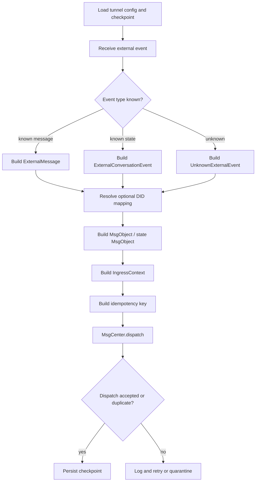
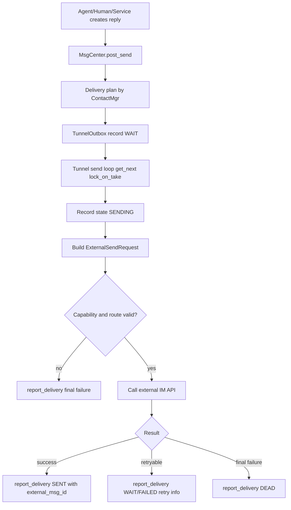
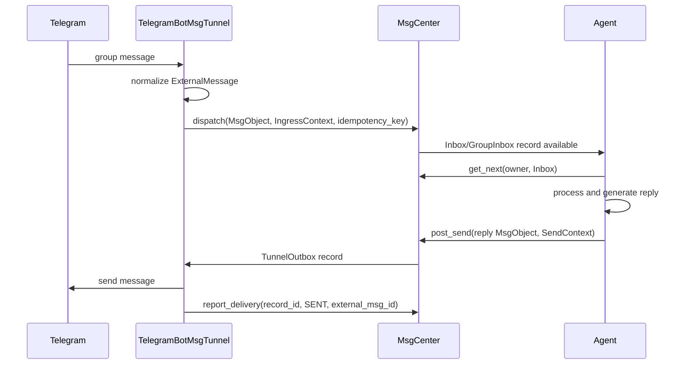
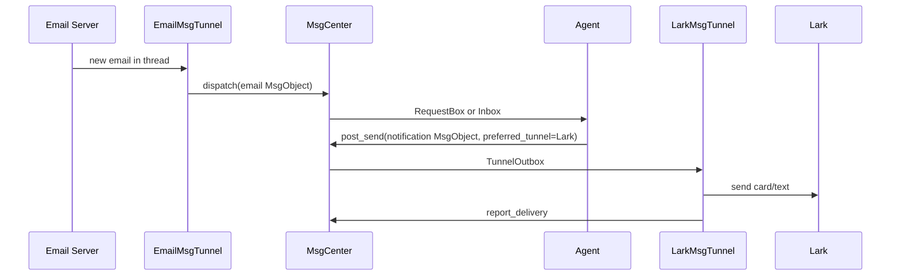

# Message Tunnel Design

本文定义 BuckyOS Message Tunnel 的理论完整模型。目标是给人类 review 设计边界、对象语义、流程、兼容性和各平台裁剪方式。给 agent/codegen 使用的最小版本见 `Message Tunnel Minimal Spec.md`。

## 1. 任务确认

Message Tunnel 是一个 IM 通道适配层。它把 Telegram、Lark、Email、MessageHub 等外部或内部会话系统中的消息和会话事件接入 BuckyOS Message Center，并把 Message Center 中的响应消息投递回来源 IM 会话或被授权的其他会话。

完整流程是：

1. Tunnel 从 IM 会话中获取消息、状态和平台事件。
2. Tunnel 将事件标准化，经 `MsgCenter.dispatch()` 投递给消息指定的目标 Agent、人操作的控制组件或其他系统组件。
3. 目标组件处理消息后，自行按规则存储响应或调用 `MsgCenter.post_send()` 创建响应消息。这一步不需要 Message Tunnel 参与。
4. Tunnel 从 `MsgCenter` 的 `TunnelOutbox` 取出响应或其他出站消息，按路由投递给来源 IM 会话或授权目标。

## 2. 设计边界

### 2.1 Message Tunnel 负责什么

Message Tunnel 负责平台协议边界：

- 连接外部 IM API、Webhook、轮询、长连接或本地 MessageHub。
- 把平台事件转换为 BuckyOS 可处理的消息对象、状态对象或未知事件对象。
- 构造 `IngressContext`、`RouteInfo` 和幂等 key。
- 调用 Message Center 的入站和投递回报 API。
- 消费 `TunnelOutbox` 并把消息发送回外部平台。
- 保存平台 offset、checkpoint、账号绑定、外部 ID、健康状态和错误信息。
- 按平台能力裁剪机器人和自然人账号的行为。

### 2.2 Message Tunnel 不负责什么

Message Tunnel 不负责：

- Agent 如何理解消息、选择工具、生成回复。
- Agent 的工作日志、长期记忆、任务状态和响应消息存储策略。
- Message Center 的 inbox/outbox 存储模型。
- ContactMgr 和 GroupMgr 的最终身份、成员、权限管理。
- 将所有外部概念强行 DID 化。

Tunnel 可以提供足够的来源信息，让 ContactMgr、GroupMgr、Agent 或 UI 决定是否建立 DID 映射。

## 3. 外部语义和 DID 的关系

外部 IM 系统中的用户账号 ID、群 ID、会话 ID 和消息 ID 是平台语义下的字符串。它们可能对应 BuckyOS DID，也可能只是一个来源标识或回复地址。

设计原则：

- 默认保留原平台 ID，不强制封装成 DID。
- 只有当系统需要长期权限、联系人、成员关系、跨平台路由、审计主体或内部群实体时，才创建或绑定 DID。
- DID 映射是可选的、可变的、可被人工确认或合并的。
- 原始平台 ID 必须持续保留，避免 DID 映射变化导致无法回信或无法审计历史。

示例：

- Telegram user id 可以只作为 `ExternalActorRef.account_id`。如果用户后来被添加为联系人，再通过 ContactMgr 绑定 DID。
- Lark open_id 可以只作为某个 Lark tunnel 的投递地址。它不一定是 BuckyOS 用户。
- Email address 可作为外部账号 ID，也可绑定到某个 Contact DID。
- MessageHub 内部用户一般已经能解析 DID，但仍应保留 session id 作为 UI 会话语义。

## 4. 基础类型复用

本文使用现有 BuckyOS 基础类型，不重新定义：

- `DID`：内部身份。
- `ObjId`：NamedObject ID。
- `MsgObject`：不可变消息对象，来自 `ndn_lib`。
- `MsgContent`、`MsgContentFormat`：文本、结构化内容、附件引用。
- `MsgObjKind`：消息业务类型。
- `MsgRecord`：某个 owner 在某个 box 中对 `MsgObject` 的视图记录。
- `RouteInfo`：投递路由，包含 tunnel、platform、account、address、chat_id、target_did、ext_ids、extra。
- `DeliveryInfo`：投递尝试、外部 message id、送达时间、错误和重试信息。
- `IngressContext` / `SendContext`：入站和出站上下文。
- `MsgReceiptObj`：阅读或处理回执。
- `MsgTunnel` / `MsgTunnelInstanceMgr`：当前实现中的 tunnel 运行接口和实例管理器。

需要升级基础类型时，应单独说明原因。例如新增 `MsgObjKind::ConversationState` 可以减少状态消息对 `meta` 的依赖，但这属于共享协议升级，不应在 tunnel 文档里直接覆盖现有定义。

## 5. 核心对象定义

以下是理论完整 Message Tunnel 的关键对象。它们可先作为文档模型和平台 tunnel 内部结构存在，不要求一次性进入公共 API。

### 5.1 外部引用对象

```rust
/// 外部 IM 平台 ID。稳定小写字符串，例如 "telegram"、"lark"、"email"、"messagehub"。
pub type PlatformId = String;

/// 外部平台账号 ID。只在某个平台或某个租户范围内有意义。
pub type ExternalAccountId = String;

/// 外部平台会话 ID。可表示私聊、群聊、频道、邮件 thread 或 MessageHub session。
pub type ExternalConversationId = String;

/// 外部平台消息 ID。通常只在平台 + 账号 + 会话范围内唯一。
pub type ExternalMessageId = String;

/// 外部平台参与者。它保持原平台语义，并可选绑定 BuckyOS DID。
#[derive(Debug, Clone, Serialize, Deserialize)]
pub struct ExternalActorRef {
    /// 平台 ID。
    pub platform: PlatformId,
    /// 平台账号 ID。
    pub account_id: ExternalAccountId,
    /// 平台显示名。
    pub display_name: Option<String>,
    /// 平台可读 ID，例如 @name、email address、open_id。
    pub display_id: Option<String>,
    /// 可选内部 DID。未解析、未知或不需要映射时为空。
    pub mapped_did: Option<DID>,
    /// 原始平台扩展字段。实现必须容忍未知字段。
    pub extra: serde_json::Value,
}

/// 外部会话引用。它不是 BuckyOS 会话实体本身。
#[derive(Debug, Clone, Serialize, Deserialize)]
pub struct ExternalConversationRef {
    /// 平台 ID。
    pub platform: PlatformId,
    /// 外部会话 ID。
    pub conversation_id: ExternalConversationId,
    /// 会话类型。
    pub kind: ExternalConversationKind,
    /// 可选内部 DID，例如 self-host group DID。
    pub mapped_did: Option<DID>,
    /// 可选父会话，用于群内 thread、topic、子群。
    pub parent: Option<Box<ExternalConversationRef>>,
    /// 原始平台扩展字段。
    pub extra: serde_json::Value,
}

#[derive(Debug, Clone, Serialize, Deserialize)]
pub enum ExternalConversationKind {
    /// 1v1 会话。
    Direct,
    /// 多人会话或群聊。
    Group,
    /// 群内子群、topic、thread、临时议题空间。
    Subgroup,
    /// 邮件 thread、频道、工单等线程型会话。
    Thread,
    /// 平台升级带来的未知类型。旧系统必须保留并降级。
    Unknown(String),
}
```

### 5.2 外部消息和内容

```rust
/// 外部消息的标准中间形态，进入 MsgObject 前使用。
#[derive(Debug, Clone, Serialize, Deserialize)]
pub struct ExternalMessage {
    /// 平台和账号范围内的消息引用。
    pub message_ref: ExternalMessageRef,
    /// 发送者。可能是自然人、机器人、群系统账号或未知 actor。
    pub sender: ExternalActorRef,
    /// 所属会话。
    pub conversation: ExternalConversationRef,
    /// 可选目标。平台未显式给出时为空，由 conversation 决定。
    pub targets: Vec<ExternalActorRef>,
    /// 规范化内容片段。
    pub parts: Vec<ExternalMessagePart>,
    /// 引用、回复、转发等关系。
    pub relations: Vec<ExternalMessageRelation>,
    /// 外部平台时间。没有可靠时间时由 tunnel 接收时间补齐。
    pub created_at_ms: u64,
    /// 原始 payload 摘要或完整 JSON。大 payload 可只保存引用。
    pub raw: serde_json::Value,
}

#[derive(Debug, Clone, Serialize, Deserialize)]
pub struct ExternalMessageRef {
    /// 平台 ID。
    pub platform: PlatformId,
    /// tunnel 绑定的外部账号 ID。
    pub tunnel_account_id: ExternalAccountId,
    /// 外部会话 ID。
    pub conversation_id: ExternalConversationId,
    /// 外部消息 ID。
    pub message_id: ExternalMessageId,
    /// 平台 offset 或 sequence，用于顺序和恢复。
    pub sequence: Option<i64>,
}

#[derive(Debug, Clone, Serialize, Deserialize)]
pub enum ExternalMessagePart {
    /// 纯文本。
    Text { text: String },
    /// 富文本，format 可为 markdown、html、platform-specific。
    RichText { format: String, body: String },
    /// 表情、reaction、贴纸。
    Symbol { kind: String, value: String },
    /// @、mention、频道引用等特殊语义字符。
    Mention {
        raw: String,
        target: Option<ExternalActorRef>,
        meaning: MentionMeaning,
    },
    /// 附件或媒体。data_ref 可指向 NamedObject，也可先保存外部 URI。
    Attachment {
        name: Option<String>,
        mime_type: Option<String>,
        size: Option<u64>,
        data_ref: AttachmentDataRef,
    },
    /// 平台可操作对象，例如红包、投票、小程序。
    Interactive(ExternalInteractiveObject),
    /// 平台升级带来的未知内容。
    Unknown(UnknownExternalContent),
}

/// 未知外部内容片段。旧版本无法理解时至少应展示 fallback_text。
#[derive(Debug, Clone, Serialize, Deserialize)]
pub struct UnknownExternalContent {
    /// 平台原始内容类型。
    pub content_kind: String,
    /// 降级展示文本。
    pub fallback_text: String,
    /// 原始 payload 或引用。
    pub raw: serde_json::Value,
}

#[derive(Debug, Clone, Serialize, Deserialize)]
pub enum MentionMeaning {
    /// 普通提及人或机器人。
    AddressActor,
    /// 指令、slash command 或平台命令入口。
    Command,
    /// 频道、群、话题或外部资源引用。
    Reference,
    /// 未知语义，保留原始字符。
    Unknown(String),
}

#[derive(Debug, Clone, Serialize, Deserialize)]
pub enum AttachmentDataRef {
    /// 已导入 BuckyOS NamedObject。
    NamedObject { obj_id: ObjId, uri_hint: Option<String> },
    /// 尚未导入，只保留外部下载地址或 file id。
    External { uri: Option<String>, file_id: Option<String> },
}

#[derive(Debug, Clone, Serialize, Deserialize)]
pub enum ExternalMessageRelation {
    ReplyTo(ExternalMessageRef),
    Quote(ExternalMessageRef),
    ForwardFrom(ExternalMessageRef),
    EditOf(ExternalMessageRef),
    DeleteOf(ExternalMessageRef),
    ReactionTo(ExternalMessageRef),
    Unknown { kind: String, payload: serde_json::Value },
}
```

### 5.3 会话状态和可操作对象

```rust
/// 外部会话状态事件。
#[derive(Debug, Clone, Serialize, Deserialize)]
pub struct ExternalConversationEvent {
    /// 事件所属会话。
    pub conversation: ExternalConversationRef,
    /// 事件发起者。系统事件可为空。
    pub actor: Option<ExternalActorRef>,
    /// 事件类型。
    pub kind: ExternalConversationEventKind,
    /// 事件时间。
    pub occurred_at_ms: u64,
    /// 原始 payload。
    pub raw: serde_json::Value,
}

#[derive(Debug, Clone, Serialize, Deserialize)]
pub enum ExternalConversationEventKind {
    MemberJoined { member: ExternalActorRef },
    MemberLeft { member: ExternalActorRef },
    MemberAdded { member: ExternalActorRef },
    MemberRemoved { member: ExternalActorRef },
    MemberOnline { member: ExternalActorRef },
    MemberOffline { member: ExternalActorRef },
    Muted { target: ExternalActorRef, until_ms: Option<u64> },
    Blocked { target: ExternalActorRef },
    PermissionChanged { target: ExternalActorRef, permission: String },
    MessageRead { reader: ExternalActorRef, message: ExternalMessageRef },
    MessageDelivered { target: ExternalActorRef, message: ExternalMessageRef },
    Typing { actor: ExternalActorRef, active: bool },
    TitleChanged { title: String },
    Unknown { kind: String },
}

/// 第三方应用或平台可操作对象。
#[derive(Debug, Clone, Serialize, Deserialize)]
pub struct ExternalInteractiveObject {
    /// 对象类型，例如 "wechat.red_packet"、"lark.vote"。
    pub object_type: String,
    /// 展示文本。旧系统至少可显示它。
    pub fallback_text: String,
    /// 允许的操作。未知或无权操作时可为空。
    pub actions: Vec<ExternalActionDescriptor>,
    /// 原始 payload 或引用。
    pub payload: serde_json::Value,
}

#[derive(Debug, Clone, Serialize, Deserialize)]
pub struct ExternalActionDescriptor {
    /// 操作名，例如 "open"、"vote"、"claim"。
    pub name: String,
    /// 是否需要用户或 Agent 额外授权。
    pub requires_authorization: bool,
    /// 平台原始操作 payload。
    pub payload: serde_json::Value,
}
```

### 5.4 未知事件和归一化结果

```rust
/// 未知外部事件。必须可持久化、可审计、可被新版本重放分析。
#[derive(Debug, Clone, Serialize, Deserialize)]
pub struct UnknownExternalEvent {
    /// 平台 ID。
    pub platform: PlatformId,
    /// tunnel 绑定的外部账号。
    pub tunnel_account_id: ExternalAccountId,
    /// 平台原始事件类型。
    pub event_kind: String,
    /// tunnel 观察到该事件的时间。
    pub observed_at_ms: u64,
    /// 降级展示文本。
    pub fallback_text: String,
    /// 原始 payload 或引用。
    pub raw: serde_json::Value,
}

/// Tunnel 入站归一化后的结果。
#[derive(Debug, Clone, Serialize, Deserialize)]
pub struct NormalizedIngress {
    /// 原平台事件类型。
    pub event_kind: String,
    /// 可提交给 MsgCenter.dispatch 的消息对象。
    pub msg: Option<MsgObject>,
    /// 入站上下文，包含来源平台、外部会话、外部账号、contact owner 等。
    pub ingress_ctx: IngressContext,
    /// 入站幂等 key。
    pub idempotency_key: String,
    /// 不能直接表达成 MsgObject 的状态更新或审计记录。
    pub side_effects: Vec<NormalizedIngressSideEffect>,
}

#[derive(Debug, Clone, Serialize, Deserialize)]
pub enum NormalizedIngressSideEffect {
    /// 更新 UI session、typing、在线等临时状态。
    UpdateSessionState { key: String, value: serde_json::Value },
    /// 写入阅读、送达、处理等回执。
    WriteReceipt { receipt: MsgReceiptObj },
    /// 保存未知事件，供人工排查或新版本重放。
    StoreUnknown { event: UnknownExternalEvent },
}
```

### 5.5 Tunnel 配置、能力和健康状态

```rust
#[derive(Debug, Clone, Serialize, Deserialize)]
pub enum TunnelAccountKind {
    /// 平台机器人账号。通常受 Bot API 限制。
    Bot,
    /// 用户授权账号。能力接近自然人，但风险更高。
    User,
    /// BuckyOS 内部系统通道。
    System,
}

#[derive(Debug, Clone, Serialize, Deserialize)]
pub struct TunnelCapabilities {
    /// 可读取外部消息。
    pub ingress: bool,
    /// 可发送外部消息。
    pub egress: bool,
    /// 可同步成员、加入退出、禁言、权限等会话状态。
    pub conversation_state: bool,
    /// 可同步已读、送达、失败等回执。
    pub receipts: bool,
    /// 可同步 typing、在线等临时状态。
    pub ephemeral_state: bool,
    /// 可导入或导出附件。
    pub attachments: bool,
    /// 可识别或操作平台特殊对象。
    pub interactive_objects: bool,
    /// 可主动加入会话。
    pub join_conversation: bool,
    /// 可向非来源会话发送消息。
    pub cross_conversation_send: bool,
}

#[derive(Debug, Clone, Serialize, Deserialize)]
pub struct MessageTunnelConfig {
    /// BuckyOS 内部 tunnel DID。
    pub tunnel_did: DID,
    /// 平台 ID。
    pub platform: PlatformId,
    /// Bot/User/System。
    pub account_kind: TunnelAccountKind,
    /// tunnel 绑定的外部账号。
    pub account_id: ExternalAccountId,
    /// 是否启用入站。
    pub ingress_enabled: bool,
    /// 是否启用出站。
    pub egress_enabled: bool,
    /// ContactMgr owner scope。
    pub contact_mgr_owner: Option<DID>,
    /// 账号密钥、token、租户等配置引用。不得直接明文写入日志。
    pub secret_refs: Vec<String>,
    /// 平台特有配置。
    pub extra: serde_json::Value,
}

#[derive(Debug, Clone, Serialize, Deserialize)]
pub struct TunnelHealthReport {
    /// tunnel DID。
    pub tunnel_did: DID,
    /// 当前实例状态。
    pub state: MsgTunnelInstanceState,
    /// 最近一次入站 checkpoint。
    pub ingress_checkpoint: Option<String>,
    /// 最近一次成功出站时间。
    pub last_egress_at_ms: Option<u64>,
    /// 最近错误。
    pub last_error: Option<String>,
    /// 当前能力缺口或降级原因。
    pub degraded_reasons: Vec<String>,
    /// 更新时间。
    pub updated_at_ms: u64,
}
```

### 5.6 出站发送请求

```rust
/// 标准出站发送请求。具体平台 tunnel 再把它转成平台 SDK/API 请求。
#[derive(Debug, Clone, Serialize, Deserialize)]
pub struct ExternalSendRequest {
    /// 平台 ID。
    pub platform: PlatformId,
    /// 发送账号。
    pub sender_account_id: ExternalAccountId,
    /// 目标会话或目标 actor。
    pub target: ExternalSendTarget,
    /// 内容片段。
    pub parts: Vec<ExternalMessagePart>,
    /// 是否替换、编辑或补全某条外部消息。
    pub replace_message_id: Option<ExternalMessageId>,
    /// 对应 MsgCenter record。
    pub record_id: String,
    /// 平台特有发送参数，例如 parse_mode、tenant_id、reply_to。
    pub extra: serde_json::Value,
}

#[derive(Debug, Clone, Serialize, Deserialize)]
pub enum ExternalSendTarget {
    /// 发送到外部会话。
    Conversation(ExternalConversationRef),
    /// 发送给单个外部参与者。
    Actor(ExternalActorRef),
}
```

## 6. 与 MsgObject 的映射

### 6.1 基本映射

入站 `ExternalMessage` 应映射为 `MsgObject`：

- `MsgObject.from`：逻辑发送方 DID。若发送方无法映射 DID，可使用 ContactMgr 创建 shadow contact，或使用代表该外部 actor 的临时 DID。是否创建由策略决定。
- `MsgObject.to`：目标 DID 列表。私聊通常是目标 Agent/User；群聊可指向 group DID 或订阅该会话的 Agent DID。
- `MsgObject.kind`：普通私聊使用 `Chat`；群消息优先使用 `GroupMsg`；状态和可操作对象在现有类型不足时通过 `meta` 表达。
- `MsgObject.content.content`：可读 fallback 文本。
- `MsgObject.content.format`：文本格式，例如 `TextPlain`、`TextMarkdown`、`TextHtml`。
- `MsgObject.content.refs`：附件、引用文件、外部资源导入后的 NamedObject 引用。
- `MsgObject.content.machine`：结构化 machine-readable 内容，例如 mention、button、vote、red packet。
- `MsgObject.meta`：平台 payload、外部 ID、会话 ID、未知字段、能力降级信息。
- `MsgObject.thread`：会话、topic、reply thread 或 UI session 归类。

### 6.2 不可丢失的信息

以下信息必须保留在 `IngressContext`、`RouteInfo` 或 `msg.meta`：

- platform。
- tunnel DID。
- tunnel account id。
- external conversation id。
- external message id。
- external sender account id。
- external sender display id/name。
- source sequence/offset。
- raw event kind。
- attachment file id 或 NamedObject id。
- unknown payload 引用或摘要。

## 7. 入站流程

### 7.1 自然语言流程

Tunnel 启动后加载配置和 checkpoint，然后通过平台 API 接收事件。每个事件先被解析为 `TunnelIngressEvent`。已知消息转换为 `ExternalMessage`，状态变化转换为 `ExternalConversationEvent`，未知事件转换为 `UnknownExternalEvent`。

Tunnel 接着按策略解析外部 actor 和 conversation。解析可以返回已有 DID、创建 shadow contact，也可以完全不映射 DID，只把外部 ID 放进上下文。然后构造 `MsgObject`、`IngressContext` 和幂等 key，调用 `MsgCenter.dispatch()`。

只有当 `dispatch()` 成功或确认该事件已幂等处理后，Tunnel 才推进平台 checkpoint。这样进程崩溃时可能重复提交，但不会丢消息。

### 7.2 流程图



### 7.3 入站关键方法

```rust
impl MessageTunnelRuntime {
    /// 接收并处理一个平台事件。该方法必须幂等可重试。
    pub async fn handle_external_event(
        &self,
        raw_event: serde_json::Value,
    ) -> anyhow::Result<DispatchResult> {
        let event = self.parse_event(raw_event).await?;
        let normalized = self.normalize_ingress(event).await?;
        let (msg, ingress_ctx, idempotency_key) = self.build_dispatch_request(normalized).await?;
        let result = self.msg_center.dispatch(msg, Some(ingress_ctx), Some(idempotency_key)).await?;
        self.commit_checkpoint_if_safe(&result).await?;
        Ok(result)
    }

    /// 将外部事件解析为 tunnel 中间对象。
    async fn parse_event(&self, raw: serde_json::Value) -> anyhow::Result<TunnelIngressEvent>;

    /// 将中间对象转换成 BuckyOS 可 dispatch 的对象。
    async fn normalize_ingress(&self, event: TunnelIngressEvent) -> anyhow::Result<NormalizedIngress>;

    /// 生成 MsgCenter 入站请求。
    async fn build_dispatch_request(
        &self,
        normalized: NormalizedIngress,
    ) -> anyhow::Result<(MsgObject, IngressContext, String)>;
}
```

## 8. 出站流程

### 8.1 自然语言流程

Agent、人类 UI 或系统服务生成响应后调用 `MsgCenter.post_send()`。Message Center 使用 ContactMgr 选择投递路径，创建 `TunnelOutbox` 记录。Tunnel 的发送循环从自己的 `TunnelOutbox` 拉取 `Wait` 记录，将 `MsgRecordWithObject` 转换为平台发送请求。

发送成功后，Tunnel 通过 `MsgCenter.report_delivery()` 写入外部 message id、送达时间和状态。发送失败时，Tunnel 必须区分可重试失败和最终失败。可重试失败应保留原因和下次重试时间；最终失败进入 `Dead` 或等价状态，供 UI 和审计发现。

### 8.2 流程图



### 8.3 出站关键方法

```rust
impl MessageTunnelRuntime {
    /// 持续消费当前 tunnel 的出站队列。
    pub async fn run_send_loop(&self) -> anyhow::Result<()> {
        loop {
            let record = self.next_tunnel_outbox_record().await?;
            if let Some(record) = record {
                let result = self.send_record_to_platform(record.clone()).await;
                self.report_delivery(record.record.record_id, result).await?;
            } else {
                self.wait_for_outbox_event_or_timeout().await;
            }
        }
    }

    /// 把 MsgCenter 记录转换成平台发送请求，并执行发送。
    async fn send_record_to_platform(
        &self,
        record: MsgRecordWithObject,
    ) -> anyhow::Result<DeliveryReportResult>;

    /// 校验 route、账号绑定、平台能力和目标会话。
    fn validate_egress_route(&self, record: &MsgRecordWithObject) -> anyhow::Result<()>;
}
```

## 9. Agent 最大功能集

理论上，如果 IM 平台对机器人没有任何限制，一个 Agent 作为 Message Tunnel 背后的账号，应能完成真实自然人在会话中可完成的一切行为：

- 阅读私聊、群聊、子群、thread、频道和历史上下文。
- 发送文本、富文本、表情、引用回复、附件、编辑、删除和 reaction。
- 收发会话状态，例如加入、退出、成员变化、已读、typing、禁言和权限变化。
- 处理平台特殊消息，例如红包、投票、小程序、审批卡片。
- 在授权范围内加入或退出会话。
- 在授权范围内给其他会话、其他人、Email、Lark 等渠道发送消息。
- 使用被授予的工具，例如发送 email、访问 B 站关注列表、向 Lark 发送通知。
- 记录行为日志，使一组机器人之间的对话和动作可观测、可追溯。

如果某个平台限制 Bot API，例如不能读取某些群成员、不能主动私聊、不能操作红包，则该限制属于平台子类能力裁剪，不应收缩通用 Message Tunnel 的最大定义。

## 10. 平台子类

### 10.1 Telegram

Telegram Tunnel 应区分：

- `TelegramBotMsgTunnel`：使用 Bot API 或 bot session，受 Telegram 对 bot 的群、私聊、成员信息限制。
- `TelegramUserMsgTunnel`：使用用户授权 session，能力更接近自然人，但需要更严格安全策略。

能力关注点：

- 私聊、群聊、频道、topic。
- message_id、chat_id、sender id 可构成稳定幂等 key。
- 附件需要下载并导入 NamedObject，或保留 file id。
- Bot 通常不能主动给未开始对话的用户发消息。
- parse mode、Markdown/HTML 转换需要平台专用处理。

### 10.2 Lark

Lark Tunnel 应区分：

- `LarkBotMsgTunnel`：企业应用机器人，适合群消息、卡片、审批和通知。
- `LarkUserMsgTunnel`：用户授权模式，适合代表用户操作，但权限范围更敏感。

能力关注点：

- open_id、union_id、chat_id、tenant_id 共同定义身份范围。
- 富文本、卡片、按钮、审批、投票等可操作对象较多，应优先进入 `InteractiveObject`。
- 企业权限和租户边界必须进入 `RouteInfo.extra` 或平台配置。
- 机器人能否加入群、读取历史和私聊取决于应用权限。

### 10.3 Email

Email Tunnel 通常不是实时 IM，但仍是 Message Tunnel：

- 入站通过 IMAP、SMTP webhook、邮件服务 API 或本地 maildir。
- 会话模型是 thread。
- actor 是 email address，可选映射 Contact DID。
- 附件天然重要，应导入 NamedObject 或保留外部引用。
- 出站需要处理 reply-to、cc、bcc、subject、message-id、in-reply-to。
- 已读、typing、在线等临时状态通常不支持。

### 10.4 MessageHub

MessageHub 是 BuckyOS 内部或 Web UI 消息通道：

- 大多数 actor 可直接解析 DID。
- session id 是 UI 和 Agent 上下文的重要语义。
- 它不一定需要外部平台账号映射，但仍应保留 tunnel、session、record id 以统一观测。
- 可作为实现其他 tunnel 的参考基线。

## 11. 消息顺序、去重和遗漏

### 11.1 顺序性

要求：

- 同一外部会话内应尽量按平台 sequence 或时间顺序 dispatch。
- 同一 tunnel 账号内的多个会话不要求全局顺序。
- 如果平台只提供乱序 webhook，Tunnel 应保留 sequence 并允许 Message Center 或 UI 按 sort_key 重排。
- 出站同一会话的响应应尽量串行发送，避免平台显示顺序反转。

### 11.2 去重

入站幂等 key 建议：

```text
{platform}:{tunnel_account_id}:{conversation_id}:{external_message_id}:{event_kind}
```

出站幂等依赖：

- `MsgObject` 的对象 ID。
- `MsgRecord.record_id`。
- `post_send` 的 idempotency key。
- 外部平台成功后的 `external_msg_id`。

重复发送风险处理：

- 如果发送请求超时但平台可能已发送成功，应优先查询外部 message id 或使用平台提供的 client token。
- 如果平台不支持查询或 client token，只能按 `DeliveryInfo` 标记不确定状态，并避免无限重试。

### 11.3 遗漏恢复

Tunnel 必须持久化：

- 入站 checkpoint 或 offset。
- 已处理 idempotency key 缓存，至少覆盖平台可能重放窗口。
- 出站 `TunnelOutbox` 状态由 Message Center 持久化。
- 发送中崩溃后，`Sending` 状态需要租约恢复或重新置为 `Wait`。

实时通知只是加速信号。任何消费者都必须能通过重新扫描 inbox/outbox 恢复。

## 12. 兼容性和未来升级

### 12.1 外部 IM 平台升级

平台升级可能增加：

- 新消息类型。
- 新会话类型。
- 新成员状态。
- 新可操作对象。
- 新权限或限制。
- payload 字段类型变化。

处理要求：

- 未知 enum 使用 `Unknown(String)`。
- 未知 payload 存入 `extra`、`raw` 或 `msg.meta.platform_payload`。
- 生成 fallback 文本，例如 `[Unsupported Telegram story]`。
- 记录 capability gap，不让 tunnel 崩溃。
- 关键转换失败时进入 quarantine/request box，而不是丢弃。

### 12.2 BuckyOS 新旧版本互通

新版本可能写入旧版本不理解的数据。旧版本应：

- 忽略未知字段。
- 保留未知字段，避免读写后丢失。
- 对未知消息内容展示 fallback text。
- 对未知状态不执行危险操作。
- 对未知投递 route 返回明确失败，不能误投递。

### 12.3 数据损坏防护

禁止以下行为：

- 解析未知事件时 panic。
- 因单条坏消息停止整个 tunnel。
- 出站 route 缺失时猜测目标并发送。
- 发送失败时静默删除 `TunnelOutbox` 记录。
- 覆盖或丢弃原始外部 ID。

## 13. 安全和授权

Message Tunnel 是高风险边界，必须遵守：

- 入站消息进入 inbox 前由 ContactMgr/策略决定是否进入 `Inbox`、`RequestBox` 或丢弃。
- 出站消息必须有明确 route 和授权来源。
- User tunnel 代表自然人操作，默认权限更高，必须有更严格审计和撤销机制。
- Agent 使用工具发送跨会话消息、Email 或 Lark 通知时，应有可解释授权来源。
- secret、token、session 文件不得写入普通日志。
- 任何平台可操作对象默认不可自动执行，除非策略明确授权。

## 14. 可观测性

每条入站事件至少能追踪：

- tunnel DID。
- platform。
- external account id。
- external conversation id。
- external message id。
- idempotency key。
- generated msg_id。
- dispatch result。

每条出站投递至少能追踪：

- record_id。
- msg_id。
- route.tunnel_did。
- route.platform。
- route.chat_id/address。
- attempts。
- external_msg_id。
- final state。
- error_code/error_message。

Agent 行为日志不属于 Message Tunnel 责任，但 Message Tunnel 需要提供足够关联 ID，让审计系统能把外部消息、Message Center record、Agent session、响应消息和外部投递串起来。

## 15. 配置会话示例的解释

用户在机器人配置会话窗口输入：

```text
你可以翻阅我在B站关注的主播，如果他们有内容更新就发EMAIL告诉我(email: xxx)
你可以加入我Telegram的好友群，如果发现他们出去浪，通过Lark告诉我(ID: xxx)
```

这里涉及多个边界：

- 配置会话本身通过某个 Message Tunnel 入站。
- Agent 理解用户授权，生成工具授权或任务配置。
- B 站更新检查不是 Message Tunnel，属于 Agent tool 或外部服务 connector。
- Email 通知通过 `EmailMsgTunnel` 出站。
- Telegram 好友群加入能力取决于 Telegram tunnel 类型和授权。
- Lark 通知通过 `LarkBotMsgTunnel` 或 `LarkUserMsgTunnel` 出站。
- 所有跨会话、跨平台发送都应留下授权来源、任务 ID、record_id 和投递结果。

## 16. 典型端到端流程

### 16.1 Telegram 群消息触发 Agent 回复



### 16.2 Email 入站和 Lark 出站



## 17. 实现入口建议

当前仓库已有：

- `src/frame/msg_center/src/msg_tunnel.rs`：`MsgTunnel` trait 和实例管理。
- `src/frame/msg_center/src/tg_tunnel.rs`：Telegram tunnel 参考实现。
- `src/frame/msg_center/src/msg_center.rs`：`dispatch`、`post_send`、`get_next`、`report_delivery` 等核心流程。
- `src/kernel/buckyos-api/src/msg_center_client.rs`：共享 API 类型。
- `src/frame/opendan/src/msg_center_pump.rs`：Agent 消费 MsgCenter inbox 的参考流程。

后续实现应优先复用这些入口。新增平台 tunnel 应先实现现有 `MsgTunnel` trait，再在平台内部逐步补齐完整对象模型、能力声明和未知事件降级。

## 18. 验收标准

设计可接受的标准：

- 能解释 Message Tunnel 和 MsgCenter、Agent、ContactMgr、GroupMgr 的边界。
- 能表达 1v1、群聊、子群、thread 和机器人群聊。
- 能表示文本、富文本、附件、mention、状态事件、可操作对象和未知消息。
- 能明确外部 ID 何时只是字符串，何时才需要映射 DID。
- 能支持 Bot/User 两类 tunnel 的能力裁剪。
- 能覆盖入站、出站、幂等、顺序、重试、遗漏恢复。
- 能在平台和 BuckyOS 升级时兼容未知字段和未知类型。
- 能给 Telegram、Lark、Email、MessageHub 四类典型 tunnel 提供实现方向。
