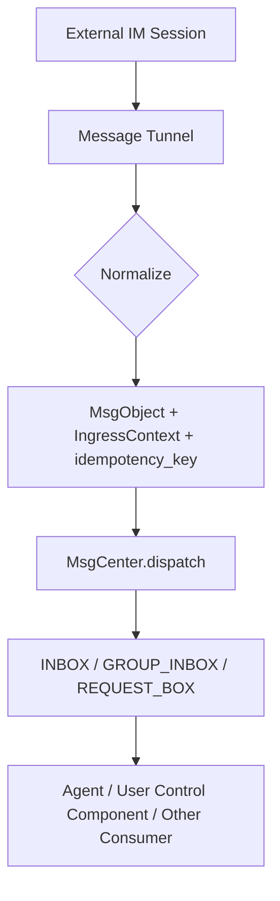
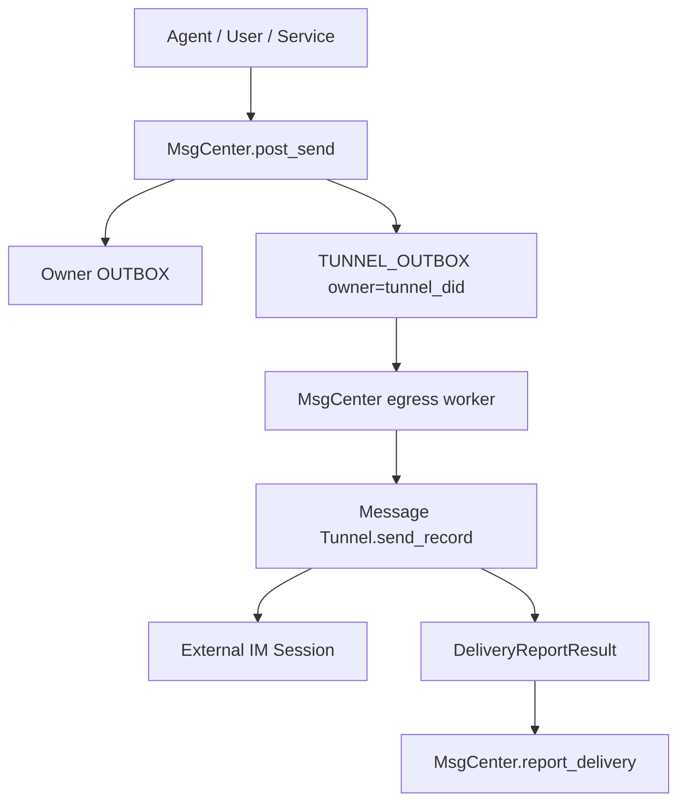

# Message Tunnel Minimal Spec

本文档给代码生成 Agent 使用，只保留实现 Message Tunnel 所需的最小协议约束。详细设计、边界和兼容性说明见 `doc/message_hub/Message Tunnel Design.md`。

## 1. 定义

Message Tunnel 是外部 IM 会话和 BuckyOS MessageCenter 之间的适配器。它代表某个外部平台账号或系统入口收发消息：

1. 入站：从外部 IM 获取消息、会话事件和平台状态，转换为 `MsgObject`，携带 `IngressContext` 调用 `MsgCenter.dispatch()`。
2. 出站：从 MessageCenter 的 `TUNNEL_OUTBOX` 拉取 `MsgRecordWithObject`，转换为外部 IM API 调用，发送完成后调用 `MsgCenter.report_delivery()`。
3. Tunnel 不负责 Agent 推理，也不负责响应消息生成。Agent、控制组件或其他系统服务处理消息后，通过 `MsgCenter.post_send()` 生成出站投递任务。

Message Tunnel 必须尽量保留外部平台原始语义，但不能把平台私有对象强行提升为 BuckyOS DID。外部 user id、chat id、message id 可以只是 `String`，通过 `RouteInfo`、`IngressContext.extra`、`MsgObject.meta` 或 `MsgContent.machine` 保留。

## 2. 复用现有类型

不要重新定义以下基础类型，只引用当前实现：

- `ndn_lib::MsgObject`：不可变消息对象，使用 canonical JSON 生成 `ObjId`。
- `ndn_lib::MsgContent`：消息内容，含 `format/content/machine/refs`。
- `ndn_lib::MsgObjKind`：当前包括 `chat/group_msg/deliver/notify/event/operation`。
- `buckyos_api::IngressContext`：入站来源上下文。
- `SendContext` 已删除：`post_send(msg, idempotency_key)` 只接受已确定的 `MsgObject.to`，target/binding/tunnel 选择在构造 `MsgObject` 前完成。
- `buckyos_api::RouteInfo`：record 级投递路径和外部 id。
- `buckyos_api::MsgRecord` / `MsgRecordWithObject`：某个 owner box 中对 `MsgObject` 的可变视图。
- `buckyos_api::BoxKind`：`INBOX/OUTBOX/GROUP_INBOX/TUNNEL_OUTBOX/REQUEST_BOX`。
- `buckyos_api::MsgState`：`UNREAD/READING/READED/WAIT/SENDING/SENT/FAILED/DEAD/DELETED/ARCHIVED`。
- `buckyos_api::DeliveryReportResult`：Tunnel 出站投递结果。

当前通用 tunnel trait 已存在：

```rust
#[async_trait]
pub trait MsgTunnel: Send + Sync {
    /// Tunnel 自身 DID，用作 TUNNEL_OUTBOX owner 和 RouteInfo.tunnel_did。
    fn tunnel_did(&self) -> DID;

    /// 人类可读名称，用于日志、配置和管理界面。
    fn name(&self) -> &str;

    /// 平台标识，例如 "telegram"、"lark"、"email"、"messagehub"。
    fn platform(&self) -> &str;

    /// 是否接收入站消息。Email outbound-only tunnel 可返回 false。
    fn supports_ingress(&self) -> bool { true }

    /// 是否支持出站投递。Webhook ingress-only tunnel 可返回 false。
    fn supports_egress(&self) -> bool { true }

    /// 启动外部连接、轮询、webhook server 或 stream consumer。
    async fn start(&self) -> AnyResult<()>;

    /// 停止外部连接并释放后台任务。
    async fn stop(&self) -> AnyResult<()>;

    /// 发送一个 TUNNEL_OUTBOX record，并返回外部平台投递结果。
    async fn send_record(&self, record: MsgRecordWithObject) -> AnyResult<DeliveryReportResult>;
}
```

## 3. 推荐新增的通用概念

这些是设计概念，不要求立刻改协议对象；能用现有字段表达时优先组合现有字段。

```rust
#[derive(Debug, Clone, Serialize, Deserialize)]
#[serde(rename_all = "snake_case")]
pub enum MessageTunnelAccountKind {
    /// 平台机器人账号。通常受平台 Bot API 能力限制。
    Bot,
    /// 平台自然人账号或用户授权账号。可能能执行更多真实用户行为。
    User,
    /// BuckyOS 内部 MessageHub 或系统入口。
    System,
}

#[derive(Debug, Clone, Serialize, Deserialize)]
pub struct MessageTunnelBinding {
    /// MessageCenter / ContactMgr 中的 owner 或 agent DID。
    pub owner_did: DID,
    /// 使用此绑定的 tunnel DID。
    pub tunnel_did: DID,
    /// 外部平台名。
    pub platform: String,
    /// 外部账号 id。保持平台原始字符串语义。
    pub account_id: String,
    /// 平台展示 id 或可路由地址，例如 email address、open_id、chat_id。
    pub display_id: String,
    /// bot/user/system。
    pub account_kind: MessageTunnelAccountKind,
    /// 平台扩展信息，只能追加字段，旧实现忽略未知 key。
    pub extra: serde_json::Value,
}
```

## 4. 入站转换规则

### 4.1 外部消息到 MsgObject

```rust
pub struct IngressEnvelope {
    /// 外部平台名。
    pub platform: String,
    /// 当前 tunnel DID。
    pub tunnel_did: DID,
    /// 外部发送者账号 id，保留原始字符串。
    pub source_account_id: String,
    /// 外部会话 id，保留原始字符串。
    pub chat_id: String,
    /// 外部消息 id 或事件 id，用于幂等。
    pub external_event_id: String,
    /// 标准化后的 BuckyOS 消息。
    pub msg: MsgObject,
    /// 入站上下文。
    pub ingress_ctx: IngressContext,
    /// 幂等 key，必须稳定。
    pub idempotency_key: String,
}
```

映射要求：

- 1v1 普通消息：`kind=Chat`，`from=sender_did`，`to=[target_agent_or_user_did]`。
- 群聊消息：`kind=GroupMsg`，`from=sender_did`，`to=[group_did]`。当前 MessageCenter 以 `to.first()` 作为 group DID，旧数据 fallback 到 `from`。
- 会话状态、成员变更、typing、已读等：优先 `kind=Event` 或 `kind=Notify`，结构化部分放 `content.machine`。
- 可操作消息、红包、投票、小程序等：优先 `kind=Operation`，`content.machine.intent` 表达操作类型，无法理解的原始 payload 放 `meta` 或 `machine.data.raw`。
- 附件和媒体：小文本可放 `content.content`；大对象必须写入对象存储后用 `content.refs` 引用。
- 平台原始 id：放 `IngressContext`、`RouteInfo.ext_ids`、`MsgObject.meta`，不要污染 `from/to`。

### 4.2 入站流程



## 5. 出站转换规则

MessageCenter 已经通过 `post_send()` 生成 `TUNNEL_OUTBOX` record。Tunnel 只消费自己的 outbox。

```rust
pub struct EgressEnvelope {
    /// 待发送 record，用于状态回报。
    pub record_id: String,
    /// 标准消息对象。
    pub msg: MsgObject,
    /// 出站路由，来自 MsgRecord.route。
    pub route: RouteInfo,
    /// 外部目标地址，通常来自 route.address/chat_id/account_id。
    pub external_target: String,
}
```

出站要求：

- `route.tunnel_did` 必须等于当前 tunnel DID。
- `route.platform/account_id/address/chat_id/ext_ids` 是投递主要依据。
- `send_record()` 成功必须返回 `DeliveryReportResult { ok: true, external_msg_id, delivered_at_ms, ... }`。
- 可重试失败返回 `ok=false, retryable=true, retry_after_ms`。
- 不可重试失败返回 `ok=false, retryable=false, error_code/error_message`。
- Tunnel 不直接更新 record state，统一由 egress worker 调用 `MsgCenter.report_delivery()`。

### 5.1 出站流程



## 6. 顺序、幂等、遗漏

- 入站幂等 key：`{platform}:{tunnel_account}:{chat_id}:{external_message_id}`。没有 message id 时用平台事件时间、nonce 和 payload hash 组合。
- 出站幂等：`MsgObjectId + tunnel_did + target + route.mode` 应映射为同一 `TUNNEL_OUTBOX` record。
- 顺序：同一外部会话内应尽量按平台消息序号或时间递增提交；跨会话不保证全局顺序。
- 重复：MessageCenter 以 `MsgObjectId`、record id 和显式 idempotency key 去重；Tunnel 仍要避免重复提交。
- 漏消息：Tunnel 重启后必须从平台 offset/cursor 或 MessageCenter outbox 恢复；实时通知只能作为提示，不能作为唯一真相。

## 7. 流式 AI 消息

对接聊天 AI 时，流式 token 不应直接破坏 `MsgObject` 不可变语义。推荐：

- 中间态：发送 `kind=Notify` 或 `kind=Event`，用相同 `thread.topic/ui_session_id` 和 `content.machine.data.turn_nonce` 标识同一轮。
- 最终态：发送一个完整 `kind=Chat` 或 `kind=GroupMsg` 回复。
- 支持消息编辑的平台可由具体 Tunnel 把中间态合并成编辑操作；不支持编辑的平台可降级为状态消息或只发送最终消息。

## 8. 典型 Tunnel 裁剪

- Telegram：Bot tunnel 已实现基础形态；支持 bot 账号入站/出站、typing/status line、附件引用。平台限制由 `TgTunnel` 内裁剪。
- Lark：同 Telegram，需额外处理企业租户、open_id/user_id/chat_id 的原始语义。
- Email：通常是 UserMsgTunnel 或 System tunnel；`chat_id` 可映射为 thread id/message-id；typing/已读通常不支持。
- MessageHub：BuckyOS 原生 tunnel；应尽量无损保留 `MsgObject`，不需要把外部平台 id 映射成 DID。

## 9. 兼容性规则

- 未知 `MsgObjKind`、`content.format`、`machine.intent`、`meta` key：必须保留或忽略，不能 panic。
- 未知外部消息类型：降级为 `kind=Event` 或 `kind=Operation`，原始 payload 放 `extra/raw`。
- 旧系统收到新字段：依赖 serde default/skip 规则忽略未知字段。
- 新系统读取旧 record：按当前实现保留 group DID fallback。
- 不允许因单条消息解析失败导致 tunnel 主循环退出；应记录日志并跳过或投递到 `REQUEST_BOX`。
