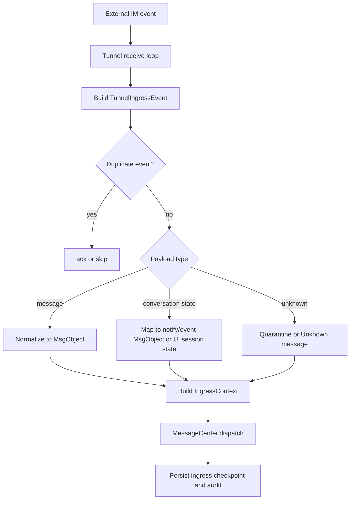
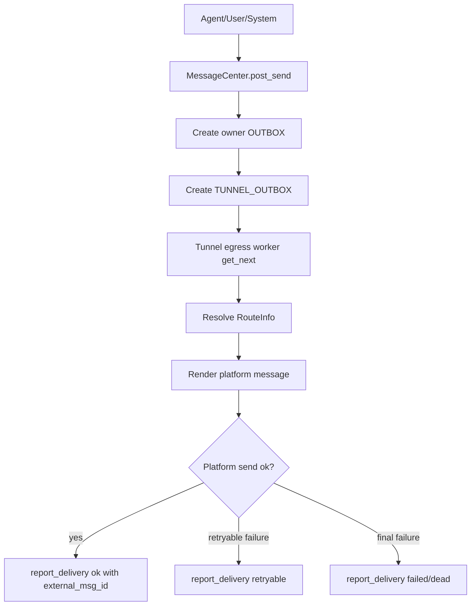

# Message Tunnel Minimal Spec

本文是给 Agent/codegen 使用的最小实现规格。详细设计见 `Message Tunnel Design.md`。

## 1. 定义

Message Tunnel 是外部 IM 系统与 BuckyOS MessageCenter 之间的会话级双向适配层。它代表某个平台上的一个特定账号或访问通道，负责：

1. 从外部 IM 会话接收消息、会话状态和平台事件。
2. 尽量保留外部 IM 原始语义，把可标准化内容转换为 BuckyOS `MsgObject`。
3. 调用 MessageCenter `dispatch(msg, ingress_ctx)`，把入站消息交给目标 Agent、人操作的控制组件或其他系统组件。
4. 从 MessageCenter 的 `TUNNEL_OUTBOX` 拉取响应消息。
5. 按平台规则把响应投递回来源 IM 会话或指定外部目标。
6. 调用 `report_delivery()` 回报外部消息 ID、成功、失败、重试和错误。

Message Tunnel 不负责 Agent 如何思考、如何保存响应、如何调用工具。Agent 生成响应后，应通过 MessageCenter `post_send(msg, send_ctx)` 或等价接口进入出站流程。

## 2. 边界

Message Tunnel 必须做：

- 平台连接、认证、收发消息。
- 入站去重、顺序恢复、断点续拉。
- 外部会话、用户、消息、附件、状态事件到标准 envelope 的转换。
- 构造 `IngressContext`、`RouteInfo` 和 `DeliveryReportResult`。
- 能力裁剪：机器人账号、自然人账号、Email、MessageHub 等平台能力不同，不能假装支持不存在的动作。
- 审计日志：至少记录入站、出站、失败、重试、权限裁剪和未知消息降级。

Message Tunnel 不应做：

- 不应绕过 MessageCenter 直接写 Agent 会话。
- 不应要求所有外部账号强制映射为 BuckyOS DID。
- 不应把平台私有字段扩散成 BuckyOS 基础类型。
- 不应在无法理解新平台消息时宕机或损坏已有状态。

## 3. 已有基础类型

下面类型已经由 BuckyOS 或 NDN 层定义，实现时复用，不在本文重新定义：

- `DID`
- `ObjId`
- `MsgObject`
- `MsgContent`
- `MsgObjKind`
- `RefItem`
- `BoxKind`
- `MsgState`
- `IngressContext`
- `SendContext`
- `RouteInfo`
- `DeliveryInfo`
- `MsgRecord`
- `MsgRecordWithObject`
- `DeliveryReportResult`
- `MsgTunnel`
- `MsgTunnelInstanceMgr`

如果实现发现这些类型不能表达必要语义，先在详细设计文档中说明升级原因，再修改共享类型、前后端和文档。

## 4. 核心对象

```rust
/// 外部平台类型。`Custom` 用于新平台，避免因为未知平台导致反序列化失败。
pub enum TunnelPlatform {
    Telegram,
    Lark,
    Email,
    MessageHub,
    Custom(String),
}

/// 账号运行形态。不同平台对 bot 和 user 的 API 限制不同。
pub enum TunnelAccountKind {
    Bot,
    User,
    System,
}

/// 单个 tunnel 实例的能力声明。MessageCenter 和 UI 只能使用这里声明为 true 的能力。
pub struct TunnelCapability {
    pub ingress: bool,             // 是否能接收入站消息。
    pub egress: bool,              // 是否能发送出站消息。
    pub edit_message: bool,        // 是否能编辑已发消息。
    pub delete_message: bool,      // 是否能删除或撤回消息。
    pub reaction: bool,            // 是否支持 reaction。
    pub read_receipt: bool,        // 是否能读取或发送已读状态。
    pub typing: bool,              // 是否能读取或发送正在输入。
    pub group_chat: bool,          // 是否支持群聊。
    pub sub_conversation: bool,    // 是否支持 thread、topic、群内临时议题。
    pub attachments: bool,         // 是否支持附件入站/出站。
    pub interactive_message: bool, // 是否支持红包、投票、小程序等可操作消息。
    pub streaming: bool,           // 是否支持 AI 流式输出或平台流式更新。
}

/// 外部账号引用。它保持平台原始语义，不强制映射为 DID。
pub struct ExternalAccountRef {
    pub platform: TunnelPlatform,
    pub account_id: String,        // 平台账号 ID、邮箱地址或 MessageHub entity key。
    pub display_id: Option<String>,
    pub display_name: Option<String>,
    pub account_kind: Option<TunnelAccountKind>,
}

/// 外部会话引用。它是平台侧概念，不要求在 BuckyOS 中存在对应对象。
pub struct ExternalConversationRef {
    pub platform: TunnelPlatform,
    pub conversation_id: String,       // chat_id、channel_id、thread id、mailbox/thread id 等。
    pub parent_conversation_id: Option<String>,
    pub conversation_kind: ExternalConversationKind,
    pub title: Option<String>,
}

pub enum ExternalConversationKind {
    Direct,
    Group,
    SubConversation,
    Channel,
    EmailThread,
    System,
    Unknown(String),
}

/// 入站事件标准 envelope。具体 tunnel 先构造它，再转换为 MsgObject 或状态更新。
pub struct TunnelIngressEvent {
    pub event_id: String,              // 平台事件唯一 ID；没有时由 tunnel 派生。
    pub tunnel_did: DID,
    pub platform: TunnelPlatform,
    pub account: ExternalAccountRef,   // tunnel 使用的本方平台账号。
    pub conversation: ExternalConversationRef,
    pub sender: ExternalAccountRef,
    pub occurred_at_ms: u64,
    pub payload: TunnelPayload,
    pub raw: serde_json::Value,        // 原始平台数据，尽量保留但不进入核心业务判断。
}

pub enum TunnelPayload {
    Message(TunnelMessage),
    ConversationEvent(TunnelConversationEvent),
    MessageState(TunnelMessageStateEvent),
    CapabilityEvent(TunnelCapabilityEvent),
    Unknown(serde_json::Value),
}

pub struct TunnelMessage {
    pub external_message_id: String,
    pub kind: TunnelMessageKind,
    pub parts: Vec<TunnelMessagePart>,
    pub reply_to: Option<String>,
    pub mentions: Vec<TunnelMention>,
    pub stream: Option<TunnelStreamInfo>,
    pub extra: serde_json::Value,
}

pub enum TunnelMessageKind {
    Text,
    RichText,
    Media,
    Attachment,
    Reaction,
    Interactive,
    AppDependent,
    AiStreamDelta,
    AiStreamComplete,
    Unknown(String),
}

pub enum TunnelMessagePart {
    Text { text: String },
    RichText { format: String, content: String },
    Emoji { code: String, text: Option<String> },
    Attachment { object_ref: Option<ObjId>, uri_hint: Option<String>, name: Option<String>, mime: Option<String>, size: Option<u64> },
    PlatformObject { object_type: String, payload: serde_json::Value },
    Unknown { payload: serde_json::Value },
}
```

## 5. 入站流程



实现要点：

- `event_id` 用于 tunnel 自己去重；`MsgObject` 自身仍由 canonical object id 保证语义幂等。
- `IngressContext.extra` 保存平台必要上下文，如原始 chat_id、message_id、thread_id、sender account、bot account、平台能力版本。
- 外部发送者没有 DID 时，不要伪造 DID。可用 ContactMgr 自动推断联系人，或仅把外部账号放入 `RouteInfo`/metadata。
- 未知消息转换为 `MsgObjKind::Event` 或 `MsgObjKind::Notify`，内容里说明不支持的类型，原始数据放 `extra`，避免丢失。

## 6. 出站流程



实现要点：

- 出站必须从 `MsgRecord.route` 读取 `tunnel_did/platform/account_id/chat_id/address/ext_ids`。
- 缺少必要路由信息时返回明确失败，不静默丢弃。
- 平台不支持的功能要降级：富文本可降为纯文本，附件可降为链接，交互消息可降为说明文本。
- 流式响应可以使用平台支持的编辑消息、typing/status 或多条 delta 消息；不支持流式的平台只发送最终消息。

## 7. 标准映射

| 外部语义 | BuckyOS 表达 |
|---|---|
| 普通文本/富文本/表情 | `MsgObject.kind=chat`，`MsgContent.format/content`，必要时保留 `extra` |
| 附件/图片/文件 | `MsgContent.refs` 指向对象；无法导入时保留平台 URI hint |
| 回复/引用 | `MsgObject.thread.reply_to` 或 `thread.correlation_id` |
| @mention | `content.machine.data.mentions` 或 `meta.mentions`，保留原始平台符号 |
| 新成员、退群、禁言、屏蔽、授权 | `MsgObjKind::Event` 或 `Notify` |
| 已读、正在输入、消息状态 | 优先写 `MsgReceiptObj` 或 `ui_session_states`；也可转成状态通知 |
| 红包、投票、小程序等可操作消息 | `TunnelMessageKind::Interactive/AppDependent`，能执行才映射成 operation，否则降级展示 |
| AI stream delta | 平台支持时编辑/流式发送；BuckyOS 内部用 session state 或增量消息表达 |

## 8. 典型 Tunnel 子类

```rust
pub trait MessageTunnel: Send + Sync {
    fn tunnel_did(&self) -> DID;
    fn platform(&self) -> TunnelPlatform;
    fn account_kind(&self) -> TunnelAccountKind;
    fn capability(&self) -> TunnelCapability;

    async fn start(&self) -> anyhow::Result<()>;
    async fn stop(&self) -> anyhow::Result<()>;

    async fn pull_or_receive(&self) -> anyhow::Result<Vec<TunnelIngressEvent>>;
    async fn handle_ingress(&self, event: TunnelIngressEvent) -> anyhow::Result<()>;
    async fn send_record(&self, record: MsgRecordWithObject) -> anyhow::Result<DeliveryReportResult>;
}

pub struct BotMsgTunnel<T> { pub inner: T }
pub struct UserMsgTunnel<T> { pub inner: T }

pub struct TelegramMsgTunnel;
pub struct LarkMsgTunnel;
pub struct EmailMsgTunnel;
pub struct MessageHubTunnel;
```

子类要求：

- Telegram：区分 Bot API 和 User API 能力；群聊、reply、附件、typing、编辑消息能力由实际 gateway 声明。
- Lark：优先保留 tenant、open_id、chat_id、message_id、卡片消息；企业权限限制必须显式失败。
- Email：按 mailbox/thread/message-id 工作；没有在线状态、typing、已读实时语义；出站要支持纯文本/HTML/附件。
- MessageHub：BuckyOS 原生 tunnel，可直接使用 DID/MsgObject，主要用于跨 Zone 或内部会话桥接。

## 9. 兼容性规则

- 所有 enum 必须保留 `Unknown(String)` 或 `Custom(String)`。
- 所有平台原始 payload 必须作为可选 `extra/raw` 保存，不能成为核心逻辑必需字段。
- 新字段只能 additive；旧实现看到未知字段应忽略、保留或降级展示。
- 无法识别的新消息类型进入 quarantine/request box/notify，不得导致进程崩溃。
- 发送失败要可观察：`DeliveryReportResult` 必须包含错误码或错误文本。

## 10. 最小验收

- 能从一个外部会话收消息并 `dispatch` 到目标 Agent。
- Agent 通过 MessageCenter 生成回复后，tunnel 能从 `TUNNEL_OUTBOX` 投递回来源会话。
- 重复入站事件不会产生重复用户可见消息。
- 出站重试不会重复发送已成功消息。
- 平台未知消息能被保留或降级，不会丢状态或宕机。
- 日志能追踪一次消息从平台入站到 Agent，再从 Agent 出站到平台的完整链路。
