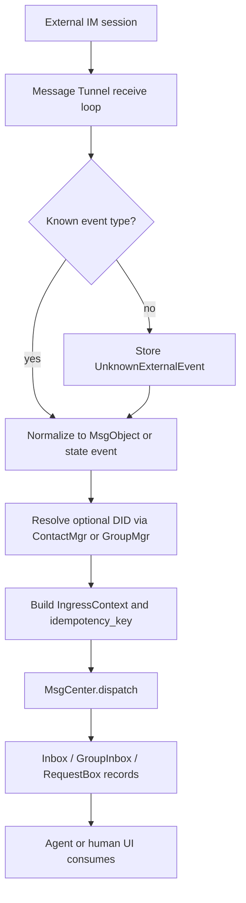
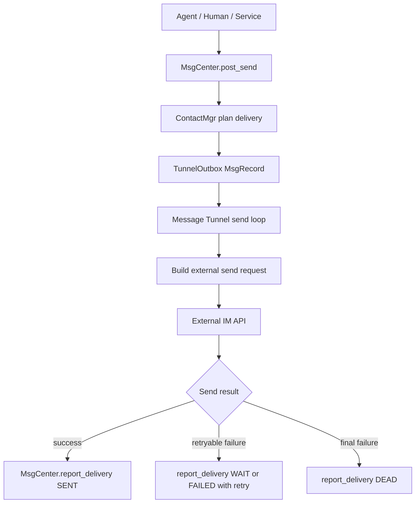

# Message Tunnel Minimal Spec

本文是给 agent/codegen 使用的最小实现说明。详细设计见 `Message Tunnel Design.md`。

## 1. 定义

Message Tunnel 是外部 IM 系统和 BuckyOS Message Center 之间的双向适配通道。它代表 IM 系统中的一个特定账号或访问通道，负责：

1. 从外部 IM 会话读取消息、会话状态和可操作事件。
2. 将外部事件标准化为 BuckyOS `MsgObject`，附带 `IngressContext`，调用 `MsgCenter.dispatch()`。
3. 从 `MsgCenter` 的 `TunnelOutbox` 拉取待投递 `MsgRecordWithObject`。
4. 将标准消息反向转换为外部 IM 可接受的消息或操作，发送后调用 `MsgCenter.report_delivery()`。

Message Tunnel 不负责 Agent 如何思考、回复和保存响应。Agent 处理完消息后，应通过 `MsgCenter.post_send()` 创建出站投递任务。

## 2. 现有基础类型

以下类型已在 BuckyOS 中定义，本文只使用，不重新定义：

- `DID`：BuckyOS 内部身份标识。
- `ObjId`：NamedObject ID。
- `MsgObject`：不可变消息对象，来自 `ndn_lib`。
- `MsgContent`、`MsgContentFormat`：消息正文、附件引用和机器可读内容。
- `MsgObjKind`：消息类型，例如 `Chat`、`GroupMsg` 等。
- `BoxKind`：`Inbox`、`Outbox`、`GroupInbox`、`TunnelOutbox`、`RequestBox`。
- `MsgState`：`Unread`、`Reading`、`Readed`、`Wait`、`Sending`、`Sent`、`Failed`、`Dead`、`Deleted`、`Archived`。
- `IngressContext`、`SendContext`、`RouteInfo`、`DeliveryInfo`、`MsgRecord`、`MsgRecordWithObject`、`MsgReceiptObj`。
- `MsgTunnel` trait 和 `MsgTunnelInstanceMgr`。

若实现需要升级上述基础类型，应先明确原因并单独提交协议变更文档。

## 3. 新增或扩展概念

### 3.1 外部引用

外部 IM 的账号、会话、消息 ID 默认保留为外部语义，不强制映射成 DID。只有当 BuckyOS 需要对它们做权限、路由、持久身份或群实体管理时，才通过 ContactMgr 或 GroupMgr 绑定到 DID。

```rust
/// 外部 IM 平台标识。建议使用稳定小写字符串，例如 "telegram"、"lark"、"email"、"messagehub"。
pub type PlatformId = String;

/// 外部 IM 账号 ID。它是平台语义下的字符串，不一定对应 BuckyOS DID。
pub type ExternalAccountId = String;

/// 外部 IM 会话 ID。可能是私聊、群聊、频道、邮件线程或应用内会话。
pub type ExternalConversationId = String;

/// 外部 IM 消息 ID。只在某个平台、账号、会话范围内有唯一性。
pub type ExternalMessageId = String;

/// 外部参与者引用。用于保留原平台语义，并为可选 DID 映射提供位置。
#[derive(Debug, Clone, Serialize, Deserialize)]
pub struct ExternalActorRef {
    /// 平台 ID。
    pub platform: PlatformId,
    /// 平台账号 ID。
    pub account_id: ExternalAccountId,
    /// 可选显示名。
    pub display_name: Option<String>,
    /// 可选平台 handle，例如 Telegram username、Lark open_id、email address。
    pub display_id: Option<String>,
    /// 如果 ContactMgr 已经解析出内部身份，填入对应 DID。
    pub mapped_did: Option<DID>,
    /// 平台特有扩展字段。未知字段必须可保留。
    pub extra: serde_json::Value,
}

/// 外部会话引用。
#[derive(Debug, Clone, Serialize, Deserialize)]
pub struct ExternalConversationRef {
    /// 平台 ID。
    pub platform: PlatformId,
    /// 会话 ID。
    pub conversation_id: ExternalConversationId,
    /// 会话类型。
    pub kind: ExternalConversationKind,
    /// 可选内部群 DID 或会话 owner DID。
    pub mapped_did: Option<DID>,
    /// 原平台扩展字段。
    pub extra: serde_json::Value,
}

#[derive(Debug, Clone, Serialize, Deserialize)]
pub enum ExternalConversationKind {
    /// 1v1 会话。
    Direct,
    /// 多人会话或群聊。
    Group,
    /// 群聊里的子群、话题、线程或临时会话。
    Subgroup,
    /// 邮件 thread、频道、工单等不能归入上述类型的会话。
    Thread,
    /// 平台新增未知类型。必须降级保留，不得 panic。
    Unknown(String),
}
```

### 3.2 Tunnel 类型

```rust
/// Tunnel 代表的账号类型。
#[derive(Debug, Clone, Serialize, Deserialize)]
pub enum TunnelAccountKind {
    /// 平台机器人账号。受平台 Bot API 限制。
    Bot,
    /// 自然人账号或用户授权账号。权限更接近真实用户。
    User,
    /// 系统内置通道，例如 MessageHub。
    System,
}

/// Message Tunnel 的能力声明。
#[derive(Debug, Clone, Serialize, Deserialize)]
pub struct TunnelCapabilities {
    /// 是否可读取外部消息。
    pub ingress: bool,
    /// 是否可发送外部消息。
    pub egress: bool,
    /// 是否可同步会话成员、加入退出、上线下线等状态。
    pub conversation_state: bool,
    /// 是否支持消息已读、送达、失败等回执。
    pub receipts: bool,
    /// 是否支持 typing、在线状态等临时状态。
    pub ephemeral_state: bool,
    /// 是否支持附件上传下载。
    pub attachments: bool,
    /// 是否支持外部平台的特殊可操作消息，例如红包、投票、小程序。
    pub interactive_objects: bool,
    /// 是否允许主动加入会话。
    pub join_conversation: bool,
    /// 是否允许向非当前来源会话发送消息。
    pub cross_conversation_send: bool,
}
```

### 3.3 标准化事件

Tunnel 应把外部输入统一降级为以下事件之一，再转换为 `MsgObject` 或状态更新：

```rust
#[derive(Debug, Clone, Serialize, Deserialize)]
pub enum TunnelIngressEvent {
    /// 普通消息、富文本、引用消息、附件消息、表情等。
    Message(ExternalMessage),
    /// 会话成员、标题、权限、禁言、上线、已读、typing 等状态变化。
    ConversationState(ExternalConversationEvent),
    /// 平台特殊可操作对象，例如红包、小程序、投票。
    InteractiveObject(ExternalInteractiveObject),
    /// 平台升级后出现的未知事件。必须持久记录并可审计。
    Unknown(UnknownExternalEvent),
}
```

```rust
/// 归一化后的入站结果。Tunnel 最终应把它转成 MsgObject 或状态更新。
#[derive(Debug, Clone, Serialize, Deserialize)]
pub struct NormalizedIngress {
    /// 原平台事件类型。
    pub event_kind: String,
    /// 可 dispatch 的消息对象。状态事件也可降级为 MsgObject。
    pub msg: Option<MsgObject>,
    /// 入站上下文，必须包含可用于回信和审计的外部来源信息。
    pub ingress_ctx: IngressContext,
    /// 幂等 key。
    pub idempotency_key: String,
    /// 不能表达为 MsgObject 的状态更新或内部操作。
    pub side_effects: Vec<NormalizedIngressSideEffect>,
}

#[derive(Debug, Clone, Serialize, Deserialize)]
pub enum NormalizedIngressSideEffect {
    /// 更新 UI session、typing、在线等临时状态。
    UpdateSessionState { key: String, value: serde_json::Value },
    /// 写入阅读或处理回执。
    WriteReceipt { receipt: MsgReceiptObj },
    /// 记录未知事件，供人工或新版本重放分析。
    StoreUnknown { event: UnknownExternalEvent },
}

/// 未知外部事件。必须可持久化、可审计、可被新版本重放。
#[derive(Debug, Clone, Serialize, Deserialize)]
pub struct UnknownExternalEvent {
    pub platform: PlatformId,
    pub tunnel_account_id: ExternalAccountId,
    pub event_kind: String,
    pub observed_at_ms: u64,
    pub fallback_text: String,
    pub raw: serde_json::Value,
}

/// 未知外部内容片段。
#[derive(Debug, Clone, Serialize, Deserialize)]
pub struct UnknownExternalContent {
    pub content_kind: String,
    pub fallback_text: String,
    pub raw: serde_json::Value,
}
```

未知事件处理原则：保留原始 payload、记录能力缺口、尽量生成可读通知或 `MsgContent.machine`，不能导致 tunnel 或 MsgCenter 崩溃。

## 4. 核心接口形状

现有 `MsgTunnel` trait 是最小运行接口。理论完整实现可在具体 tunnel 内部补齐以下逻辑，不要求一次性改公共 trait：

```rust
#[async_trait]
pub trait FullMessageTunnel: MsgTunnel {
    /// 返回账号类型和能力声明。
    fn account_kind(&self) -> TunnelAccountKind;
    fn capabilities(&self) -> TunnelCapabilities;

    /// 将外部事件转换为 BuckyOS 标准对象或状态操作。
    async fn normalize_ingress(
        &self,
        event: TunnelIngressEvent,
    ) -> anyhow::Result<NormalizedIngress>;

    /// 将 MsgCenter 出站记录转换为外部平台发送请求。
    async fn build_egress(
        &self,
        record: MsgRecordWithObject,
    ) -> anyhow::Result<ExternalSendRequest>;

    /// 上报健康状态、offset、最近错误和能力缺口。
    async fn health_report(&self) -> anyhow::Result<TunnelHealthReport>;
}
```

```rust
/// 标准出站发送请求。具体平台 tunnel 再转成平台 SDK/API 的请求。
#[derive(Debug, Clone, Serialize, Deserialize)]
pub struct ExternalSendRequest {
    /// 平台 ID。
    pub platform: PlatformId,
    /// 发送账号。
    pub sender_account_id: ExternalAccountId,
    /// 目标会话或目标 actor。
    pub target: ExternalSendTarget,
    /// 内容片段。
    pub parts: Vec<ExternalMessagePart>,
    /// 是否替换或编辑某条外部消息。
    pub replace_message_id: Option<ExternalMessageId>,
    /// 原 MsgCenter record，用于投递回报。
    pub record_id: String,
    /// 平台特有发送参数。
    pub extra: serde_json::Value,
}

#[derive(Debug, Clone, Serialize, Deserialize)]
pub enum ExternalSendTarget {
    Conversation(ExternalConversationRef),
    Actor(ExternalActorRef),
}
```

## 5. 入站流程



入站幂等 key 建议：

```text
{platform}:{tunnel_account_id}:{conversation_id}:{external_message_id}:{event_kind}
```

如果平台没有稳定 message id，应使用平台 offset、时间戳、发送方、内容摘要组合，并把可靠性标记为 `best_effort`。

## 6. 出站流程



出站投递必须通过 `record.route` 指定平台、tunnel、账号、会话地址和目标 DID。发送成功后，必须把外部 message id 写入 `DeliveryInfo.external_msg_id` 或 `RouteInfo.ext_ids`。

## 7. 会话语义

会话最小支持：

- `Direct`：1v1。
- `Group`：多人会话，成员可以是自然人、Agent、机器人。
- `Subgroup`：群内临时议题、thread、topic、子群。
- `Thread`：Email thread、MessageHub session、工单类上下文。

会话 ID 优先保留外部 ID；只有系统内需要长期管理成员、权限、展示或跨平台路由时，才创建或绑定 BuckyOS DID。

## 8. 消息内容语义

Tunnel 必须尽量映射以下内容：

- 文本、富文本、符号、表情、引用、回复、转发。
- 附件，优先保存为 `MsgContent.refs` 指向 NamedObject 或外部 URI hint。
- @、slash command、mention 等特殊字符，保留原文，同时在 `MsgContent.machine` 或 `msg.meta` 中提供结构化 mention。
- 会话状态事件，映射为 `MsgObjKind` 状态消息或 `msg.meta.machine_event`。
- 可操作消息和第三方应用消息，映射为 `MsgContent.machine`，原始 payload 放入 `msg.meta.platform_payload`。
- 未知内容，映射为 `Unknown`，保留原始 payload 和降级展示文本。

## 9. 平台子类

每个平台应有两个方向的能力裁剪：

```rust
pub struct TelegramBotMsgTunnel;
pub struct TelegramUserMsgTunnel;
pub struct LarkBotMsgTunnel;
pub struct LarkUserMsgTunnel;
pub struct EmailMsgTunnel;
pub struct MessageHubTunnel;
```

如果平台限制机器人行为，限制应体现在该子类的 `TunnelCapabilities` 和发送前校验中，不应污染通用 Message Tunnel 定义。

## 10. 可靠性要求

- 入站 offset/checkpoint 必须持久化。进程重启后从最后确认点恢复。
- 入站和出站都必须幂等。
- 发送前必须把任务持久化到 `TunnelOutbox`，发送后必须回报投递结果。
- 同一会话内应尽量保持平台顺序；跨会话不要求全局顺序。
- 对未知字段、未知 enum、未知内容类型使用兼容降级，不能 panic。
- 新版本写入的数据被旧版本读取时，旧版本应保留未知字段或降级为 `Unknown`。

## 11. 观测性要求

每个 tunnel 至少记录：

- `tunnel_did`、platform、account kind、capabilities。
- 入站事件 ID、幂等 key、转换结果、dispatch 结果。
- 出站 record_id、目标 route、外部 message id、重试次数、失败原因。
- Agent 读取和回复消息不由 Message Tunnel 执行，但 tunnel 需要能串联 record_id、msg_id、external ids 供审计。
