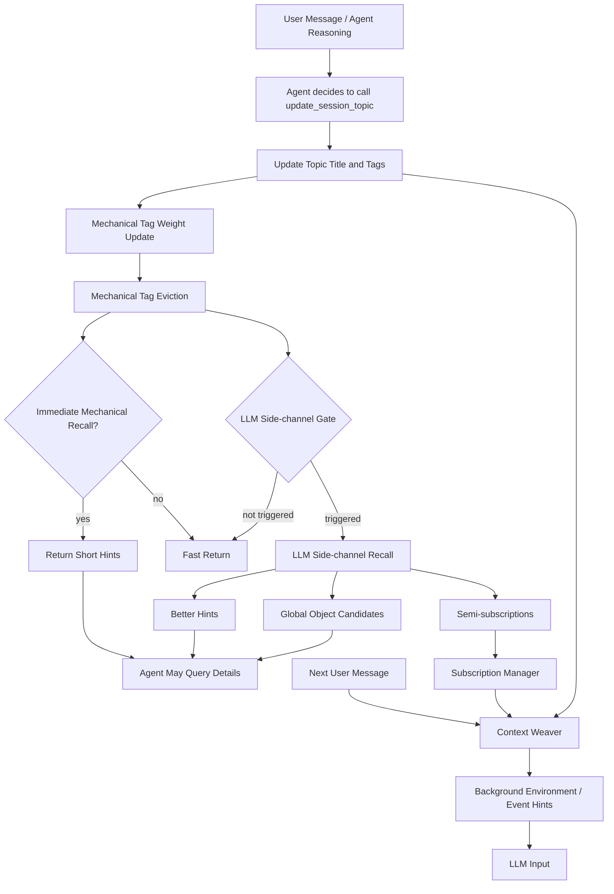

# OpenDAN Agent 如何观察世界

> 本文整理自已有草稿与补充口述信息，目标是说明 OpenDAN 如何把基于“浮现”的 Hints 体系贯穿起来，作为 Agent 跨 Session 获得全局信息、观察现实世界、并把相关信息编织进当前推理上下文的核心机制。

---

## 1. 问题背景：Agent 首先要能观察世界

如果把 Agent 的能力抽象成三件事：

1. **如何观察并了解现实世界**；
2. **如何基于观察进行推理**；
3. **如何通过工具或行动影响现实世界**；

那么“观察世界”是整个 Agent 架构中最基础的一环。

一个 Session 在启动时，本质上是一个线性的上下文窗口。除了系统提示词、工具定义和少量初始环境信息之外，Agent 并不能天然看到现实世界中已经发生的事情，也不能天然知道用户在其它 Session、Notebook、Memory、文件系统、日程、位置、项目目录、外部对象状态里留下了什么信息。

所以核心问题是：

> 在有限的线性上下文中，Agent 如何持续获得和当前任务有关的现实世界信息？

传统上，这个问题常常被归类到 RAG。但从 OpenDAN 的角度看，它更接近一个“观察系统”问题，而不仅仅是“检索增强生成”问题。

---

## 2. 两类传统方案及其问题

目前主流思路大致可以归纳成两类。

### 2.1 自动插入模式：机械式 RAG

第一类是自动插入模式。

每当用户输入一条消息，系统就在旁路中执行一次机械检索，例如：

- 全文搜索；
- 向量相似度搜索；
- 图数据库邻近节点搜索；
- 结构化索引匹配。

然后系统把召回出来的前若干个结果直接插入到用户输入前面，作为上下文的一部分交给 LLM。

这种方式的优点是“不容易漏查”。但问题也很明显：

1. **插入时机固定**：通常每次输入都查，每次输入都插。
2. **插入内容机械**：检索结果基于文本相似度或索引相关性，并不一定和当前推理目标真正相关。
3. **上下文污染严重**：用户可能只说了一句话，但系统在前面塞入大量文本块。
4. **逻辑关联弱**：LLM 在阅读上下文时，很难知道这些 block 为什么出现、和推理目标有什么关系。
5. **成本和密度高**：为了避免漏掉信息，只能高频触发和高密度插入。

这是一种“怕漏查”的工程路线。它能提高覆盖率，但代价是上下文窗口被大量背景文本占用，且这些背景文本并不天然符合 Agent 的推理流。

### 2.2 Agent Tool 模式：主动查询

第二类是 Agent Tool 模式。

系统不自动插入大量内容，而是把现实世界中的资源暴露成工具，例如：

- 文件系统查询工具；
- grep / glob；
- SQL 查询；
- RPC 接口；
- MCP 工具；
- 向量库或全文索引查询工具；
- Global Object 读取接口。

这样 Agent 可以带着意图去查。如果不查询，工具只占用少量工具定义上下文。

这种方式比机械式 RAG 更符合 Agent 的推理逻辑，因为 Agent 大致知道自己为什么要查，以及查到的信息如何服务当前目标。

但它有一个认知层面的根本问题：

> Agent 不知道自己不知道什么。

如果 Agent 没有任何线索，它就不会主动查询某件事是否存在。

例如用户说：

> 我明天中午要和某某吃饭。

如果外部日程里有冲突，Agent 必须意识到“这可能和日程冲突有关”，然后主动查询日程。但如果系统没有给出任何线索，Agent 很可能只根据当前对话继续推理，而不会想到上下文之外还有一个相关事件。

所以 Agent Tool 模式的问题不是“查不到”，而是“想不到要查”。

---

## 3. OpenDAN 的核心思路：让相关信息先“浮现”为 Hint

OpenDAN 的设计不是简单选择自动插入或主动查询其中之一，而是在两者之间加入一层“浮现机制”。

所谓“浮现”，可以理解为一种模拟人类工作记忆的机制：

- 人在对话时，并不是把所有长期记忆全部读入脑中；
- 也不是完全等到自己明确知道要查什么才查；
- 很多时候，人脑中会先浮现出一些线索；
- 如果线索足够重要，人会顺着线索去打开笔记、文件、聊天记录或外部系统，确认完整事实。

OpenDAN 中，这个浮现机制的核心是：

> **Session Topic Tag + Hints + 主动查询 / 半订阅。**

基本流程是：

1. 当前 Session 中浮现出一组 Topic Tags。
2. 系统基于这些 Topic Tags 召回一组 Hints。
3. Hints 不要求包含完整事实，只要告诉 Agent“某件相关事情存在”。
4. Agent 后续可以基于这些 Hints 决定是否主动查询详细信息，或者订阅相关对象状态变化。

这解决了主动查询模式中的关键问题：

> Agent 不需要一开始就知道所有事实，但它需要知道“可能有这么一件相关的事”。

### 3.1 Notepad 与 Memory 的本质区分

主流 memory 方案常把两种不同的东西混成一个系统，导致两边都不到位。OpenDAN 把它们分开看待：

| 维度 | Notepad | Memory |
|---|---|---|
| 写入语义 | “请记下来”（显式） | “刚才发生了”（沉淀） |
| 内容形态 | 事实 / 规则 / 提醒 | 经历 / 感觉 / 线索 |
| 召回需求 | 精确匹配 / 必然召回 | 联想浮现 / 可能相关 |
| 写入者 | 用户主导（含 Agent 显式调用） | 系统主导 |
| Prompt 位置 | system prompt | 紧贴 user msg |
| 失败模式 | 漏掉 = 灾难 | 没浮现 = 可接受 |

`update_session_topic` **属于 Notepad 子系统的工具** —— 由 Agent 显式调用、写入精确的事实条目（本 Session 当前在谈什么）。但它写入的内容会被 **Memory 浮现层** 消费：未来 Session 在合适时机浮现“昨天讨论过 X (session: …)”时，topic 行就是浮现产物的来源。

简言之：

> **写入是 Notepad 语义，消费是 Memory 语义。**

这条工具是把“事实级 topic”和“启发式浮现”对接的桥。

### 3.2 浮现 = pointer + hint + 延迟具象化

整个浮现机制可以归纳为三个层次，复用同一个文件系统抽象（`session_dir` 是天然的锚）：

1. **“这里有东西”**：浮现产物只是 *awareness* —— 一个 Session 存在、它大致谈了什么；
2. **“它在哪”**：Session ID 作为锚点，文件系统路径作为统一 schema（不引入专门的 memory API）；
3. **“用的时候再展开”**：浮现阶段每条线索只占 20–50 token；模型判断要不要深入时再触发对文件级资产的“深度调用”。

`update_session_topic` 写入的 **topic 行**就是这一层的 “hint”，`session_id` 就是 pointer，`session_dir` 下的 history / artifacts 就是延迟具象化的目标。

---

## 4. 核心概念

### 4.1 Session

Session 是 Agent 当前正在进行的一段线性上下文。它可能是一次聊天、一次任务执行、一次代码修改、一次旅行计划制定，或一次跨工具的工作流。

Session 的本质特征是：

- 它是线性的；
- 它有上下文窗口限制；
- 它承载当前正在进行的推理；
- 它不能直接容纳所有长期记忆和全局状态。

### 4.2 Session Topic Tag

Session Topic Tag 是当前 Session 的“工作焦点标签”。

它不是长期记忆，也不是完整任务描述，而是类似人脑工作记忆中的当前关注点列表。

例如：

```text
OpenDAN
Agent Memory
Session Topic
RAG
旅行计划
Booking
NFL
49ers
```

这些 Tags 的作用是帮助系统判断：

- 当前 Session 正在围绕什么话题展开；
- 哪些 Memory / Notebook / 历史 Session / Global Object 可能相关；
- 是否需要触发 Hints 召回；
- 是否需要对某些环境状态进行半订阅。

### 4.3 Last Topic Title / Last Session Title

系统除了维护一组 Tags，还应维护一个更自然语言化的当前主题标题，例如：

```text
讨论 OpenDAN 中基于 Session Topic 的浮现式 Hints 召回机制
```

这个标题可以理解为当前 Session 的一句话摘要。它的意义是：

- 为 Tags 提供语义解释；
- 帮助后续 Session 级别召回；
- 作为历史 Session 的可索引标题；
- 给 Agent 一个更接近任务意图的当前工作描述。

### 4.4 Hint

Hint 是“线索”，不是完整上下文。

Hint 的目标不是把所有事实都塞进上下文，而是告诉 Agent：

> 有一个可能相关的对象、事实、记忆、笔记或历史 Session 存在。

一个好的 Hint 应该包含：

- 它指向什么对象；
- 为什么和当前 Topic 有关；
- 它大概是什么类型的信息；
- Agent 是否需要进一步查询；
- 如有必要，是否可以订阅其状态变化。

Hint 不应该默认携带大段原始文本。

### 4.5 Global Object

Global Object 是 OpenDAN 中对现实世界数字化状态的一种抽象。

从心智模型上看，可以认为：

> 数字世界中的所有状态，都可以通过一个巨型文件系统访问。

也就是说，某个对象可以用类似下面的结构定位：

```text
hostname / object_id / path
```

其中：

- `hostname` 表示对象所在的系统或命名空间；
- `object_id` 表示具体对象；
- `path` 表示对象中的某个状态、属性或字段。

Memory、Notebook、历史 Session、文件目录、项目状态、用户位置、日程、设备状态、外部服务状态，都可以被抽象为 Global Object。

---

## 5. `update_session_topic`：浮现机制的标准工具入口

`update_session_topic` 是 Agent 观察世界机制中的一个关键工具。

它的职责不是直接回答用户问题，而是维护当前 Session 的 Topic 状态，并在必要时触发 Hints 召回或环境状态订阅。

从 Agent 角度看，它是一个标准工具：

```text
Agent 在发现当前任务主题发生变化、收敛或深化时，调用 update_session_topic。
```

典型输入可以包括：

- 当前 Topic Title；
- 一组 Topic Tags；
- 每个 Tag 的简短理由；
- 当前变化是否显著；
- 可选的召回策略参数。

示意：

```json
{
  "title": "讨论 OpenDAN 的 Session Topic 与 Hints 召回机制",
  "tags": [
    { "name": "OpenDAN", "reason": "当前讨论的系统架构" },
    { "name": "Session Topic", "reason": "当前机制核心" },
    { "name": "Hints", "reason": "用于浮现相关信息" },
    { "name": "Agent Memory", "reason": "召回来源之一" }
  ]
}
```

典型输出可以包括：

- 更新后的 Topic Title；
- 当前仍然新鲜的 Tags；
- 被增强的 Tags；
- 被淘汰的 Tags；
- 立即召回的 Hints；
- LLM 旁路是否触发；
- 新创建的半订阅；
- 下一次上下文编织时需要关注的 Background Information。

但需要强调：

> `update_session_topic` 不一定每次都执行完整召回。它可以只是快速更新 Topic，然后返回。

### 5.1 调用时机：反例

期望模型在以下时机调用：用户首条消息已让主题清晰、话题发生显著漂移、Session 即将进入长尾。下列情况**不应触发**：

- 用户随手聊一句、和当前任务无关的边角问答；
- 模型自己内部的中间步骤；
- 当前 topic 的细微展开（不是漂移）。

主题更新本身是 Agent 的元行为，调用频率应远低于普通工具调用。工具描述（给 LLM 看的 system prompt 片段）必须明确：只在主题首次明确或显著漂移时调用、写给“未来的自己”而不是给用户看、不是会话总结、不要堆细节。

### 5.2 同步契约：永不 pending

`update_session_topic` 的工具结果遵守 `success | error` 协议，**永不返回 pending**。具体约束见 §10.3，这里先给出对 Agent 状态机的含义：

- Agent 拿到 `success` 时可以确信：要么没召回（`recall` 字段为 None），要么召回已完成（`recall` 字段含完整条目）；
- 即便召回失败（超时 / 旁路 LLM 报错），工具仍 `success`，因为 Tag 更新这一“保底语义”已经完成；
- **不存在“工具已返回但召回还在后台跑”的中间状态** —— Agent 侧不需要处理异步召回的事件回调。

### 5.3 调用语义补充

- **覆盖写**（非 append）。一个 Session 同一时刻只有一个 topic；
- **幂等**：相同 topic 内容重复调用对 `topic.md` 是 no-op；但 tags 的变化仍会触发 Tag 集合更新与可能的召回；
- **历史可追溯但不必暴露给 LLM**：底层把每次更新落到 `topic_log.jsonl`（运维 / 审计用），但工具对外只承诺“当前 topic = 最后一次写入”；
- **隔离边界**：不允许跨 Session 写他人的 topic（边界 = session_id）；
- **单行 ≤ 120 字符校验**：topic title 单行、人类可读、对未来的“我”友好。

### 5.4 文件布局

复用 `session_dir` 作为锚，避免引入第二套 memory 数据库：

```
{session_dir}/
  .meta/
    topic.md           # 当前 topic（覆盖写）
    topic_log.jsonl    # 历次更新审计（append-only，可选）
    tag_set.json       # 当前 Tag 集合状态（含权重、时间戳、tier）
    subscriptions.json # 当前活跃的状态订阅（由 LLM 召回路径产生）
  round_history/       # 见 session-history 设计
  ...
```

`topic.md` 内容形态：

```markdown
---
session_id: 2026-05-12-xxx
updated_at: 2026-05-12T15:30:00Z
tags: [llm-context, design]
---

讨论 LLM Context 设计与“浮现”式 Memory 的工程实现
```

`tag_set.json` 内容形态：

```json
{
  "capacity": 8,
  "tags": [
    {
      "name": "llm-context",
      "weight": 3.2,
      "last_touched": "2026-05-12T15:30:00Z",
      "tier": "active"
    }
  ],
  "last_recall_turn": 12,
  "last_recall_at": "2026-05-12T15:25:00Z"
}
```

全局索引由浮现层另行维护，本工具不负责索引，只承诺：写完 `topic.md` 后浮现层最终能看到。

---

## 6. Session Topic Tag 的数量限制与机械淘汰

Session Topic Tag 是当前工作记忆，不是长期记忆。

因此它必须有数量上限。

例如可以设定：

```text
max_session_topic_tags = 8
```

这个值可以配置，但原则上不应无限增长。

如果 Tags 无限增长，Session Topic 会重新退化成长期上下文污染，导致：

- 当前工作焦点模糊；
- 主题漂移；
- 召回范围越来越大；
- 上下文编织越来越重；
- 当前 Session 失去“正在做什么”的表达能力。

### 6.1 Tag 权重

每个 Tag 都有一个动态权重。

权重主要由两个因素决定：

1. **反复被提到会增强权重**；
2. **随着时间流逝，权重自然衰减**。

可以抽象成：

```text
tag_score = mention_weight × time_decay
```

如果某个 Tag 在最近多轮对话中持续出现，它的权重会升高；如果一个 Tag 曾经重要但长时间没有再出现，它会自然降权。

参考实现（v0.2 默认）：

```text
score = weight * exp(-(now - last_touched) / TAU)
TAU = 30 分钟（可配置）
```

新 Tag 进入流程：

1. 若已存在同名 Tag → 权重 `+= 1.0`，`last_touched` 更新为当前时间；
2. 若不存在 → 以 `weight=1.0, tier=Transient` 加入；
3. 容量超限时：计算每个 transient Tag 的 score，淘汰得分最低者。

`tier` 字段（Pinned / Active / Transient）保留接口但 v0.2 全部置为 Transient；tier 升降级未来由 LLM 召回路径调用。

### 6.2 机械淘汰

当当前 Tags 数量达到上限，又有新的 Tag 进入时，系统必须淘汰旧 Tag。

淘汰逻辑应该是机械式的：

```text
淘汰当前 score 最低的 Tag
```

也就是综合考虑：

- 最近是否被提到；
- 被提到的频率；
- 当前权重；
- 时间衰减；
- 是否已经不再与当前 Topic Title 匹配。

这套淘汰逻辑不应每次都依赖 LLM 判断。LLM 可以帮助生成或解释 Tags，但 Tag 的冷热管理和容量淘汰应尽量确定、稳定、可调试。

### 6.3 工作记忆而非长期记忆

Tag 被淘汰不代表信息丢失。

它只表示：

> 这个话题不再属于当前 Session 的工作焦点。

真正长期有价值的信息应该进入：

- Memory；
- Notebook；
- 历史 Session；
- Global Object；
- 归档系统。

Session Topic 只负责表达当前 Session 的短期注意力。

---

## 7. 召回机制：从 Topic 到 Hints

OpenDAN 的召回不是直接基于用户刚说的一句话，而是优先基于当前浮现出的 Session Topic。

这点非常关键。

传统 RAG 常常是：

```text
User Message -> Vector Search -> Insert Blocks -> LLM
```

OpenDAN 更接近：

```text
User Message / Agent Reasoning
  -> update_session_topic
  -> Session Topic Tags
  -> Recall Hints
  -> Agent decides query / subscribe / ignore
```

也就是说，召回依据从“单条输入消息”升级为“当前 Session 的主题状态”。

这会带来几个好处：

1. Topic 比单条输入更稳定；
2. Topic 更接近 Agent 的任务意图；
3. Hints 可以更短、更有解释性；
4. Agent 可以基于 Hint 主动追问或查询；
5. 系统不必每次都插入大段文本块。

### 7.1 Hints 的来源

Hints 可以来自多个系统：

- Memory：用户偏好、长期事实、稳定背景；
- Notebook：用户或 Agent 记录的结构化笔记；
- 历史 Session：过去曾经讨论过的相关任务；
- 文件系统：项目目录、文档、代码、配置；
- Global Object：日程、位置、设备、应用状态、远程服务状态；
- Search Index：全文索引、向量索引、图索引等。

例如当前 Topic 出现 `NFL`，系统可能召回：

```text
Hint: 用户长期偏好 49ers。
Source: Memory
Reason: 当前 Session Topic 包含 NFL。
```

也可能召回：

```text
Hint: 之前有一个 Session 讨论过今年超级碗门票搜索。
Source: Historical Session
Reason: 当前 Topic 包含 NFL / ticket / event planning。
```

注意，这些 Hint 不一定包含完整门票搜索结果。它们只需要让 Agent 知道：“这件事存在，可能值得查”。

---

## 8. 机械召回与 LLM 旁路召回

从实现上，OpenDAN 可以同时保留两套召回机制：

1. 机械召回；
2. LLM 旁路召回。

### 8.1 机械召回

机械召回是低成本、确定性的。

它可以在 `update_session_topic` 调用后立即执行，例如：

- Tag 匹配；
- 全文检索；
- Notebook 标题匹配；
- Memory 关键词匹配；
- 历史 Session Title 匹配；
- 简单向量相似度搜索。

机械召回可以直接返回一组短 Hints。

它适合处理：

- 明确命中的长期记忆；
- 明确命中的 Notebook；
- 历史 Session 的标题级召回；
- 与当前 Tags 直接相关的对象列表。

机械召回的原则是：

> 返回“可能相关的线索”，而不是把大段信息直接插入上下文。

### 8.2 LLM 旁路召回

LLM 旁路召回用于更复杂的语义判断。

它可以在 Topic 变化较剧烈、或者系统判断当前 Topic 可能需要更复杂背景理解时触发。

LLM 旁路可能判断：

- 哪些 Memory / Notebook / Session 真正值得提示；
- 当前 Topic 是否意味着一个新的任务阶段；
- 是否应该恢复某个历史 Work Session；
- 是否应该关注某些动态环境状态；
- 是否应该创建半订阅；
- 是否需要在后续 User Message 前注入背景信息。

重要原则是：

> 环境感知与状态订阅，应该通过 LLM 旁路产生。

机械召回可以返回静态 Hints，但如果系统要开始关注“位置”“日程”“时间窗口”“项目目录变化”“某个外部对象状态”等动态环境，应该由 LLM 旁路判断其必要性。

---

## 9. LLM 旁路触发阀门

LLM 旁路有成本，因此不能每次 `update_session_topic` 都触发。

需要一个阀门机制。

核心可以由两个因素控制。

### 9.1 距离上一次旁路触发的距离

系统应记录上一次 LLM 旁路触发时间或轮次：

```text
last_llm_recall_at
```

如果上一次刚触发过，则短时间内不应重复触发。

这个距离可以按：

- 对话轮次；
- 时间间隔；
- Agent step 数；
- Topic 更新次数；

来计算。

### 9.2 Topic 改变的剧烈程度

另一个因素是 Topic Change Intensity。

如果 Session Topic 长时间稳定，但突然出现明显变化，就应提高触发概率。

典型信号包括：

- 一次加入多个新 Tags；
- 多个旧 Tags 被淘汰；
- Topic Title 语义方向明显变化；
- Tag 权重分布大幅变化；
- 用户从一个任务域跳到另一个任务域；
- 当前 Topic 命中了需要动态环境感知的领域，例如旅行、booking、日程安排、位置相关任务。

可以抽象成：

```text
should_trigger_llm_side_channel =
  distance_from_last_trigger > cooldown_threshold
  AND topic_change_intensity > change_threshold
```

实际实现中也可以是加权分数：

```text
trigger_score =
  α * distance_score
  + β * new_tag_score
  + γ * evicted_tag_score
  + δ * semantic_shift_score
  + ε * environment_sensitivity_score
```

当 `trigger_score` 超过阀门值时，触发 LLM 旁路。

参考默认（v0.2）：

```text
distance_threshold = 5      # 距离上一次召回的对话轮次
change_threshold   = 0.5    # (added + removed) / tag_set.len()

# 阀门判定三态
if change_ratio >= change_threshold:
    return LLM           # 剧烈变化 → 走深度路径
elif turns_since_last_recall >= distance_threshold:
    return Mechanical    # 距离够 → 走轻量路径
else:
    return NotTriggered  # 阀门未突破，直接 success 返回
```

> 阀门策略必须可配置（通过 `RecallPolicy` 结构注入），不得硬编码常量。

### 9.3 旁路不是必然召回全文

即使触发了 LLM 旁路，也不意味着一定要读取大量数据。

LLM 旁路可能只产生：

- 一组更精确的 Hints；
- 一组待关注 Global Objects；
- 一组半订阅；
- 一个“暂不召回”的决策；
- 一个对当前 Topic 的重写或合并建议。

---

## 10. 召回时机：立即召回与延迟召回

召回不一定发生在 `update_session_topic` 的同一次调用中。

系统可以有两类召回时机。

### 10.1 立即召回

当 Topic 变化较明显，或者机械检索命中明确对象时，`update_session_topic` 可以直接返回 Hints。

流程是：

```text
update_session_topic
  -> 机械式更新 Tag 权重
  -> 执行 Tag 淘汰
  -> 机械召回 Memory / Notebook / Session / Object Hints
  -> 返回 Hints
```

这种模式适合低成本召回，尤其适合：

- Memory 中的一句话事实；
- Notebook 中的标题级线索；
- 历史 Session 的摘要级线索；
- 明确命中的对象引用。

### 10.2 延迟召回 / 半订阅召回

另一类召回并不立即返回完整 Hints，而是创建状态关注关系。

例如当前 Topic 涉及：

- 旅行计划；
- booking；
- 日程安排；
- 地点变化；
- 开发目录变化；
- 某个外部对象的实时状态。

LLM 旁路可能判断：

> 当前 Session 应该关注用户位置、日程或某个对象状态的变化。

于是系统不是立刻把所有信息读出来，而是创建一个半订阅。

后续当：

- 下一条 User Message 到达；
- 被订阅对象状态发生变化；
- Background Environment 编织阶段执行；

系统再把相关变化作为背景信息插入到 LLM 输入前。

示意：

```text
User Message 到达
  -> Context Weaver 检查当前 Session Topic
  -> 检查半订阅对象是否变化
  -> 生成 Background Information
  -> 插入到 User Message 前
  -> LLM 推理
```

这类似系统在用户输入前插入当前时间，但范围可以扩展到更多动态状态。

### 10.3 工程契约：互斥二选一 + 同步等待

> **机械召回与 LLM 召回是互斥的二选一关系**。一旦判定触发召回，`update_session_topic` 工具调用会**同步等待召回完成**才返回 `success`，召回结果作为工具返回值的一部分交付。

含义：

- 调用方（Agent）拿到 `success` 时可以确信：要么没召回（`recall` 字段为 None），要么召回已完成；
- **不存在“工具已返回但召回还在后台跑”的中间状态**；
- 简化 Agent 侧状态机：无需处理异步召回的事件回调；
- LLM 旁路超时（默认 10s）归入 `Failed` 状态，工具仍 `success`。

若未来需要异步语义，应另开新的召回入口（如 `OnUserMessageEnter` 钩子），而不是改变本工具的契约。

---

## 11. 半订阅机制：介于自动插入与主动查询之间

半订阅是 OpenDAN 观察世界机制中的一个重要设计。

它既不是每次都把对象完整内容塞进上下文，也不是完全等 Agent 主动查询。

它的基本思想是：

1. Topic 浮现后，系统识别出一组相关 Global Objects；
2. Agent 或 LLM 旁路判断这些对象值得关注；
3. 系统订阅这些对象的某些状态变化；
4. 当变化发生时，以 Background Hint 的方式注入上下文；
5. Agent 再决定是否读取完整对象。

例如：

### 11.1 旅行计划

当前 Topic 包含：

```text
旅行计划
Booking
机票
酒店
地点
```

LLM 旁路可能创建订阅：

```text
订阅用户当前位置变化
订阅用户时区变化
订阅相关日程变化
订阅航班价格或 booking 状态变化
```

当用户位置变化时，系统可以在下一次输入前插入：

```text
Background Hint:
用户当前位置已从 A 城市变化到 B 城市。当前 Session Topic 涉及旅行计划和 booking，因此该位置变化可能影响推荐、时间换算或票务选择。
```

### 11.2 日程安排

用户说：

```text
我明天中午要和某某吃饭。
```

Topic 浮现：

```text
日程
午餐
某某
明天中午
```

系统可能半订阅或检查日历冲突。如果发现变化或冲突，注入：

```text
Background Hint:
明天中午用户日程中已有一个可能冲突的安排。当前 Session Topic 涉及约饭安排，建议确认时间冲突。
```

### 11.3 开发目录变化

当前 Topic 涉及某个代码项目。

系统可能订阅项目目录状态。

如果该目录在其它地方被修改，后续输入前可注入：

```text
Background Hint:
当前 Session 相关的开发目录在外部发生了变化。建议在继续修改前检查最新文件状态。
```

---

## 12. 召回结果如何显示与注入

召回结果不应该简单等同于“把一堆文本插入上下文”。

OpenDAN 中可以把召回结果分为几种显示层级。

### 12.1 工具返回级 Hints

这是 `update_session_topic` 的直接返回。

适合展示给 Agent，而不是直接展示给用户。

格式应短小、结构化、带理由：

```text
Hint:
- Type: Memory
- Summary: 用户偏好 49ers。
- Reason: 当前 Topic 包含 NFL。
- Action: 如需要讨论球队偏好，可主动查询该 Memory 详情。
```

### 12.2 Background Environment 注入

这是在下一次 LLM 输入前插入的背景信息。

它类似当前时间、地点等环境信息，但必须说明为什么出现。

示意：

```text
[Background Environment]
- 当前时间：2026-05-26 18:30 America/Los_Angeles
- 当前 Session Topic：旅行计划 / Booking / 地点
- 相关状态变化：用户位置发生变化，可能影响当前旅行计划。
```

这类信息不是用户主动说的，但它是当前推理环境的一部分。

### 12.3 Event Hint 注入

当半订阅对象发生变化时，可以插入事件级 Hint：

```text
[Background Event]
Object: calendar://user/main/events/2026-05-27-noon
Change: 发现明天中午存在已有安排
Reason: 当前 Session Topic 涉及午餐约会安排
Suggested Action: 在确认约饭前检查日程冲突
```

### 12.4 不直接暴露完整读取方法

在很多情况下，第一阶段 Hint 不应直接暴露完整读取方法。

原因是：

> 一旦 Agent 知道可以读取某个对象的完整路径，它可能会非常积极地查询，造成大量冗余读取。

因此可以采用分阶段披露：

1. 第一阶段只暴露对象存在和相关理由；
2. 如果状态变化发生，或 Agent 明确需要更多信息，再暴露读取方法；
3. 对于一些高频对象，只允许订阅，不允许主动全量读取；
4. 对于敏感对象，必须通过权限和策略控制。

这是一种工程上的频率控制。

---

## 13. Context Weaving：每次输入前都有机会基于 Topic 编织上下文

`update_session_topic` 不只是一个更新 Tags 的工具，它更像是 Context Weaving 的入口之一。

只要当前 Session Topic 仍然新鲜，那么每一次新的 LLM 输入前，系统都有机会基于它编织上下文。

流程可以是：

```text
New User Message
  -> 读取当前 Session Topic
  -> 检查 Topic Tags 是否仍然新鲜
  -> 检查机械 Hints 是否需要刷新
  -> 检查半订阅状态是否变化
  -> 生成 Background Information
  -> 与 User Message 一起输入 LLM
```

这意味着：

- 召回可以发生在 `update_session_topic` 当下；
- 也可以发生在下一条 User Message 到达前；
- 也可以由订阅对象状态变化触发；
- 还可以由 Context Weaver 按策略周期性检查。

关键原则是：

> Topic 是持续存在的短期工作状态，而不是一次性检索 query。

---

## 14. 总体流程图



---

## 15. 推荐的内部模块划分

可以把整个系统拆成以下模块。

### 15.1 SessionTopicManager

负责：

- 接收 `update_session_topic` 调用；
- 更新 Topic Title；
- 合并或新增 Tags；
- 维护 Tag 权重；
- 执行容量限制和淘汰；
- 计算 Topic Change Intensity。

### 15.2 TopicTagStore

负责存储当前 Session 的 Topic 状态。

每个 Tag 可以包含：

```json
{
  "name": "Session Topic",
  "weight": 0.86,
  "first_seen_at": "...",
  "last_seen_at": "...",
  "mention_count": 5,
  "source": "agent_tool_call",
  "status": "active"
}
```

### 15.3 HintRecallEngine

负责机械召回。

输入：

- Topic Title；
- 当前 Tags；
- Tag 权重；
- Session ID；
- User / Agent profile；
- 检索预算。

输出：

- Memory Hints；
- Notebook Hints；
- Historical Session Hints；
- Global Object Hints；
- 去重后的短线索集合。

### 15.4 LLMSideChannel

负责复杂语义判断。

触发后，它可以判断：

- 当前 Topic 是否代表重要迁移；
- 哪些 Hints 真正值得保留；
- 是否需要创建半订阅；
- 是否需要关注环境状态；
- 是否需要延迟召回而不是立即召回。

### 15.5 SubscriptionManager

负责半订阅。

它维护：

- 订阅对象；
- 订阅字段；
- 订阅理由；
- 对应 Topic；
- TTL；
- 最近触发时间；
- 是否允许暴露读取方法。

订阅生命周期：

- **创建**：仅由 LLM 召回路径产出；
- **TTL**：默认与产生它的 Tag 绑定 —— 订阅记录中显式带 `bound_tags: Vec<String>`，**Tag 被淘汰，对应订阅自动失效**；
- **去重**：同一类订阅（如“地理位置”）多次注册时合并为一条，更新最新 Tag 关联；
- **退订**：Session 结束时全部清理；或 Tag tier 被降级至淘汰时清理。

订阅与 Tag 在数据结构上必须**显式关联**，以支持级联清理；这是实现层的硬约束，不可省。

### 15.6 ContextWeaver

负责在 LLM 输入前编织背景信息。

它读取：

- 当前 Session Topic；
- 仍然有效的 Hints；
- 半订阅事件；
- 当前时间、地点等环境信息；
- 策略预算。

然后生成简短、可解释的 Background Information。

### 15.7 GlobalObjectSystem

负责把现实世界的数字状态抽象成对象系统。

它提供：

- 对象定位；
- 状态路径；
- 事件订阅；
- 可选读取；
- 权限控制；
- 对象到 Hint 的解释能力。

### 15.8 三子系统硬解耦：RecallService 抽象

整套机制由三个**独立可演化**的子系统构成：

| 子系统 | 职责 | 何时执行 |
|---|---|---|
| **A. Topic / Tag 更新** | 维护 Session Tag 集合（增删 + 淘汰） | `update_session_topic` 调用时 |
| **B. 基于 Topic 的召回** | 以当前 Tag 为背景信息，从 Memory / Notebook / Global Object 中检索条目 | 任意触发点（当前仅 `update_session_topic`，但接口开放） |
| **C. 召回信息的呈现** | 决定召回结果以何种形式、在何时进入 LLM 上下文 | 立即返回 / 背景注入 / 状态订阅触发 |

> **关键约束**：三者必须通过定义良好的数据交换协议解耦。实现时，B 子系统必须抽象为独立的 `RecallService`，**不得**把召回逻辑直接耦合到 `update_session_topic` 工具实现内部。`update_session_topic` 是 `RecallService` 的**调用方，不是实现者**，两者必须在不同的模块 / crate 中。

参考 trait 定义（Rust 风格示意）：

```rust
trait RecallService {
    async fn recall(
        &self,
        tags: &TagSet,
        mode: RecallMode,
        policy: &RecallPolicy,
    ) -> RecallResult;
}

enum RecallMode {
    Mechanical,
    LLM,
    Auto,  // 由 policy 的阀门判定决定
}

enum RecallResult {
    NotTriggered,
    Recalled {
        items: Vec<RecallItem>,
        subscriptions: Vec<Subscription>,  // 仅 LLM 路径可能产出
    },
    Failed { reason: String },
}
```

未来可在其他位置接入新的召回入口（例：`OnUserMessageEnter`、长时间无活动、外部事件到达），复用同一个 `RecallService`。

---

## 16. 策略控制点

这套系统的价值很大程度上取决于策略可调。

### 16.1 Tag 数量上限

默认可以从 8 个左右开始。

数量过少会漏掉并行工作主题；数量过多会导致召回发散。

### 16.2 Tag 衰减速度

衰减速度决定 Topic 的“记忆长度”。

- 衰减太快：Session 容易丢失刚才讨论过的方向；
- 衰减太慢：旧 Topic 过久残留，导致召回污染。

### 16.3 LLM 旁路冷却时间

控制旁路成本。

- 冷却太短：成本高，频繁打扰；
- 冷却太长：Topic 迁移时反应迟钝。

### 16.4 Topic Change Intensity 阈值

决定什么时候认为话题发生剧烈变化。

可结合：

- 新 Tag 数量；
- 淘汰 Tag 数量；
- Title 语义变化；
- Tag 权重变化；
- 当前领域是否环境敏感。

### 16.5 Hint 数量预算

Hints 应该少而精。

推荐原则：

- 一次不要返回太多；
- 优先返回解释性强的；
- 优先返回“存在性线索”；
- 避免直接插入大段内容；
- 对重复 Hints 做合并。

### 16.6 读取方法披露策略

为了避免 Agent 过度查询，可以分层披露能力：

1. 只告诉 Agent 有相关对象；
2. 允许订阅对象变化；
3. 在事件发生或任务需要时才暴露读取方法；
4. 对高成本对象设置查询预算；
5. 对敏感对象设置权限确认。

### 16.7 策略矩阵参考默认值

集中列出 v0.2 的可调维度及默认值，方便实现者一次性看清：

| 维度 | 选项 | 当前默认 |
|---|---|---|
| Tag 容量 | 整数 | 8 |
| Tag 分层 | pinned / active / transient | 全 transient（v0.2 简化） |
| 衰减常数 TAU | 时长 | 30 分钟 |
| 距离阀门 | turn 间隔 | 5 |
| 剧烈度阀门 | (add+remove)/total 比例 | 0.5 |
| 召回路径选择 | mechanical / llm / auto | auto |
| 召回入口 | `update_session_topic` | 仅此一个（接口开放） |
| 呈现通道 | tool result / bg inject / sub trigger | 三通道并存 |
| LLM 召回超时 | 时长 | 10s |
| topic title 长度 | 字符上限 | 120 |

---

## 17. 与传统 RAG 的关键区别

OpenDAN 的 Hints 体系与传统 RAG 的区别可以总结如下。

| 维度 | 传统机械 RAG | OpenDAN 浮现式 Hints |
|---|---|---|
| 触发依据 | 用户当前输入 | Session Topic 状态 |
| 插入内容 | 文本块 | 线索、对象、事件、背景说明 |
| 插入时机 | 通常每次输入前 | Topic 更新、输入前编织、状态变化 |
| 是否需要 LLM 判断 | 通常不需要 | 可通过 LLM 旁路判断复杂情况 |
| Agent 是否理解来源 | 弱 | 强，Hint 带理由 |
| 上下文占用 | 高 | 低 |
| 对未知未知的处理 | 依赖召回命中 | 通过 Topic 浮现和 Hint 告知存在性 |
| 对动态环境的处理 | 不擅长 | 通过半订阅处理 |
| 后续行动 | 通常直接让 LLM 消化文本 | Agent 可查询、订阅或忽略 |

最核心的差异是：

> OpenDAN 不是把检索结果当作答案上下文，而是把召回结果当作 Agent 观察世界时浮现出的线索。

---

## 18. 示例：NFL 话题

用户开始讨论 NFL。

Agent 调用：

```text
update_session_topic(
  title = "讨论 NFL 相关内容",
  tags = ["NFL", "football", "sports"]
)
```

系统执行：

1. 更新 Tags；
2. 如果 Tags 已满，机械淘汰低权重旧 Tag；
3. 机械召回 Memory；
4. 命中用户偏好 49ers；
5. 命中历史 Session：之前搜索过超级碗门票。

返回 Hints：

```text
Hint 1:
用户可能偏好 49ers。
Source: Memory
Reason: 当前 Topic 包含 NFL。

Hint 2:
曾有历史 Session 讨论今年超级碗门票搜索。
Source: Historical Session
Reason: 当前 Topic 包含 NFL / tickets / event。
```

Agent 可以继续决定：

- 是否在回答中考虑用户偏好；
- 是否查询历史 Session 的完整内容；
- 是否询问用户是否继续之前的票务计划。

---

## 19. 示例：旅行和 Booking

用户开始规划旅行。

Topic Tags：

```text
旅行计划
Booking
机票
酒店
地点
时间
```

由于旅行和 booking 对环境状态敏感，LLM 旁路可能触发。

旁路判断：

- 当前任务可能依赖用户位置；
- 当前任务可能依赖用户时区；
- 当前任务可能依赖日程；
- 不需要立即读取全部位置历史；
- 应创建半订阅。

于是系统创建：

```text
Subscribe: user.location.current
Reason: 当前 Session Topic 涉及旅行计划和 booking。

Subscribe: user.calendar.upcoming
Reason: 当前 Session Topic 涉及出行安排，日程可能影响建议。
```

下一次用户输入前，Context Weaver 可以注入：

```text
[Background Environment]
当前 Session Topic 涉及旅行计划与 booking。
用户当前位置为旧金山湾区，时区为 America/Los_Angeles。
如涉及出发时间、航班日期或酒店入住时间，应考虑该时区。
```

如果位置变化，则注入事件 Hint，而不是每轮读取完整位置历史。

---

## 20. 示例：代码项目目录变化

当前 Session 在处理某个开发项目。

Topic Tags：

```text
OpenDAN
Agent Runtime
代码修改
Session Topic
```

系统召回一个 Global Object：

```text
Object: project://opendan/runtime
Reason: 当前 Session 正在讨论 Agent Runtime 相关实现。
```

LLM 旁路可能不直接暴露读取整个目录的方法，而是创建订阅：

```text
Subscribe: project://opendan/runtime/** change events
```

如果目录在其它地方发生变化，系统在下一次输入前注入：

```text
[Background Event]
当前 Session 相关项目目录已在外部发生变化。
建议继续修改前检查最新状态，避免基于旧文件推理。
```

这样可以避免 Agent 没事就反复读取整个目录，同时仍然让它感知关键变化。

---

## 21. 设计原则总结

### 21.1 Topic 是工作记忆，不是长期记忆

Session Topic 只表达“当前正在做什么”。

它必须有上限、会衰减、会淘汰。

### 21.2 Hint 是线索，不是答案

Hint 的目标是告诉 Agent 某件事可能存在，而不是把完整事实塞进上下文。

### 21.3 召回应基于 Topic，而不是仅基于当前输入

Topic 比单条用户消息更稳定，也更符合 Agent 的任务意图。

### 21.4 机械逻辑负责稳定性，LLM 旁路负责语义判断

Tag 淘汰、权重衰减、基础召回应尽量机械、可预测。

复杂环境感知、状态订阅、语义迁移判断可以交给 LLM 旁路。

### 21.5 环境状态优先通过半订阅处理

对动态对象，不鼓励每次主动读取。

更好的方式是：

- 先发现对象；
- 再订阅变化；
- 变化发生时注入 Hint；
- 必要时再读取详情。

### 21.6 Context Weaving 是持续过程

`update_session_topic` 不只是一次工具调用。

只要 Topic 新鲜，每次 LLM 输入前都有机会基于 Topic 编织背景信息。

---

## 22. 最终架构定位

OpenDAN 的观察世界机制可以概括为：

> 以 Session Topic 为当前工作记忆，以 Hints 作为相关信息的存在性线索，以 Global Object 作为现实世界状态的统一抽象，以半订阅和 Context Weaving 控制动态状态注入，从而在机械 RAG 和 Agent 主动查询之间建立一套更符合 Agent 推理流的观察系统。

它要解决的不是简单“如何把更多资料塞给 LLM”，而是：

> 如何让 Agent 在有限上下文中，知道当前世界中有哪些事情可能和它正在做的任务有关。

这也是 OpenDAN Cross-session Memory / Notebook / Global Object System 的核心连接点。

最终，Agent 的观察路径不再是单一的：

```text
输入 -> 检索 -> 塞上下文
```

而是：

```text
输入 / 推理
  -> Topic 浮现
  -> Hints 浮现
  -> 对象被感知
  -> 决定查询或订阅
  -> 状态变化通过 Background Environment 编织回来
  -> Agent 基于更完整的现实观察继续推理
```

这套机制让 Agent 既不会被机械 RAG 的上下文洪水淹没，也不会因为完全依赖主动查询而陷入“不知道自己不知道”的盲区。

## 23. 附录 原始语音

====
这个文档介绍OpenDAN是如何系统性地把基于浮现的 Hints 这套体系贯穿起来，作为让 Agent 有机会获得更全面的全局信息的召回机制起点吧 

这篇文章的相关领域 其实很多时候跟比较热门的 RAG 是有关系的。但从实现的角度来讲，它更加倾向于、也更加符合 Agent 的思维链吧。

它要解决的首要问题是，我们都知道 Agent 其实是一个线性上下文。不管它在执行什么工作，其核心就是在一个线性上下文里，去积累必要的所谓现状或者叫观察信息。

然后，基于这些现实中的观察信息，推理得到真正正确的结论。也就是说，当每一个 session 启动（即空上下文）的时候，其实 Agent 除了系统提示词以外，什么都看不到。

那它在跟用户不断聊天的过程中，要如何去了解现实中的信息呢？

这应该说是 Agent 架构中非常核心的一部分。如果我们把 Agent 的架构分成三部分，其核心逻辑如下：
1. 如何观察并了解现实世界（处理逻辑是什么）
2. 如何进行推理
3. 如何影响现实世界

所以说，如何观察现实世界是一个非常基础且重要的问题。

传统的 RAG 技术其实是把它当成一种搜索引擎来看的，也就是说，它忽略了“三步走”的概念。

它核心的想法是：每当用户有输入时，系统一定会通过一次机械性的 RAG 查询。这相当于在把用户输入塞进推理引擎之前，先利用输入信息的特点去走一个旁路查询。这个旁路中可能包含大量信息，但由于查询过程是非智能的机械性查询（通常是全文搜索），你无法分辨查询结果对 LLM 而言到底有没有用。

在这种模式下，你唯一能做的就是把查询到的结果直接插入到上下文里，作为用户正式输入的一部分。换句话说，用户可能只说了一两句话，但你在这两句话前面插入了一大堆所谓的文本块。你希望通过这些文本块的上下文补充，指望模型能从中挑选出正确的上下文块。

这就是 RAG 过去比较传统的一种模式。我们来看看这个模式中存在哪几种问题，或者说它代表的根源是什么。

这里的最大问题在于，你每一次触发节点的机制中其实隐含了一个模式，叫做“机械式的上下文注入”。

这种注入是非大语言模型（LLM）控制的。也就是说，每一次用户输入都可能导致一大堆文本，或者说来自于现实世界的各种信息，被强制性地注入到上下文里，供后续筛选使用。

关于这个模式，有两点核心逻辑：
1. 插入时机：固定在每一次输入时。
2. 插入内容：基于现实世界的机械性关联度分析。

从 RAG（检索增强生成）的角度来看，这是一种常用的方法：基于当前输入消息在向量空间中的相似度，把与之相关的其他对象块（无论是结构化还是非结构化的数据）统统找一遍。

换句话说，考虑到现实世界的信息量非常大，通常会设置一个权重，比如只召回前 10 个相关结果。在这种情况下，所有可以通过这种方法访问到的信息其实都存储在向量数据库中。它本质上就是一个离当前输入更近的查询逻辑。

这个思路的痛点就在于插入密度很高。本质上讲，它还是一个怕漏查的思路，因为非常担心漏掉信息，所以每次用户输入消息时都会去进行查询。

当然也有一种逻辑是，只有在第一次输入时才去查询。但总之，如果为了解决大语言模型“知不知道要查”的问题，而采取这种“管他三七二十一”、每次用户输入都查一次的主动方式来注入信息，其实对于本来就比较精贵的上下文来讲，是非常简单粗暴的。

这种方案的插入时机和插入内容，从某种意义上讲是不符合 COT（思维链）要求的：
1. 逻辑关联度问题：大语言模型在看上下文时，总是希望知道每一个 token 是怎么来的，需要有所谓的逻辑关联度。
2. 推理无关性：通过向量空间召回产生的这些 Block，其实是跟推理无关的东西。
3. 契合度差：它作为一种 background environment 的信息（背景信息）插入进来，放在大语言模型的 token 流里，其实跟前后文的关联度很差。


刚刚讲的这种属于被动查询，还有一种是主动查询。

这种方式相当于我并不是用机械式的文本插入，而是给系统扩展一些查询函数。通过标准的 Agent Tool 方法，在系统里扩展功能。

比如我可以告诉系统我有一个文件系统，里面存储了一些信息。那么 Agent 自然而然就会调用传统的文件查找工具（比如 grep 或者 glob）去寻找它想要的内容。如果你给他一个 RDB 的 schema，可能 agent 在理解这个 schema 之后，会直接写 SQL 去查询。当然，你也可以给他一个关于服务的 RPC 接口定义，agent 也有可能会去调用这些 RPC 接口。

这就是所谓的 MCP还有就是说，我们可以把刚才讲的矢量库、全文索引数据库或者某种图数据库，统统都做成一种 Agent 可以理解的工具（Agent Tool）。

这样做的目的是，如果我把工具放在这里，Agent 每次可以带着意图去查询。如果不去查的话，它对上下文的占用其实仅仅是一个工具定义的占用。

从某种意义上讲，这种方式比上一种机械的思路要好，因为 Agent 大概能理解自己为什么会得到这些信息。

主动查询的一个缺点，从哲学或认知层面来讲，就是“人不知道自己不知道”。

因为 Agent 没有相关的线索，所以它不知道自己要去查某个东西。换句话说，如果它不知道某件事情的存在，也就不知道需要去查这件事，除非用户主动提到。

但其实很多事情并不是主动提到的。例如：
1. 用户说：“我明天中午要跟某某人吃饭。”
2. 如果这个信息存在潜在的行程冲突，你必须通过非常强的逻辑告诉 Agent：在涉及到任何约会安排时，都要先调用查询工具，确认该时间点是否已经有其他安排。

这种逻辑的难点在于：Agent 在处理事情 A 的时候，需要意识到上下文之外还存在事情 B，并想到去查询事情 B。从认知科学的角度来看，这其实是不太合理的，因为人确实没办法主动去寻找自己完全意识不到的信息。

所以说总结一下，我们可以把现有的这种在有限记忆中试图访问不断改变的现实世界的思路进行归纳。

我们不一定非要把它叫做 RAG（检索增强生成）。我觉得这更多的是一种观察。RAG 讲的是生成式检索，它其实更偏向于主动查询。

从原理上讲，核心其实就是两个流派：

1. 第一个流派是所谓的 自动插入 模式：大语言模型永远不主动查询。查询是一个旁路。
2. 另一个流派是 Agent Tool模式 全部由大语言模型主动查询。

这是我们可以看到的两种模式

这两种模式之间的缺点也比较明显：

第一种模式对上下文窗口（Context Window）的影响比较大，而且确实对 Agent 本身的整个 Session 推理流的关联度有一个比较大的影响。

当然，有一种做法是每次都做两次 LLM 推理：
1. 在任何请求进来之前，先把整个历史记录扔到一个系统空间里，让它去分析。
2. 给它一个特别重的检索过程，去检索现在的记录与用户以及相关的 Global State 之间有哪些关系。

这是一种最重的路线。原理上讲确实可行，如果可以不计成本地追求效果，或者 LLM 的算力已经无限大了，我觉得这个路线也许是可行的。但以现在这种半机械的方法来看，我觉得还是需要有一个取舍。

第二种模式就是刚刚讲的，缺点也很明显（这里不再复述了），核心就是：它不可能知道自己不知道的事。
===


这是一个分类学的问题，其实没有第三条路。那我们怎么去解决这个问题呢？

我们的思路叫做“浮现”。这种“浮现”是对认知学的一种观察或者整理。相当于说我们人在互相聊天的时候，人为什么会有记忆？目前有两种观点：

1. 潜意识观点
   (a) 所谓潜意识就是你大脑里的权重，当这个事情被激活后，你就能自然而然地把记忆提取出来。
   (b) 但很明显，人的潜意识训练会很快，而大语言模型（LLM）并不允许在运行中实时修改权重。

2. 线索与外部系统观点
   (a) 观察个人的话，其实很多工作上一直在改变的事情，脑子里想到的往往只是一个线索。
   (b) 在聊天的一瞬间，脑子的速度其实比嘴快，脑子里会浮现出各种各样的线索。虽然这一刻你可能想得不太清楚（人脑确实没那么强的记忆力），但如果这件事情特别重要，比如别人在微信上给你发了条信息，你在回复之前，可能会通过脑中的线索去打开文件系统或笔记本。
   (c) 试着找到那一页，看到完整且实际写下来的事实信息后，再回头去整理、组织语言，最后回复别人。


上面这种认知学的结论，就是我们鼓励两种系统混合使用。简单来说，我们鼓励通过所谓的“浮现机制”来实现。

这个浮现机制的核心叫做 Session Topic Tag，换句话讲，就是让大模型比较轻的推理，出现在会话上下文涉及到的一些话题中。

1. 召回机制的转变
   我们并不是基于用户说的一句话去直接召回，而是基于 Agent 或大模型总结出来的 Topic 去召回。

2. 召回的内容：Hints（线索）
   召回的东西是 Hints，也就是所谓的线索。这些线索本身并不要求包含事件的全部细节，只要能说明这个事情存在就好了。

3. 解决“模式二”的问题
   这解决了模式二中“不知道这个事情在不在”的问题。也就是应对“你不知道自己不知道的事”。

整个认知学流程如下：
1. 首先浮现出一个 Topic。
2. 通过一个全局性的机械召回系统（也可能是半机械的，这里即便有 LLM 的接入我觉得也能接受）召回一些 Hints。
3. 最后，Agent 可以基于主动查询工具，结合这些 Hints，在自己需要的时候去了解事情的细节。


这个机制就是我们的核心，应该说是我们整个 OpenDAN Agent （Cross-session） 全局 Memory 系统最核心的一个套路分析。

从根本上讲，它其实综合了两类模式的优点（缺点也会有）

这里详细讲一下刚才提到的三个步骤中的一些细节：

1. Session Topic 的合并与淘汰
   这是对“浮现”这件事最原始的管理。原理上，大语言模型每一次推理都可能调用 set_session_topic。我们的参数是一组 Tags 和一句话，这其实是一个微型的 COT（思维链）。通过推导出这一句话，模型可以得到更准确的 Tags，而这个过程的准确性对整个系统影响极大。

2. Tags 的冷热度管理
   (a) 动态更新：新的 Tags 会淘汰旧的 Tags，而反复被提到的 Tags 会得到增强，不易被淘汰。
   (b) 核心概念：系统里会始终维持一个 Last Topic Title（或者叫 Last Session Title），即最后一次调用时的那句话，用来表征当前正在处理的任务。
   (c) 历史积累：系统还会维护一个随时间淘汰、动态变化的 Topic 列表。

按照这个思路，系统里就一直维持着一个模拟认知科学中人脑思维的列表，记录着现在的聊天与哪些事情相关。


====

然后第二个是触发环节，即触发 hints 的环节。

我们现在有一个主动触发点：大模型每次调用 update_session_topic 时（也就是换场去更新 target 的时候），都可能会触发一次基于新 target 得到并更新 hints 的过程。就比如说，如果聊天聊到了 NFL，系统会基于 NFL 这个标签走一个召回流程。它可能会召回出几个 hints（提示）：

1. 一句话的 hint
   比如用户喜欢“49人队”，这就是存在 Memory（记忆）里的一条 hint。

2. 从 Notebook/Session 出来的 hint
   比如用户正在搜索今年超级碗总决赛的门票。在这个搜索过程中，如果有一个 session 谈到了这个话题，那么这个 hint 指向的并不是最终结果，而是我们之前提到的 session title.这些 title 其实是有历史记录的。如果在某个 session 里面曾经总结过一句话，而这句话跟当前的 tag 相关，就意味着该 session 与此相关。这种情况下，hint 指向的就是这个 session 本身。

另一种召回比较复杂，我们把它称之为“半订阅”的一种召回。

也就是说，系统在 Update Session Topic 或者某个时间点的时候，并不是返回一组 Hints，而是订阅了一组事件。这时候就涉及到我们的 Global Object System（基于文件系统的全局对象系统）。

从根本上讲，这相当于回答了：对于 Agent 来说，如果它主动查询，它应该怎么了解这个世界的问题。关于 CYFS 的设计，我们给出的答案是：我们认为 Agent 可以通过文件系统来了解世界。也就是说，从简化和一致性心智模型的角度来讲，我们认为这个世界所有的状态在数字化之后，就是一个巨型的文件系统。换句话讲，这个文件系统是基于这种 URL 的：Hostname/Object ID 表明了一个对象。Path 表达了这个对象的状态（即里面的具体属性）
基于这样的一种认知，我们就可以通过这种路径去订阅一个对象的状态改变。

很多时候，我们并不一定需要现场去读取信息，因为现实世界一直在变化。比如你可能有一个 Session 已经存在很久了，很多信息都发生了改变。我们之前经常举的一个例子是：如果一个 Session Topic 涉及到一个旅游计划，它可能需要通过 Update Session Topic 的内部流程或显性流程来更新。

这里很重要的一点是：
1. 它召回的是一组相关对象。
2. 虽然这一组对象看起来像是一组目录，但我们会通过一些 Skills 提示词（Prompt）让 Agent 知道，它其实是对象属性这类东西。

比如我本地的一个开发目录，其实也可以用这个方法：
当这个开发目录在其他地方被改变时，Agent 其实可以通过订阅这个目录的状态改变，通过 Hints 把这些变化传回来。


也就是说，基于半订阅的事件，从原理和根本上讲，其实是披露了和当前 Session Topic 相关的 Global Object（全局对象）。这些 Hints 指向了这些全局对象，包括前面讲到的 Session Notebook，其实都是一种全局对象。

如果说我们能够贯彻“所有的全局对象通过文件系统一定可以访问”，而且推荐通过事件去订阅的话，那么：
1. 你的 Hints 只要指向了这个对象，Agent 就可以考虑要不要去订阅该对象改变的状态。
2. 它可以决定是针对哪个具体字段的改变进行订阅，还是在需要的时候直接去查询。

也就是说，我们在更多意义上构建了一个图。相当于我通过一个 Session Topic，在 Hints 这里注入了一组对象，并以此告知为什么会和这些对象有关。

总结一下，我们的机制在召回环节的根本是把一组对象拉回来，后续 Agent 可以决定是要订阅这个对象的状态，还是主动查询其状态信息。

基于这两种抉择，我们的设计逻辑如下：

1. 解决“不知道自己不知道”的问题
   我们首要通过 Session Topic 机制，解决 Agent 意识不到某些信息存在的问题。

2. 解决主动查询的频率问题
   一旦 Agent 订阅了对象状态，系统另一套名为“半订阅”的机制就会开始工作。当感兴趣的对象状态发生改变时，信息会注入到 background environment 中，并给出一个更具体的 hint。
   通过“hint + 事件”的机制，我们不鼓励 Agent 没事就把所有东西读一遍，很多时候它只需要订阅一个状态即可。

关于主动查询的管理，这其实是一种工程优化。在实际开发中我们发现，大模型一旦知道对象的路径是文件系统，其主动查询的意图会非常强烈。

针对这种工程抉择，如果我们认为这种主动信号比较危险或不好控制，最常见的方法就是：
1. 根本不告诉 Agent 怎么去读文件。
2. 强制它只能选择订阅状态。

这样一来，触发频率就完全在我们的控制之下。这也是之前两大流派的区分点：查询流的主动查询有时会被 Agent 用得特别凶，在工程上很难控制，因此必须做一些取舍。我们通过故意不披露查询方法，只披露这个 Event 事件来控制频度。

否则会出现一种很常见的情况：明明 Search 的对象就是当前 Session，但他还是会通过文件系统去查这个 Session 里的上下文。因为这些上下文说到底都在历史聊天记录里面，有的时候他就是会做这种事情。

如果我们通过 Event 事件，在这里是可以做很多工程上的优化：
1. 当一个事件发生改变时，把它注入到 Background Environment 里面作为一条 Hint。
2. 在这条 Hint 中，才真正暴露读取该状态全部信息的方法。
3. 而不是在第一步 Update Session Topic、立刻召回 Hint 的时候，就把读取方法全部暴露出来。

根据工程经验，如果第一步就暴露方法，会导致产生大量的冗余查询。
