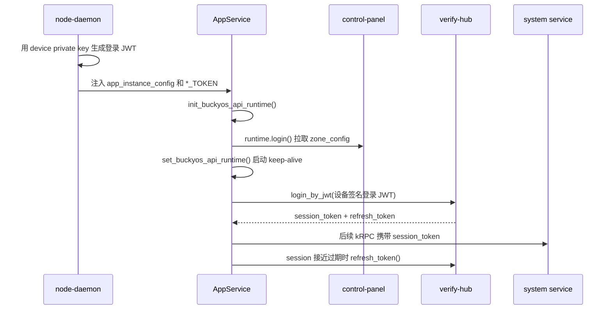

# BuckyOS API Runtime 登录机制

本文从 SDK 使用者视角说明 `BuckyOSRuntime::login()` 到底做了什么、verify-hub 签发的 token 怎么用，以及登录相关错误通常来自哪里。

如果只关心 Web SSO 的页面跳转、cookie 和 `/sso_refresh`，先读 `doc/sdk/SSO.md`。本文关注更底层的 API runtime：Rust service、AppClient、Frame/Kernel service，以及这些进程怎么拿到能调用系统服务的 `session_token`。

## 先记住三件事

1. `init_buckyos_api_runtime()` 只是收集配置，不能把 `user_id` 当成已认证身份。
2. `runtime.login()` 的目标是让 runtime 拥有一个可用的 `session_token`，并拉取 `zone_config`；它不等价于“总是立刻向 verify-hub 发起密码登录”。
3. `session_token` 绑定 `appid` 和主体，`refresh_token` 只用于向 verify-hub 换新 token，两者不能混用。

推荐初始化顺序如下：

```rust
let mut runtime = init_buckyos_api_runtime(
    "my-app",
    Some("alice".to_string()),
    BuckyOSRuntimeType::AppService,
).await?;

runtime.login().await?;
set_buckyos_api_runtime(runtime)?;

let runtime = get_buckyos_api_runtime()?;
let system_config = runtime.get_system_config_client().await?;
```

这三个步骤的语义分别是：

| 步骤 | 做什么 | 还不能做什么 |
| --- | --- | --- |
| `init_buckyos_api_runtime()` | 解析 `app_id`、owner、runtime type，读取环境变量和本地配置 | 不能证明身份，不能依赖全局 runtime |
| `runtime.login()` | 确认或生成初始 `session_token`，连接 control-panel 拉取 `zone_config`；service runtime 还会初始化 RBAC 和 trust keys | 不保证此时已经拿到 verify-hub 签发的长期 token pair |
| `set_buckyos_api_runtime()` | 注册全局 runtime，并启动后台 keep-alive | 只能调用一次 |

后台 keep-alive 每 5 秒检查一次状态，负责三类工作：接近过期时续期 token、上报 service instance info、刷新 service runtime 的 trust keys。也就是说，AppService 启动时常见的设备签名登录 JWT，会在 runtime 注册后由后台逻辑兑换成 verify-hub 签发的 `session_token + refresh_token`。

## Token 模型

当前实现里主要有三种容易混淆的 token。

### 登录 JWT

登录 JWT 是“用已有身份去换 verify-hub token pair”的启动凭证。它通常由本地私钥签发：

- AppClient 可以用用户私钥签发。
- AppService 通常由 node-daemon 在启动服务时用本机 device private key 签发，并通过环境变量注入。
- Kernel/Frame service 可以使用设备身份或启动环境传入的 token。

当前 runtime 对私钥加载有一个重要约束：`login()` 不会隐式读取设备私钥。AppClient 会在 `fill_by_load_config()` 中尝试加载 `user_private_key.pem`；设备私钥只会在组件显式调用 `load_device_private_key()` 后进入 runtime。普通 AppService 不应该自己读取设备私钥，而是使用 node-daemon 注入的登录 JWT。

verify-hub 的 `login_by_jwt` 会验证该 JWT 的签名、过期时间、`sub`、`appid`、`jti`。同一个登录 JWT 只能用一次，当前实现用 `sub + appid + jti` 作为重放检测 key。

### session_token

`session_token` 是业务调用使用的短期 token。verify-hub 签发的 session token 当前有效期是 15 分钟，典型字段包括：

| 字段 | 含义 |
| --- | --- |
| `iss` | 签发者。verify-hub 签发的 token 为 `verify-hub` |
| `sub` | 当前主体，通常是 username 或 user id |
| `appid` | token 绑定的应用 |
| `exp` | 过期时间 |
| `jti` | token id |
| `session` | 当前会话 id，存在 extra claims 里 |
| `sudo` | 是否是 sudo token |

旧文档里有时把它叫 access token。当前代码和 API 字段名统一是 `session_token`。

### refresh_token

`refresh_token` 只用于调用 verify-hub 的 `refresh_token`。它当前有效期是 7 天，`aud` 为 `verify-hub`。每次 refresh 都会返回新的 `session_token + refresh_token`，旧 refresh token 立即失效；如果旧 token 被复用，verify-hub 会按重放风险处理并撤销该 session 的缓存。

业务服务不能把 refresh token 当 session token 用。verify-hub 的 `verify_token` 会拒绝 `aud=verify-hub` 的 refresh token。

## RuntimeType 决定登录材料从哪来

`BuckyOSRuntimeType` 不是权限等级的 UI 概念，而是 SDK 初始化时选择配置来源和 token 来源的开关。

| RuntimeType | 典型进程 | 登录材料来源 | 使用者要注意 |
| --- | --- | --- | --- |
| `AppClient` | buckycli、桌面外部客户端、Deno/TS client | `BUCKYOS_APPCLIENT_SESSION_TOKEN`，或本地 user config + user private key | 客户端通常没有本机 node-gateway，必须能找到 zone host/boot config |
| `AppService` | 用户安装的 app service | `app_instance_config` 解析 app/owner；node-daemon 注入 `<FULL_APPID>_TOKEN` 或 `<APPID>_TOKEN` | 必须有 owner_user_id；不要用 app-service 自己的 token 冒充页面用户 |
| `FrameService` | frame 系统服务 | 设备配置、service env token；可从 `app_instance_config` 补 app/owner | `login()` 后会加载 RBAC 和 trust keys |
| `KernelService` | scheduler、task-manager 等 kernel service | `<APP>_SESSION_TOKEN`、`BUCKYOS_THIS_DEVICE` 等启动环境 | 需要 device config；通常由 node-daemon/boot 流程准备；不会自动读设备私钥 |
| `Kernel` | node-daemon、cyfs-gateway 等基础进程 | 本地设备配置和特殊启动逻辑 | 属于基础系统自举路径；只有明确需要设备签名时才显式加载设备私钥 |

环境变量名由 `get_session_token_env_key()` 生成：非 app service 使用 `*_SESSION_TOKEN`，app service 使用 `*_TOKEN`。`-` 会转为 `_` 并转成大写。

## AppService 的典型启动流程



这里最容易误解的是 `*_TOKEN`：node-daemon 注入的初始 token 只是登录 JWT，不应被长期保存，也不代表最终 verify-hub 会话。SDK 会在后台尽快兑换并轮换。

## AppClient 的典型登录流程

AppClient 面向用户交互程序。它可以有两种方式获得可用 token：

1. 外部直接提供 `BUCKYOS_APPCLIENT_SESSION_TOKEN`，runtime 直接使用。
2. 从本地 `.buckycli` / `.buckyos` 等目录读取 user config 和 user private key，生成本地登录 JWT，再通过 verify-hub 兑换。

TS/Deno 侧常见写法是：

```ts
await buckyos.initBuckyOS(appId, {
  appId,
  ownerUserId: "devtest",
  runtimeType: RuntimeType.AppClient,
  zoneHost: "test.buckyos.io",
  defaultProtocol: "https://",
  privateKeySearchPaths,
  autoRenew: false,
});

const account = await buckyos.login();
```

本地 JWT 签发可能依赖当前时间，客户端示例里有短暂等待以避开 not-before 时间差。实际产品代码应优先使用 SDK 封装，不要手写 JWT。

## 用户密码登录

用户密码登录走 verify-hub 的 `login_by_password`，常见入口是 control-panel 的 `auth.login` 或 Web SSO 登录页。

当前参数包括：

| 参数 | 含义 |
| --- | --- |
| `username` | 登录用户名 |
| `password` | 不是明文密码，而是 SDK 生成的派生值 |
| `appid` | 本次登录绑定的 appid |
| `login_nonce` | 一次性 nonce，通常使用当前毫秒时间 |

前端登录页调用 `buckyos.hashPassword(username, password, nonce)` 后再提交。verify-hub 会用 `UserSettings.password + login_nonce` 计算 SHA-256，并和提交值比较。

因此，直接调用 raw RPC 时不要把明文密码传给 verify-hub；也不要复用 `login_nonce`。同一 `username + appid + login_nonce` 成功后会进入缓存，再次使用会被当成重放。

## Web SSO 与 runtime login 的关系

Web SSO 是面向浏览器页面的封装：

1. 页面跳到 `https://sys.<zone>/login?client_id=<appid>&redirect_url=<url>`。
2. control-panel 调 `login_by_password`。
3. `/sso_callback` 把 refresh token 写入 HttpOnly cookie。
4. 页面调用 `/sso_refresh`，拿到 JS 可读的 `session_token`。
5. 页面后续请求用 `X-Auth`、`Authorization: Bearer`、query 或 kRPC `token` 字段携带 `session_token`。

当前 control-panel 里 refresh cookie 和部分历史 session cookie 使用同一个 cookie 名 `buckyos_session_token`。对接时按语义区分：HttpOnly cookie 里的值用于 `/sso_refresh`，业务请求应使用 `/sso_refresh` 返回体里的短期 `session_token`。

## 服务端怎么验证 token

SDK 使用者通常不直接验签，而是使用 api-runtime 和 service client。理解验证链有助于定位权限问题：

1. 服务端先解析 `session_token`。
2. 根据 JWT header/claims 里的 `kid` 或 `iss` 找 trust key。
3. 验证 EdDSA 签名和 `exp`。
4. 取出 `sub` 和 `appid`。
5. 用 RBAC 判断 `sub + appid` 是否允许访问目标资源和 action。

system-config 的 trust keys 来自 `boot/config` 里的 owner/root key、verify-hub key，以及当前设备 key；运行中也能按 issuer 加载受信用户或设备的公钥。Frame/Kernel service 的 api-runtime 会在 login 后加载 RBAC 和 trust keys，并在后台刷新 trust keys。

对于普通业务服务，推荐只把 verify-hub 签发的 `session_token` 当作外部用户请求凭证。app-service 自己主动发起的后台任务可以使用自身 runtime token，但用户请求链路必须传递页面用户的 token。

## sudo 不是普通登录

`sudo_by_password` 会返回一个短期 sudo `session_token`，当前有效期是 3 分钟，不返回 refresh token。

当前实现中 sudo token 由 verify-hub 签发，并设置 `sudo=true`；旧文档里“用户私钥自签代表 sudo”的说法不再适合作为当前实现依据。最终能否执行敏感操作仍由 RBAC 决定，sudo 只是给授权判断提供一个额外身份，例如默认的 `su_<userid>`。

## 常见错误和根因

### `BuckyOSRuntime is not initialized`

通常是还没调用 `set_buckyos_api_runtime(runtime)`，或者调用顺序错了。正确顺序是 `init -> login -> set -> get`。`init()` 后不要让其它模块调用 `get_buckyos_api_runtime()`。

### `session_token is empty`

runtime 没有从环境变量读到 token，也没有足够的本地私钥材料生成登录 JWT。常见原因：

- AppService 缺少 `app_instance_config` 或 owner_user_id。
- node-daemon 没有注入正确的 `*_TOKEN` 环境变量。
- AppClient 没有 `BUCKYOS_APPCLIENT_SESSION_TOKEN`，也找不到 user private key。
- Kernel/Frame service 缺少 `BUCKYOS_THIS_DEVICE` 或启动环境注入的 `*_SESSION_TOKEN`。
- 组件确实需要用设备私钥重新生成登录 JWT，但没有在初始化阶段显式调用 `load_device_private_key()`。

### `Session token is not valid` 或 `appid mismatch`

token 绑定的 `appid` 和当前 runtime/app 不一致。不要复用其它 app 的 token，也不要用 control-panel 登录 token 调自己的 app service。

在 `app-web-page -> app-service -> system service` 链路里，app-service 必须继续传递页面用户的 token，不能改用 app-service 自己的 token。否则会出现越权风险、审计主体错误，或者 RBAC 因主体不对而拒绝。

### refresh 后旧 token 失效

这是预期行为。refresh token 是轮换的，每次 refresh 成功后都必须保存新的 refresh token。旧 refresh token 再次使用会失败，并可能触发 session 撤销。

浏览器 SSO 场景下由 `/sso_refresh` 负责写回新的 HttpOnly cookie；如果自己调用 verify-hub client，就必须更新本地保存的 refresh token。

### 密码登录偶发 `Invalid nonce` 或重放错误

`login_nonce` 必须接近当前时间，并且一次登录只能使用一次。前端使用 `Date.now()` 并同时设置 kRPC seq。不要缓存登录请求重试，也不要多个并发请求复用同一个 nonce。

### refresh token 被当成业务 token 使用

refresh token 的 `aud` 是 `verify-hub`，只能发给 verify-hub。业务请求必须携带 `session_token`。如果服务端报 `refresh token cannot be used as session token`，就是把两者混用了。

### `kid not found` 或 trust key 验证失败

通常是签发者不在当前 trust keys 中，或者 `boot/config` / user config / device config 尚未同步。service runtime 在 login 后会刷新 trust keys；如果刚修改了身份或 boot config，需要考虑 system-config、scheduler、目标服务之间的传播延迟。

### `login_by_jwt` 第二次失败

同一个登录 JWT 不能重复使用。当前 verify-hub 用 JWT 里的 `jti` 做重放检测；重新登录时要重新生成 JWT 和 `jti`。

### verify-hub 重启后需要重新登录

当前 session/refresh 缓存在 verify-hub 进程内存中。verify-hub 重启后，已有 session token 在离线验签场景下可能还能用到过期，但 refresh token 可能因为缓存丢失而无法续期。客户端应把 refresh 失败视为需要重新登录的正常恢复路径。

## 当前实现和旧文档差异

旧文档可以帮助理解历史设计，但接入时以当前代码为准。几个关键差异：

| 旧文档说法 | 当前实现 |
| --- | --- |
| 通用 `login` 方法，params 里用 `type=password/jwt` | verify-hub client 暴露 `login_by_password`、`login_by_jwt`、`refresh_token`、`logout`、`verify_token` |
| access token / refresh token | 当前 API 字段是 `session_token` / `refresh_token` |
| JWT 有统一 `token_use` 字段 | 当前 `RPCSessionToken` 主要用 `aud=verify-hub` 区分 refresh token，用 `sudo` bool 区分 sudo |
| service bootstrap JWT 包含 `target_service_id`、独立 nonce 等完整目标方案 | 当前 node-daemon 注入的是设备签名登录 JWT，`jti` 用于重放检测 |
| `verify_token` 返回用户/app/exp | 当前 `verify_token` 返回 `bool`，并可选校验 `appid` |
| sudo 是用户私钥自签特权 token | 当前 `sudo_by_password` 返回 verify-hub 签发的短期 sudo token |

## 使用者检查清单

接入一个新的 SDK 调用链时，至少确认这些点：

- 选择了正确的 `BuckyOSRuntimeType`。
- `app_id` 和 owner_user_id 与部署配置一致。
- `init -> login -> set` 顺序没有被打乱。
- 用户请求链路传递的是用户页面的 `session_token`，不是 app-service 自己的 token。
- refresh 成功后保存了新的 refresh token。
- raw 密码登录使用 SDK 的 `hashPassword` 结果和新的 `login_nonce`。
- 出现权限错误时同时检查 token 的 `sub`、`appid`、签发者和 RBAC。

## 参考实现入口

- `src/kernel/buckyos-api/src/runtime.rs`：`BuckyOSRuntime::login()`、后台 keep-alive、token 续期、trust key 刷新。
- `src/kernel/buckyos-api/src/verify_hub_client.rs`：verify-hub RPC client 和请求/响应类型。
- `src/kernel/verify_hub/src/main.rs`：`login_by_jwt`、`login_by_password`、`refresh_token`、`logout`、`sudo_by_password` 的服务端实现。
- `src/frame/control_panel/src/sys_auth_backend.rs`：Web SSO 的 `auth.login`、`/sso_callback`、`/sso_refresh`、`/sso_logout`。
- `src/kernel/node_daemon/src/app_loader.rs`：AppService 启动时注入 `app_instance_config` 和设备签名登录 JWT。
