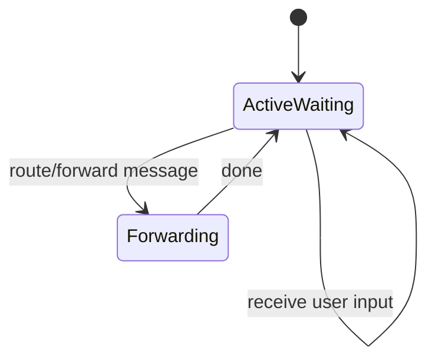
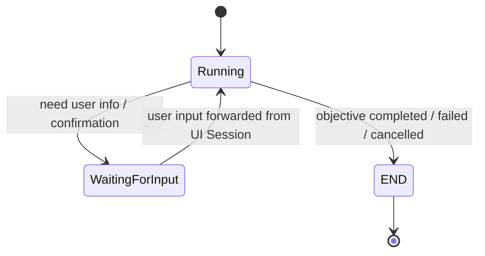
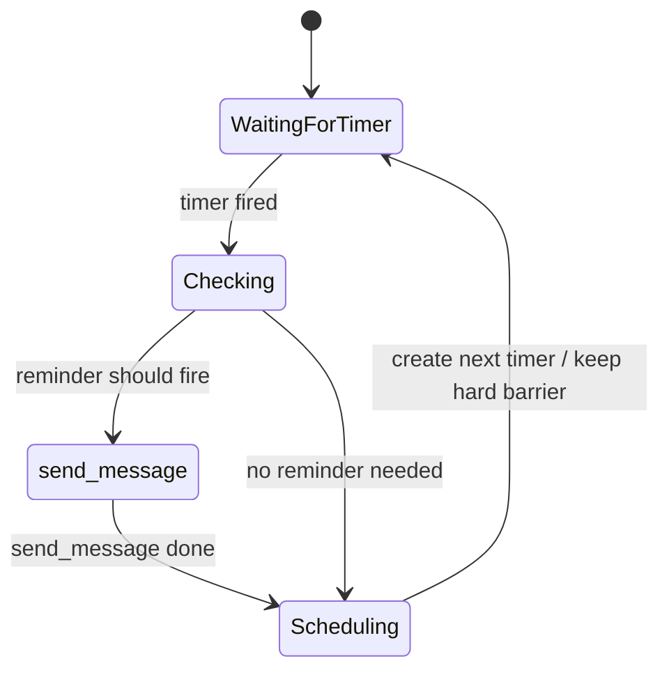
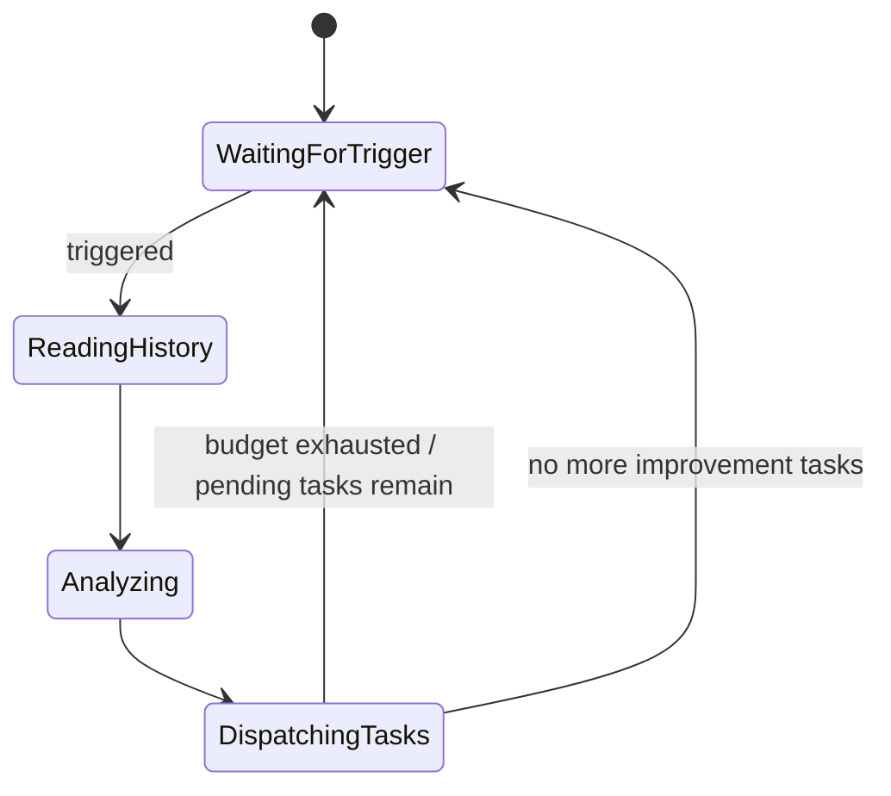

# AgentSession 状态管理补充

## 1. 背景

从动态运行的角度看，`AgentSession` 的差异不只体现在「由谁创建」或「服务什么目标」，更体现在它如何等待事件、消费事件、转移状态，以及何时结束。

当前可以将 Session 理解为四类：

1. **UI Session**：长期存在，持续等待用户输入。
2. **Work Session**：围绕明确 objective 的短期工作会话。
3. **SelfCheck Session**：一种特殊 Work Session，主要由 timer 事件驱动，用于检查提醒等定时任务。
4. **SelfImprove Session**：一种特殊 Work Session，不关心外部输入，只关心 agent 的 global state，并尝试自我改进。

> 其中 SelfCheck 和 SelfImprove 本质上都属于 Work Session 的特化形式，但它们的事件来源、生命周期和状态管理规则不同于普通用户任务型 Work Session。

---

## 2. 核心状态管理视角

AgentSession 的状态管理可以从以下几个问题拆解：

- 它是否长期存在？
- 它是否有明确的 objective？
- 它是否会结束到 `END`？
- 它等待什么事件？
- 它是否消费用户输入？
- 它是否消费 timer 事件？
- 它是否只关心 global state？
- 它是否允许 UI Session 将用户消息 forward 过来？

不同类型 Session 的核心差异如下：

| Session 类型 | 生命周期 | 主要事件来源 | 是否关心用户输入 | 是否关心 timer | 是否有明确 objective | 结束方式 |
| --- | --- | --- | --- | --- | --- | --- |
| UI Session | 长期存在 | 用户输入 | 是 | 通常不是核心 | 通常无单一短期 objective | 原则上不主动 END |
| Work Session | 短期 | 用户输入、系统事件、工具结果 | 是，视状态而定 | 可选 | 是 | objective 完成后 END |
| SelfCheck Session | 长期/周期性触发的特殊 Work Session | timer | 否 | 是 | 是，检查并触发提醒 | 单次检查结束后回到等待 timer |
| SelfImprove Session | 周期性触发的特殊 Work Session | timer 或内部触发 | 否 | 可作为触发源 | 是，改进 agent 状态 | budget 用尽或任务完成后等待下次触发 |

---

## 3. UI Session

### 3.1 定位

UI Session 是用户与 agent 系统交互的入口。它的关键特征是：

- 永远处于可以被激活的状态。
- 永远积极等待新的用户输入。
- 不会在 `wait for input` 这件事上设置额外栅栏。
- 用户消息首先进入 UI Session，再由 UI Session 决定是否 forward 给某个 Work Session。

### 3.2 等待语义

UI Session 的等待不是阻塞式等待，而是开放式等待：

```text
UI Session ≈ always wait for input
```

它不应该因为某个 Work Session 正在运行、等待确认或已经结束，而停止接收用户输入。

### 3.3 与 Work Session 的关系

UI Session 可以承担消息路由职责：

- 当某个 Work Session 显式处于 `WaitForInput` 状态时，UI Session 中的新用户消息可以被 forward 到该 Work Session。
- 当某个 Work Session 尚未到达 `END`，但仍处于工作过程中时，UI Session 中的新用户消息也可能被追加到该 Work Session，例如通过 `forwardMessage`。
- 当 Work Session 已经 `END` 后，默认不再接收新的用户消息，除非系统显式创建新的 Work Session 或重新打开上下文。

### 3.4 状态示意



UI Session 的核心状态可以简化为 `ActiveWaiting`：它始终可接收输入，并在需要时执行消息转发。

---

## 4. 普通 Work Session

### 4.1 定位

普通 Work Session 是面向明确 objective 的短期工作单元。

它通常被设计为：

- 有明确任务目标。
- 围绕 objective 工作。
- 完成后进入 `END`。
- 在需要用户信息或确认时，可以进入 `WaitForInput`。

### 4.2 状态流转

典型状态流转如下：



### 4.3 WaitForInput 语义

Work Session 的 `WaitForInput` 是显式等待用户补充信息或确认。

进入该状态通常意味着：

- 当前 objective 无法继续推进。
- 需要用户提供缺失信息。
- 需要用户确认某个关键决策。
- 用户在 UI Session 中发送的相关消息，应有机会被转发到该 Work Session。

### 4.4 Running 状态下的用户输入

即使 Work Session 不在 `WaitForInput`，只要它还没有到达 `END`，用户在 UI Session 发出的消息也可能与当前 Work Session 有关。

因此可以允许：

```text
UI Session receive message
    -> route decision
    -> forwardMessage to active Work Session
    -> append to Work Session context
```

这种机制用于处理用户在任务执行过程中追加要求、修正约束或打断当前工作。

但这里需要路由策略来避免污染上下文，例如：

- 只 forward 给尚未结束的 Work Session。
- 优先 forward 给处于 `WaitForInput` 的 Work Session。
- 对 Running 中的 Work Session，需要判断消息是否与其 objective 相关。
- 若存在多个候选 Work Session，需要明确优先级或让 UI Session 创建新的 Work Session。

---

## 5. SelfCheck Session

### 5.1 定位

SelfCheck Session 本质上是一种特殊 Work Session，但它不是由用户输入驱动，而主要由 timer 事件驱动。

它的核心用途是执行周期性或精确时间点的自检逻辑，例如提醒任务检查。

### 5.2 事件消费规则

SelfCheck 基本上只消费 timer 事件：

```text
SelfCheck Session consumes timer events only
```

它原则上不关心用户输入，也不依赖 UI Session 的 message forward。

### 5.3 Timer 的两层机制

SelfCheck 的 timer 可以分为两类：

#### 1. 硬栅栏 timer

这是固定频率的兜底检查机制。

例如：

```text
每隔固定时间，一定触发一次 SelfCheck
```

它保证系统不会完全依赖精确 trigger，从而避免提醒任务遗漏。

#### 2. 精确 trigger timer

SelfCheck 在运行过程中，会根据具体提醒任务推断出更精确的触发时间，并创建对应 timer。

例如：

```text
提醒任务 A 的推断触发时间 = 2026-05-24 15:00
=> 创建一个精确 timer trigger
```

当精确 trigger 到达时，SelfCheck 会根据 timer 设置时记录的 reason，重点检查对应事件是否应该触发提醒。

### 5.4 Timer reason

每个精确 timer 应该带有触发理由，即 `reason`。

`reason` 用于说明该 timer 为什么被创建，例如：

```json
{
  "type": "reminder_check",
  "target_id": "reminder_123",
  "expected_trigger_time": "2026-05-24T15:00:00-07:00",
  "created_by": "selfcheck",
  "reason": "check whether reminder_123 should be delivered"
}
```

SelfCheck 被 timer 唤醒后，不应该盲目扫描所有任务，而应该优先根据 `reason` 做定向检查。

### 5.5 主要工作：触发提醒

SelfCheck 的主要工作不是与用户持续对话，而是检查是否有事件需要触发。

如果确认需要提醒，则调用消息能力，例如：

```text
send_message(reminder)
```

也就是说：

```text
timer event
    -> SelfCheck Session activated
    -> check target event based on timer reason
    -> if reminder should fire
        -> call send_message
    -> schedule next timer if needed
    -> return to timer waiting
```

### 5.6 状态示意



---

## 6. SelfImprove Session

### 6.1 定位

SelfImprove Session 也是一种特殊 Work Session，但它与 SelfCheck 不同：

- 它不关心用户输入。
- 它不关心外部事件本身。
- 它只关心 agent 的 global state。
- 它被触发后，会读取 history，尝试发现可改进点，并下达改进任务。

### 6.2 触发与执行

SelfImprove 一旦被触发，会执行类似流程：

```text
trigger
    -> read all history
    -> analyze possible improvements
    -> generate improvement tasks
    -> dispatch improvement tasks
```

这里的 trigger 可以来自 timer，也可以来自内部调度机制。

### 6.3 Budget 限制

SelfImprove 有 budget 限制，因此它不一定能在一次触发中完成所有改进工作。

当 budget 不足时：

- 当前 SelfImprove 运行会暂停或结束。
- 未完成的改进任务保留在系统中。
- 等待下一次触发。
- 下一次触发时，global state 可能已经发生变化，需要重新读取和判断。

因此，SelfImprove 的执行不是单次全量完成模型，而是增量推进模型。

### 6.4 状态示意



### 6.5 与用户输入的关系

SelfImprove 原则上不会被用户输入打断，也不会消费 UI Session forward 过来的用户消息。

它关注的是：

```text
agent.global_state
agent.history
pending_improvement_tasks
available_budget
```

而不是：

```text
latest user message
current UI interaction
external event payload
```

---

## 7. 统一事件分发建议

可以将 AgentSession 的事件分发抽象为如下规则。

### 7.1 UserInput 事件

用户输入首先进入 UI Session。

```text
UserInput -> UI Session
```

然后由 UI Session 判断是否需要 forward：

```text
if target Work Session is WaitingForInput:
    forwardMessage(user_message, target_session)
elif target Work Session is Running and not END:
    if message is relevant to objective:
        forwardMessage(user_message, target_session)
else:
    create new Work Session or keep in UI Session
```

### 7.2 Timer 事件

Timer 事件主要分发给 SelfCheck 或 SelfImprove。

```text
TimerEvent -> SelfCheck Session
TimerEvent -> SelfImprove Session
```

分发时需要依赖 timer metadata：

- `timer_id`
- `created_by`
- `reason`
- `target_id`
- `expected_trigger_time`
- `trigger_type`

### 7.3 GlobalState 事件

GlobalState 的变化主要被 SelfImprove 消费，也可能被 SelfCheck 用于判断提醒条件。

```text
GlobalStateChanged -> SelfImprove candidate trigger
GlobalStateSnapshot -> SelfCheck condition evaluation
```

---

## 8. Session 状态与事件消费矩阵

| 状态 / Session | UI Session | 普通 Work Session | SelfCheck Session | SelfImprove Session |
| --- | --- | --- | --- | --- |
| 接收用户输入 | 总是接收 | 通过 UI forward 接收 | 不接收 | 不接收 |
| WaitForInput | 常态开放等待 | 显式等待用户补充 | 不适用 | 不适用 |
| Running | 路由与协调 | 执行 objective | 检查 timer reason 对应事件 | 读取 history 并生成改进任务 |
| WaitingForTimer | 通常不需要 | 可选 | 核心状态 | 可作为触发等待状态 |
| END | 原则上不主动 END | objective 完成后 END | 单次检查结束，不等于系统结束 | 单次改进结束，等待下次触发 |
| 是否允许 forwardMessage | 作为发送方 | 作为接收方 | 否 | 否 |
| 是否关心 global state | 间接关心 | 视任务而定 | 用于条件判断 | 核心依赖 |

---

## 9. 需要明确的设计点

后续实现时建议补充以下约束，避免状态管理歧义。

### 9.1 forwardMessage 的路由策略

需要明确：

- 一个用户消息最多 forward 给几个 Work Session？
- 多个 Work Session 都处于 `WaitForInput` 时如何选择？
- Running 中的 Work Session 接收追加消息的相关性判断由谁负责？
- 用户打断当前任务时，是 forward 到原 Work Session，还是创建新 Work Session？

### 9.2 Work Session 的 END 语义

需要明确：

- `END` 后是否允许 reopen？
- 如果用户在 END 后追问同一任务，是复用历史创建新 Work Session，还是恢复旧 Session？
- END 后是否仍保留 routing metadata？

### 9.3 SelfCheck 的 timer reason schema

建议标准化 timer reason，至少包含：

```json
{
  "trigger_type": "hard_barrier | precise_trigger",
  "target_type": "reminder | scheduled_task | other",
  "target_id": "string",
  "expected_trigger_time": "datetime",
  "reason": "string"
}
```

### 9.4 SelfImprove 的 budget 与任务续跑

需要明确：

- budget 单位是什么，例如 token、时间、任务数或成本。
- budget 用尽后，未完成任务如何持久化。
- 下一次触发时，是继续旧任务，还是重新基于 global state 规划。
- 如果 global state 已变化，旧 improvement task 是否需要重新验证。

---

## 10. 总结

从状态管理角度看：

- **UI Session** 是长期开放的用户输入入口，始终可以被激活，不在等待输入上设置栅栏。
- **普通 Work Session** 是 objective 驱动的短期任务会话，会工作到 `END`，必要时进入 `WaitForInput` 等待用户补充。
- **SelfCheck Session** 是 timer 驱动的特殊 Work Session，主要负责周期性或精确时间点的检查，并通过 `sync_message` 触发提醒。
- **SelfImprove Session** 是 global state 驱动的特殊 Work Session，不消费外部输入，只读取 history 和 global state，在 budget 限制下增量地产生和下达改进任务。

整体上，AgentSession 的关键不是静态分类，而是事件消费方式和状态转移规则：谁等待什么、谁能被什么激活、谁能接收 forwardMessage、谁会 END，以及谁只依赖 timer 或 global state。
