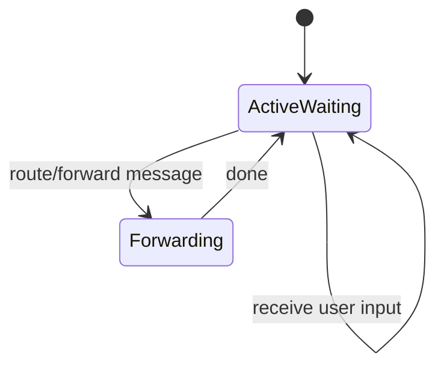
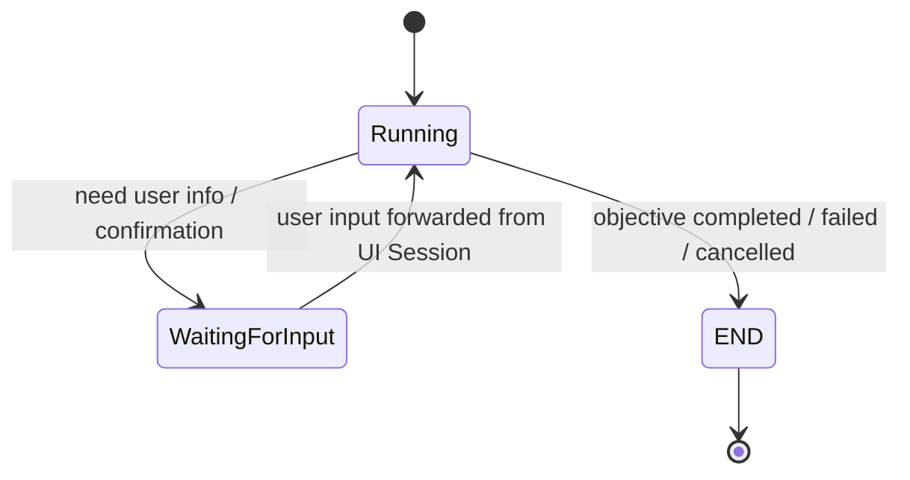
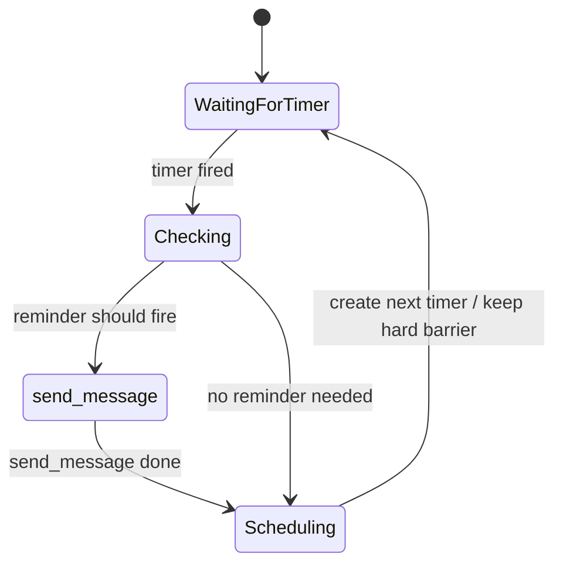
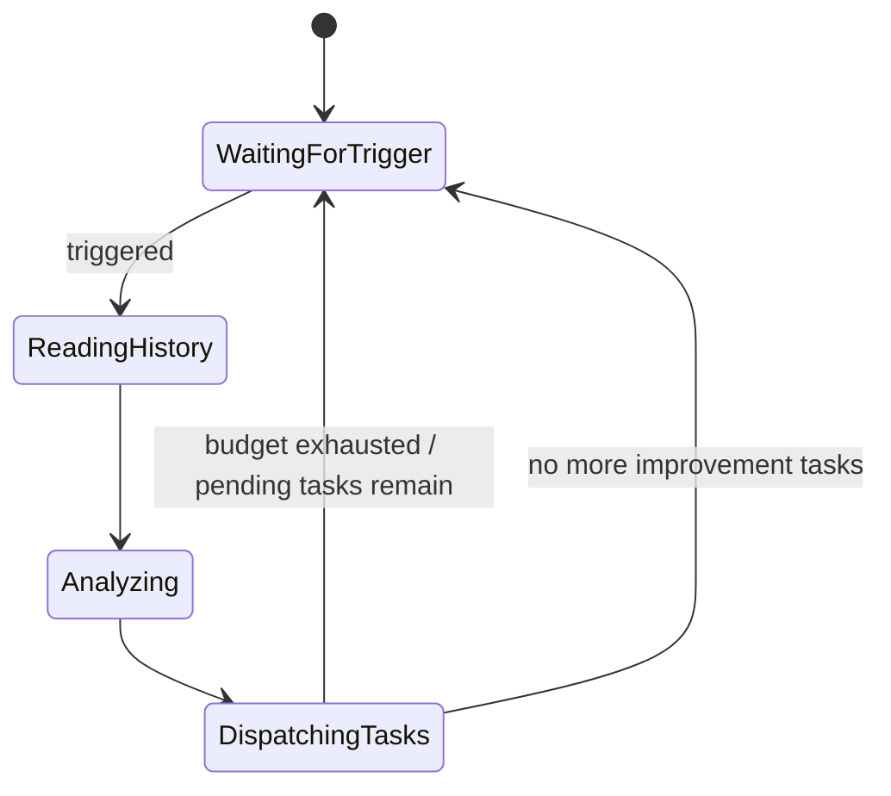

# AgentSession 状态管理补充

## 1. 背景

从动态运行的角度看，`AgentSession` 的差异不只体现在「由谁创建」或「服务什么目标」，更体现在它如何等待事件、消费事件、转移状态，以及何时结束。

当前可以将 Session 理解为四类：

1. **UI Session**：长期存在，持续等待用户输入。
2. **Work Session**：围绕明确 objective 的短期工作会话。
3. **SelfCheck Session**：一种特殊 Work Session，主要由 timer 事件驱动，用于检查提醒等定时任务。
4. **SelfImprove Session**：一种特殊 Work Session，不关心外部输入，只关心 agent 的 global state，并尝试自我改进。

> 其中 SelfCheck 和 SelfImprove 本质上都属于 Work Session 的特化形式，但它们的事件来源、生命周期和状态管理规则不同于普通用户任务型 Work Session。

---

## 2. 核心状态管理视角

AgentSession 的状态管理可以从以下几个问题拆解：

- 它是否长期存在？
- 它是否有明确的 objective？
- 它是否会结束到 `END`？
- 它等待什么事件？
- 它是否消费用户输入？
- 它是否消费 timer 事件？
- 它是否只关心 global state？
- 它是否允许 UI Session 将用户消息 forward 过来？

不同类型 Session 的核心差异如下：

| Session 类型 | 生命周期 | 主要事件来源 | 是否关心用户输入 | 是否关心 timer | 是否有明确 objective | 结束方式 |
| --- | --- | --- | --- | --- | --- | --- |
| UI Session | 长期存在 | 用户输入 | 是 | 通常不是核心 | 通常无单一短期 objective | 原则上不主动 END |
| Work Session | 短期 | 用户输入、系统事件、工具结果 | 是，视状态而定 | 可选 | 是 | objective 完成后 END |
| SelfCheck Session | 长期/周期性触发的特殊 Work Session | timer | 否 | 是 | 是，检查并触发提醒 | 单次检查结束后回到等待 timer |
| SelfImprove Session | 周期性触发的特殊 Work Session | timer 或内部触发 | 否 | 可作为触发源 | 是，改进 agent 状态 | budget 用尽或任务完成后等待下次触发 |

---

## 3. UI Session

### 3.1 定位

UI Session 是用户与 agent 系统交互的入口。它的关键特征是：

- 永远处于可以被激活的状态。
- 永远积极等待新的用户输入。
- 不会在 `wait for input` 这件事上设置额外栅栏。
- 用户消息首先进入 UI Session，再由 UI Session 决定是否 forward 给某个 Work Session。

### 3.2 等待语义

UI Session 的等待不是阻塞式等待，而是开放式等待：

```text
UI Session ≈ always wait for input
```

它不应该因为某个 Work Session 正在运行、等待确认或已经结束，而停止接收用户输入。

### 3.3 与 Work Session 的关系

UI Session 可以承担消息路由职责：

- 当某个 Work Session 显式处于 `WaitForInput` 状态时，UI Session 中的新用户消息可以被 forward 到该 Work Session。
- 当某个 Work Session 尚未到达 `END`，但仍处于工作过程中时，UI Session 中的新用户消息也可能被追加到该 Work Session，例如通过 `forwardMessage`。
- 当 Work Session 已经 `END` 后，默认不再接收新的用户消息，除非系统显式创建新的 Work Session 或重新打开上下文。

### 3.4 状态示意



UI Session 的核心状态可以简化为 `ActiveWaiting`：它始终可接收输入，并在需要时执行消息转发。

---

## 4. 普通 Work Session

### 4.1 定位

普通 Work Session 是面向明确 objective 的短期工作单元。

它通常被设计为：

- 有明确任务目标。
- 围绕 objective 工作。
- 完成后进入 `END`。
- 在需要用户信息或确认时，可以进入 `WaitForInput`。

### 4.2 状态流转

典型状态流转如下：



### 4.3 WaitForInput 语义

Work Session 的 `WaitForInput` 是显式等待用户补充信息或确认。

进入该状态通常意味着：

- 当前 objective 无法继续推进。
- 需要用户提供缺失信息。
- 需要用户确认某个关键决策。
- 用户在 UI Session 中发送的相关消息，应有机会被转发到该 Work Session。

### 4.4 Running 状态下的用户输入

即使 Work Session 不在 `WaitForInput`，只要它还没有到达 `END`，用户在 UI Session 发出的消息也可能与当前 Work Session 有关。

因此可以允许：

```text
UI Session receive message
    -> route decision
    -> forwardMessage to active Work Session
    -> append to Work Session context
```

这种机制用于处理用户在任务执行过程中追加要求、修正约束或打断当前工作。

但这里需要路由策略来避免污染上下文，例如：

- 只 forward 给尚未结束的 Work Session。
- 优先 forward 给处于 `WaitForInput` 的 Work Session。
- 对 Running 中的 Work Session，需要判断消息是否与其 objective 相关。
- 若存在多个候选 Work Session，需要明确优先级或让 UI Session 创建新的 Work Session。

---

## 5. SelfCheck Session

### 5.1 定位

SelfCheck Session 本质上是一种特殊 Work Session，但它不是由用户输入驱动，而主要由 timer 事件驱动。

它的核心用途是执行周期性或精确时间点的自检逻辑，例如提醒任务检查。

### 5.2 事件消费规则

SelfCheck 基本上只消费 timer 事件：

```text
SelfCheck Session consumes timer events only
```

它原则上不关心用户输入，也不依赖 UI Session 的 message forward。

### 5.3 Timer 的两层机制

SelfCheck 的 timer 可以分为两类：

#### 1. 硬栅栏 timer

这是固定频率的兜底检查机制。

例如：

```text
每隔固定时间，一定触发一次 SelfCheck
```

它保证系统不会完全依赖精确 trigger，从而避免提醒任务遗漏。

#### 2. 精确 trigger timer

SelfCheck 在运行过程中，会根据具体提醒任务推断出更精确的触发时间，并创建对应 timer。

例如：

```text
提醒任务 A 的推断触发时间 = 2026-05-24 15:00
=> 创建一个精确 timer trigger
```

当精确 trigger 到达时，SelfCheck 会根据 timer 设置时记录的 reason，重点检查对应事件是否应该触发提醒。

### 5.4 Timer reason

每个精确 timer 应该带有触发理由，即 `reason`。

`reason` 用于说明该 timer 为什么被创建，例如：

```json
{
  "type": "reminder_check",
  "target_id": "reminder_123",
  "expected_trigger_time": "2026-05-24T15:00:00-07:00",
  "created_by": "selfcheck",
  "reason": "check whether reminder_123 should be delivered"
}
```

SelfCheck 被 timer 唤醒后，不应该盲目扫描所有任务，而应该优先根据 `reason` 做定向检查。

### 5.5 主要工作：触发提醒

SelfCheck 的主要工作不是与用户持续对话，而是检查是否有事件需要触发。

如果确认需要提醒，则调用消息能力，例如：

```text
send_message(reminder)
```

也就是说：

```text
timer event
    -> SelfCheck Session activated
    -> check target event based on timer reason
    -> if reminder should fire
        -> call send_message
    -> schedule next timer if needed
    -> return to timer waiting
```

### 5.6 状态示意



---

## 6. SelfImprove Session

### 6.1 定位

SelfImprove Session 也是一种特殊 Work Session，但它与 SelfCheck 不同：

- 它不关心用户输入。
- 它不关心外部事件本身。
- 它只关心 agent 的 global state。
- 它被触发后，会读取 history，尝试发现可改进点，并下达改进任务。

### 6.2 触发与执行

SelfImprove 一旦被触发，会执行类似流程：

```text
trigger
    -> read all history
    -> analyze possible improvements
    -> generate improvement tasks
    -> dispatch improvement tasks
```

这里的 trigger 可以来自 timer，也可以来自内部调度机制。

### 6.3 Budget 限制

SelfImprove 有 budget 限制，因此它不一定能在一次触发中完成所有改进工作。

当 budget 不足时：

- 当前 SelfImprove 运行会暂停或结束。
- 未完成的改进任务保留在系统中。
- 等待下一次触发。
- 下一次触发时，global state 可能已经发生变化，需要重新读取和判断。

因此，SelfImprove 的执行不是单次全量完成模型，而是增量推进模型。

### 6.4 状态示意



### 6.5 与用户输入的关系

SelfImprove 原则上不会被用户输入打断，也不会消费 UI Session forward 过来的用户消息。

它关注的是：

```text
agent.global_state
agent.history
pending_improvement_tasks
available_budget
```

而不是：

```text
latest user message
current UI interaction
external event payload
```

---

## 7. 统一事件分发建议

可以将 AgentSession 的事件分发抽象为如下规则。

### 7.1 UserInput 事件

用户输入首先进入 UI Session。

```text
UserInput -> UI Session
```

然后由 UI Session 判断是否需要 forward：

```text
if target Work Session is WaitingForInput:
    forwardMessage(user_message, target_session)
elif target Work Session is Running and not END:
    if message is relevant to objective:
        forwardMessage(user_message, target_session)
else:
    create new Work Session or keep in UI Session
```

### 7.2 Timer 事件

Timer 事件主要分发给 SelfCheck 或 SelfImprove。

```text
TimerEvent -> SelfCheck Session
TimerEvent -> SelfImprove Session
```

分发时需要依赖 timer metadata：

- `timer_id`
- `created_by`
- `reason`
- `target_id`
- `expected_trigger_time`
- `trigger_type`

### 7.3 GlobalState 事件

GlobalState 的变化主要被 SelfImprove 消费，也可能被 SelfCheck 用于判断提醒条件。

```text
GlobalStateChanged -> SelfImprove candidate trigger
GlobalStateSnapshot -> SelfCheck condition evaluation
```

---

## 8. Session 唤醒：Agent Main Loop 主导

### 8.1 现状与问题

现有实现中，`session.worker` 持续在跑，消息和事件的分发逻辑嵌在 session loop 内部。这意味着：

- Session 必须**常驻内存**（即使长期无事件）
- Session 状态与运行结构紧耦合（worker 不存在 = session 接不到事件）
- Agent 启动 = spin up 所有 session worker，启动成本随 session 数量线性增长

### 8.2 新架构：Agent.main_loop 是唯一 pump

由 Agent.main_loop 统一拉取并路由 message 和 event，session.worker 按需从磁盘加载启动。

```python
# 只有 agent main loop 有真正的 pump
def agent.main_loop():
    # message pump
    msg = self.pull_msg()
    target_session_id = route_msg(msg)
    # 从磁盘恢复（仅在需要时启动 worker）
    target_session = self.ensure_session(target_session_id)
    # 只是放入 session 的 pending；如果是 read-only 可以拒绝
    push_ok = target_session.push_msg(msg)

    # event pump
    event = self.pull_events()
    target_session_ids = route_event(event.eventid)
    for sid in target_session_ids:
        target_session = self.ensure_session(sid)
        # session 内部根据自己的订阅逻辑，决定是触发推理还是更新 background_env
        # event 是 notify 机制；main_loop 是尽力通知，不关心后续
        target_session.notify_event(event)
```

关键变化：

1. **Agent.main_loop 是事件/消息的唯一 pump**，负责拉取 + 路由
2. **Dispatch 包含两步**：route → `ensure_session`（按需从磁盘加载并启动 worker）
3. **session.worker 是 transient**：处理完一批工作可休眠/退出，释放内存
4. **Session 状态唯一真相源 = 磁盘**，worker 只是 ephemeral 的状态机 + 缓存

### 8.3 关键 invariant

- **Session 状态完全持久化在磁盘**：worker 启停不丢任何状态
- **worker 是 ephemeral**：启停不影响 session 的逻辑生命周期
- **dispatch 只 push 不假设 worker 存在**：push msg = 写 pending queue + 唤醒 worker；不是 forward 给某个 running coroutine

### 8.4 ensure_session 的并发与生命周期

- **并发**：多个 event 同时分发给同一 `session_id` → per-session 锁，序列化处理
- **退出时机**（候选策略）：
  - 处理完当前 batch 即退出（最省内存，但每次唤醒有冷启动成本）
  - 空闲超时退出（兼顾热路径 + 长尾节省）
  - 显式 shutdown（如 session 走到 END）
- **`keep_alive` 字段在新架构下的语义**：
  - `keep_alive = true` → worker 处理完不退出，持续在内存中等待下一轮
  - `keep_alive = false` → 一 batch 处理完即退出，下次有 event 到达再 ensure_session 重新加载

### 8.5 跟 §7 事件分发的关系

§7 描述的"事件分发到 session"在新架构下精确化为：

1. `agent.main_loop` 拉取 event/msg
2. `route_*` 决定目标 `session_id`
3. `ensure_session` 把 session 从磁盘恢复到内存（如未在内存）
4. `push_msg` / `notify_event` 到 session pending queue
5. session.worker 醒来按 Driver 配置消费（见 §11）

§7 的所有 forward 规则继续适用，只是触发载体从"running session worker"变成"dispatcher + on-demand worker"。

### 8.6 跟 §11 Driver 配置的解耦

§11 描述的 Driver 配置（hook point × filter × pull policy）讨论的是"worker 在跑时怎么消费 pending queue"。Worker 启停是本章（§8）的事，**Driver 行为不受影响**——它依然是 session 在跑时的内部状态机。

两层正交：

- **§8 决定 worker 什么时候在跑**
- **§11 决定 worker 跑起来后怎么消费**

整体形成一个完整的"事件 → 推理"链路。

---

## 9. Session 状态与事件消费矩阵

| 状态 / Session | UI Session | 普通 Work Session | SelfCheck Session | SelfImprove Session |
| --- | --- | --- | --- | --- |
| 接收用户输入 | 总是接收 | 通过 UI forward 接收 | 不接收 | 不接收 |
| WaitForInput | 常态开放等待 | 显式等待用户补充 | 不适用 | 不适用 |
| Running | 路由与协调 | 执行 objective | 检查 timer reason 对应事件 | 读取 history 并生成改进任务 |
| WaitingForTimer | 通常不需要 | 可选 | 核心状态 | 可作为触发等待状态 |
| END | 原则上不主动 END | objective 完成后 END | 单次检查结束，不等于系统结束 | 单次改进结束，等待下次触发 |
| 是否允许 forwardMessage | 作为发送方 | 作为接收方 | 否 | 否 |
| 是否关心 global state | 间接关心 | 视任务而定 | 用于条件判断 | 核心依赖 |

---

## 10. 需要明确的设计点

后续实现时建议补充以下约束，避免状态管理歧义。

### 9.1 forwardMessage 的路由策略

需要明确：

- 一个用户消息最多 forward 给几个 Work Session？
- 多个 Work Session 都处于 `WaitForInput` 时如何选择？
- Running 中的 Work Session 接收追加消息的相关性判断由谁负责？
- 用户打断当前任务时，是 forward 到原 Work Session，还是创建新 Work Session？

### 9.2 Work Session 的 END 语义

需要明确：

- `END` 后是否允许 reopen？
- 如果用户在 END 后追问同一任务，是复用历史创建新 Work Session，还是恢复旧 Session？
- END 后是否仍保留 routing metadata？

### 9.3 SelfCheck 的 timer reason schema

建议标准化 timer reason，至少包含：

```json
{
  "trigger_type": "hard_barrier | precise_trigger",
  "target_type": "reminder | scheduled_task | other",
  "target_id": "string",
  "expected_trigger_time": "datetime",
  "reason": "string"
}
```

### 9.4 SelfImprove 的 budget 与任务续跑

需要明确：

- budget 单位是什么，例如 token、时间、任务数或成本。
- budget 用尽后，未完成任务如何持久化。
- 下一次触发时，是继续旧任务，还是重新基于 global state 规划。
- 如果 global state 已变化，旧 improvement task 是否需要重新验证。

---

## 11. Driver 配置：把 Session 类型差异显式化

### 11.1 核心观察

前面 §3-6 描述的 4 类 Session 本质是同一个 Session 抽象的不同 specialization。它们的差异（等待什么、消费什么、何时触发推理、何时 END）可以**统一抽象成一组 driver 配置**——把"哪些事件能成为推理驱动力"作为 session 的一等配置项。

agent.toml 已经在分散字段里做这件事：

| 现有字段 | driver 性质 |
| --- | --- |
| `subscribe_events` | 输入 filter，决定什么进 pending queue |
| `inject_background_environment` | 半订阅 event 是否进 user message |
| `switch_mode` | behavior 切换的驱动策略 |
| `report_delivery` | sub-behavior 报告投递时机 |
| `keep_alive` | END 后是否被新输入唤醒 |

把这些零散字段统一进一个 `[session.<kind>.driver]` 块，是自然终态。

### 11.2 Driver 的核心抽象：Hook Point × Filter × Pull Policy

当前 work session 已经具备 4 个 hook point，每个 hook 上挂极少几个 enum 配置：

命名上用 `on_wakeup` 表示“session 从 idle / waiting 状态被 pending input 唤醒后触发”。早期实现和配置里叫 `on_wait`，迁移时应保留为 deprecated alias。

```text
on_init

on_behavior_step_ob

on_behavior_switch
    filter = "top"
    pull_msg = "all"
    pull_event = "all"

on_wakeup
    filter = "top"
    pull_msg = "all"
```

每个 hook point 是 llm_context **物理状态机**上"有机会渲染 user_message 并启动新一轮推理"的窗口。Hook point 数量有物理上限，不会膨胀——这是相对"开放 fire 表达式"的根本简化。

| Hook Point | 触发时机 |
| --- | --- |
| `on_init` | session 启动时一次性触发，渲染初始 system prompt |
| `on_behavior_switch` | 每次 behavior switch / fork / 独立切换时触发，渲染新 behavior 的入口 user_message |
| `on_behavior_step_ob` | Behavior Loop 内每个 step 边界（观察阶段）触发 |
| `on_wakeup` | session 处于 idle 状态、新 pending input 到达时触发 |

每个 hook point 上挂三个 enum 配置：

| 配置 | 含义 | 取值集合 |
| --- | --- | --- |
| `filter` | 哪些 behavior 启用本 hook | `top` / `default_only` / `all` / `none` / `<behavior_name>` |
| `pull_msg` | 从 pending message queue 拉取的策略 | `none` / `one` / `all` |
| `pull_event` | 从 pending event queue 拉取的策略 | `none` / `<filter_name>` / `all` |

`filter` 前 4 个是固定 enum，`<behavior_name>` 是闭集合标识符（startup 时对照 session 的 behavior 列表 validate）——整体仍属"受限标识符 + 枚举"，不是开放表达式。

**Session.worker 运行逻辑（伪代码）**：

```python
def session.worker():
    # 在推理的间隙，根据当前 hook point 配置从 pending queue pull
    # 示例：on_behavior_switch
    pull_msg_policy   = get_current_pull_msg_policy()
    pull_msgs         = self.pull_msgs(pull_msg_policy)
    pull_event_policy = get_current_pull_event_policy()
    pull_events       = self.pull_events(pull_event_policy)

    llm_context_env = self.prepare_context_env(pull_msgs, pull_events)
    user_msg = render_prompt(self.current_behavior.on_switch, llm_context_env)

    new_llm_context = create_llm_context(current_llm_context)
    new_llm_context.append_user_msg(user_msg)
    new_llm_context.drive_to_end()
    # ↑ 进入此调用 = pull 拿到的 input 立即 commit pop（见 §11.5）
```

`llm_context_env` 的 schema 是**固定的**（framework-level 决策），不是 per-config declared：

| Key | 来源 |
| --- | --- |
| `msgs` | `pull_msgs` 结果 |
| `events` | `pull_events` 结果 |
| `bg_events` | 半订阅 event 当前快照（不消费） |
| `session_state` | session 状态机当前状态 |
| `last_step` | step observation 阶段的 last_step_result（仅 Behavior Loop） |
| `behavior_history` | StepRecord history（仅 Behavior Loop） |

模板从这个固定 env 自由读，按需引用。**没有 binding name 契约，没有 binding usage 校验**——env schema 是框架级 invariant，不是每个 driver/behavior 单独声明。

### 11.3 为什么驱动力必须在 Session 层而不是 Behavior 层

1. **同一 behavior 在不同 session 下驱动力不同**：`chat_route` 在 UI session 是 `per_peer`，在 group session 是 `per_group`。绑死在 behavior 上无法跨 session 复用。
2. **同一 session 多个 behavior 通常共享驱动策略**：每个 behavior 重复声明是 DRY 违反。
3. **Behavior 配置只剩纯渲染**：心智模型干净，可独立测试。

### 11.4 Driver / Behavior 契约：固定 env schema + 模板幂等

Driver 和 Behavior 在新架构下的契约非常薄：

1. **Driver 负责**：按 hook point 配置 pull + 构造 `llm_context_env`
2. **Behavior 模板负责**：从 `llm_context_env` 读取所需字段，渲染 user_message
3. **`llm_context_env` schema 固定**（由框架定义），不是 per-behavior declared

没有 binding name 校验、没有 binding usage tracking、没有"必须引用某 binding"的硬契约——因为模板**自由读取**固定 schema 即可，未读取的字段直接忽略。

> **模板引擎必须是幂等的**：同一个 `llm_context_env` 渲染 N 次结果必须完全一致。**模板不幂等就是 bug**，没有例外。

直接代价：

- 模板不能产生副作用
- 模板不能依赖随机 / 时间 / 外部状态
- 时间 / 半订阅事件快照 / pending tool result 等所有外部状态由 Driver 在构造 env 时 freeze 进去

### 11.5 关键 invariant：进入推理 = commit pop

> **一旦 render 成功且 user_msg 喂给 `llm_context.drive_to_end()`，本次 pull 拿到的 input 立即从 pending queue 消失**。  
> Commit pop 不依赖推理成功 / 失败，不依赖 tool 调用结果，不依赖 drive_to_end 返回值。

直接推论：

- **推理失败 → input 丢失**，by design，框架**不**自动重放
- **Crash recovery 不允许自动重新触发未完成的推理**——上次崩在哪一步无法精确还原，重放等于把 tool 调用风险翻倍
- **重试只能由上层显式做**——用户重发消息 / scheduler 重新 push event；**永远不能是框架隐式重放**

为什么不选 peek + 后置 commit（推理完成后再消费）：

| 风险 | 代价 | 可恢复性 |
| --- | --- | --- |
| Input 丢失（推理挂了 msg 没了） | 中 | ✅ 用户/scheduler 可重新 push |
| Tool 调用副作用重复（rollback 后 msg 回 queue → 下次推理重新触发同一 tool） | **灾难** | ❌ 账户扣两次 / 邮件发两次 / 文件改两次——不可逆 |

推理过程中的 tool 调用**本身就不幂等**，重放比丢消息危险得多。早 commit pop 是用"可恢复的小风险"换"不可恢复的大风险"——这是有意识的设计抉择。

### 11.6 取值集合

`pull_msg`：

| 取值 | 语义 |
| --- | --- |
| `none` | 本 hook 不消费 message |
| `one` | 取队列头部一条 |
| `all` | 取队列中所有 message |

`pull_event`：

| 取值 | 语义 |
| --- | --- |
| `none` | 本 hook 不消费 event |
| `<filter_name>` | 取队列中匹配该 filter 的 event（如 `ban_lifted` / `timer.reminder_check` 等命名空间）|
| `all` | 取队列所有 event |

`filter`：

| 取值 | 语义 |
| --- | --- |
| `top` | 只在顶层 behavior 启用 |
| `default_only` | 只在 default behavior 启用 |
| `all` | 所有 behavior 启用 |
| `none` | 全禁用 |
| `<behavior_name>` | 在指定 behavior 启用（startup 时校验名字存在） |

每加一个 pull policy enum，对模板的语法要求增加一项（字段访问 / 数组迭代 / 计数 / 边界判断 / ...）。这条耦合决定了 pull policy 必须 enum 化、可枚举、可契约校验——不能走开放表达式 / 脚本路线。

### 11.7 四类 Session 在 Hook Point 视角下的配置

把 §3-6 的 session 差异翻译成具体 hook point 配置：

| Session 类型 | on_init | on_behavior_switch | on_behavior_step_ob | on_wakeup |
| --- | --- | --- | --- | --- |
| UI Session | 标准初始化 | `filter=top, pull_msg=all` | — | `filter=top, pull_msg=all` |
| 普通 Work Session | 标准初始化 | `filter=top, pull_msg=all, pull_event=ban_lifted` | `filter=top, pull_msg=all` | — |
| SelfCheck Session | timer-aware 初始化 | `filter=top, pull_event=timer.*` | — | — |
| SelfImprove Session | global-state 初始化 | `filter=top, pull_msg=none, pull_event=none` | — | — |

观察：

- **SelfImprove 全程 `pull_msg=none / pull_event=none`**——它"不消费外部输入"的具体表达。history 和 global_state 通过 env 自动注入（不在 pull 范畴内）。
- **SelfCheck 的事件路由**（按 `timer.reason` 区分提醒类型）通过 `pull_event` 的 filter 名称命名空间参数化——具体 filter 集合属于 schema 设计点（见 §11.8）。
- **UI Session 的 on_wakeup 是核心**——它常态在 idle + 监听 pending input；on_behavior_switch 在 UI 内基本对应路由判断。
- **普通 Work Session 的 on_behavior_step_ob 是 Behavior Loop 独有**——step 边界拉新 message 是允许在 step 中段感知用户追加输入的关键。

### 11.8 §10 设计点 = Hook Point 配置取值集合的设计题

§10 列出的四个待明确点，本质都是 hook point 配置的**取值集合设计**：

| §10 待明确点 | Hook Point 视角 |
| --- | --- |
| forwardMessage 路由策略 | dispatch 层 driver（见 §8 Session 唤醒），不是 session 内 driver |
| Work Session END 语义 | `keep_alive` + "END 状态下 on_wakeup 是否触发"开关 |
| SelfCheck timer reason schema | `pull_event` 的 filter 名称命名空间设计（`timer.reminder_check` / `timer.hard_barrier` / ...） |
| SelfImprove budget 与续跑 | `on_init` 阶段对 `pending_improvement_tasks` 的读取规则 + budget 状态机 |

§10 的设计点都在向"完整 hook point 配置取值集合"逼近。一旦 hook point + filter + pull policy 的取值集合定义清楚，§10 的歧义会自动收敛。

---

## 12. 总结

从状态管理角度看：

- **UI Session** 是长期开放的用户输入入口，始终可以被激活，不在等待输入上设置栅栏。
- **普通 Work Session** 是 objective 驱动的短期任务会话，会工作到 `END`，必要时进入 `WaitForInput` 等待用户补充。
- **SelfCheck Session** 是 timer 驱动的特殊 Work Session，主要负责周期性或精确时间点的检查，并通过 `sync_message` 触发提醒。
- **SelfImprove Session** 是 global state 驱动的特殊 Work Session，不消费外部输入，只读取 history 和 global state，在 budget 限制下增量地产生和下达改进任务。

整体上，AgentSession 的关键不是静态分类，而是事件消费方式和状态转移规则：谁等待什么、谁能被什么激活、谁能接收 forwardMessage、谁会 END，以及谁只依赖 timer 或 global state。

这些差异最终通过两层正交架构统一表达：

- **§8 Session 唤醒**：Agent.main_loop 是唯一的 event/msg pump；session.worker 按需从磁盘加载启动，session 状态唯一真相源 = 磁盘
- **§11 Driver 配置**：hook point × filter × pull policy，决定 worker 跑起来后如何消费 pending queue

两层职责清晰分离：**唤醒**决定 worker 何时在跑、**Driver** 决定 worker 跑起来后如何消费。**Session 类型的差异 = (worker 生命周期策略) × (driver 配置)**——这是 AgentSession 设计的核心 invariant。

---

## 13. 实现映射（Phase 3 - Phase 5）

### 13.1 SelfCheck Session

- §5.3 hard barrier timer / precise trigger timer：
  - `src/frame/opendan/src/agent.rs`
    - `AIAgent::ensure_self_check_hard_barrier_timer`
    - `AIAgent::schedule_precise_timer`
  - `src/frame/opendan/src/session_model.rs`
    - `TimerReason`
    - `TimerTriggerType`
    - `TimerTargetType`
    - `TimerEventKind`
- §5.4 TimerReason schema：
  - `src/frame/opendan/src/session_model.rs::TimerReason`
  - 测试：`session_model::tests::timer_reason_round_trips_fixed_schema`
- §5.5 reminder trigger path：
  - `src/frame/opendan/src/agent_session.rs`
    - `AgentSession::dispatch_behavior_send_messages`
    - `AgentSession::post_send_message_record`
  - 行为模板：`src/rootfs/bin/buckyos_jarvis/behaviors/self_check.toml`
- §11.6 timer pull_event filter 命名空间：
  - `src/frame/opendan/src/session_model.rs::TimerEventKind`
  - `src/frame/opendan/src/agent_config.rs::validate_driver_filters`
- §11.7 SelfCheck driver 默认配置：
  - `src/frame/opendan/src/agent_config.rs::default_self_check_driver`
  - 模板：`src/rootfs/bin/buckyos_jarvis/agent.toml [session.self_check]`

### 13.2 SelfImprove Session

- §6.3 budget 状态机：
  - `src/frame/opendan/src/session_model.rs`
    - `ImprovementBudget`
    - `ImprovementBudgetUnit`
    - `ImprovementTask`
    - `ImprovementTaskStatus`
    - `SessionMeta.improvement_budget`
    - `SessionMeta.pending_improvement_tasks`
  - `src/frame/opendan/src/agent_session.rs`
    - `AgentSession::mark_improvement_budget_exhausted`
- §11.4 / §11.7 history + global_state 注入：
  - `src/frame/opendan/src/prompt_env.rs::LlmContextEnv`
  - `src/frame/opendan/src/agent.rs::AIAgent::snapshot_global_state`
  - `src/frame/opendan/src/agent_session.rs::AgentSession::apply_hook`
- §6.3 改进任务 dispatch：
  - `src/frame/opendan/src/agent_session.rs::dispatch_self_improvement_tasks`
  - 最小落地：写 `improvement_tasks.jsonl`，并同步更新 `SessionMeta.pending_improvement_tasks`
  - 行为模板：`src/rootfs/bin/buckyos_jarvis/behaviors/self_improve.toml`
- §11.7 SelfImprove driver 默认配置：
  - `src/frame/opendan/src/agent_config.rs::default_self_improve_driver`
  - 模板：`src/rootfs/bin/buckyos_jarvis/agent.toml [session.self_improve]`

### 13.3 收尾与回归

- 旧字段 deprecation warning：
  - `src/frame/opendan/src/agent_config.rs::warn_deprecated_session_keys`
  - 覆盖字段：`subscribe_events` / `inject_background_environment` / `switch_mode` / `report_delivery`
- `/timer/wake` 测试迁移到新 TimerReason schema：
  - `src/frame/opendan/src/agent_session_test.rs`
    - `format_event_for_turn_includes_id_and_data`
    - `session_meta_round_trips_pending_inputs`
- Driver 配置与 baseline 组合测试：
  - `src/frame/opendan/src/agent_config.rs`
    - `defaults_when_no_toml`
    - `driver_hook_point_round_trips`
    - `rejects_unknown_timer_driver_filter`
    - `jarvis_work_session_uses_fork_switch_mode`
- 运行验证：
  - `cargo test -p opendan`
