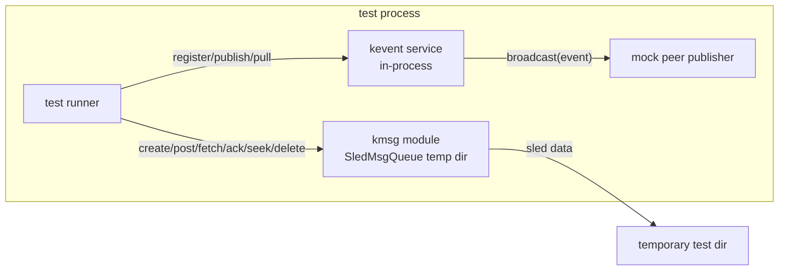
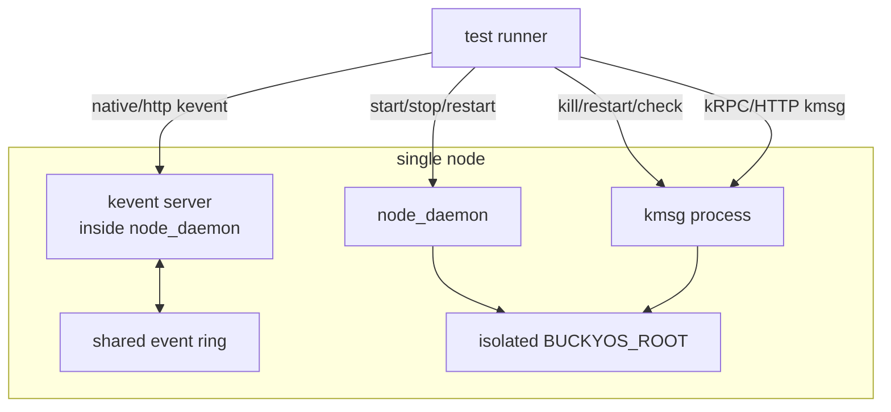
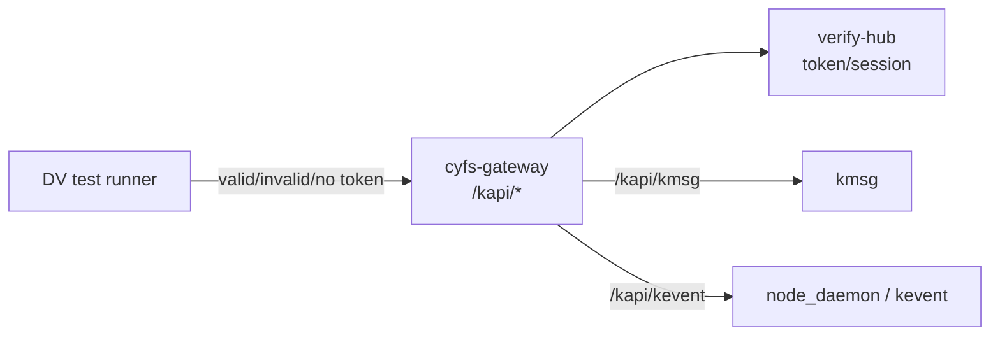
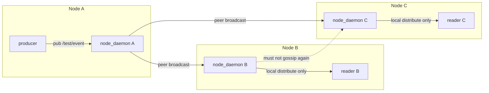
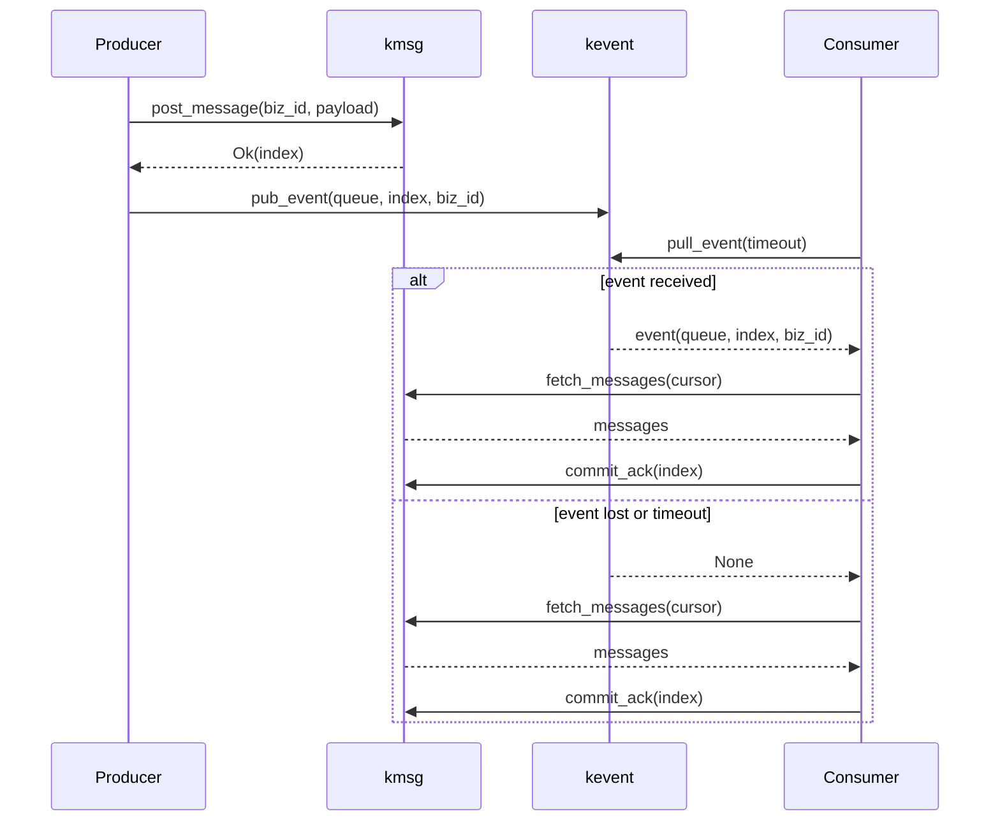

# kevent-kmsg 测试计划

## 1. 测试目标

本测试计划只验证当前 kevent/kmsg 设计边界是否清楚、实现行为是否可回归、组合使用是否不会丢业务数据。

核心结论需要被测试固定下来：

- `kevent` 是 best-effort 通知通道，只负责加速，不保证送达、不持久化、不回放。
- `kmsg` 是可靠消息通道，`post_message` 返回成功后的消息必须可恢复消费。
- 业务组合模式必须是：`kevent` 触发快路径，`kmsg` 或业务权威源负责 timeout 兜底。
- 协议错误、鉴权错误、异常输入不能导致 panic、500 或不可重复运行的测试残留。

本计划避免把所有风险都做成第一阶段验收。压力、网络故障和性能阈值先做基线报告，不作为第一版硬门槛。

## 2. 测试分层和通过标准

| 层级 | 定位 | 是否进入硬验收 | 通过标准 |
|---|---|---|---|
| P0 | 核心语义和数据安全 | 是 | 任一失败都说明 kevent/kmsg 基础语义不可靠 |
| P1 | 协议边界、生命周期、负向输入 | 是 | 不 panic、不 500、状态一致、错误明确 |
| P2 | 压力、故障注入、多节点扰动 | 否，先基线 | 输出结构化报告；不得出现数据损坏或服务崩溃 |

本文中的自动化分为两类：

- 完全自动化：只依赖单测、in-process mock、临时目录或本地 test harness，CI 可以直接跑。
- 依赖环境自动化：仍然可以自动化，但需要先补齐外部能力，例如 DV 环境、gateway token、服务启停脚本、网络故障注入、CPU/IO/内存采样或代理层超时注入。它不是“无法自动化”。

统一判定规则：

- `kevent` 用例允许事件丢失，除非该用例明确验证基础可达路径。
- `kmsg` 用例中，凡是 `post_message` 返回 `Ok(index)` 的消息，最终必须可读。
- 组合用例中，`kevent` timeout 或丢失只能影响延迟，不能导致 `missing_messages > 0`。
- 服务不可用期间返回失败的请求不能计入成功发布数。
- 重试用例允许重复消息，但消费者必须能按业务 id 幂等处理。
- 负向协议、鉴权、未知 method、异常 body 必须返回明确错误；非预期 5xx、panic、进程退出都算失败。
- 每个自动化用例必须使用唯一 queue/sub/reader/event 前缀，并在结束时清理资源；残留资源算测试失败。

## 3. 必要测试拓扑图

这些拓扑图用于指导测试实现。每个测试用例应尽量绑定到其中一种拓扑，避免为单个用例临时发明复杂流程。

### 3.1 in-process 单模块拓扑

适用用例：

- P0 kevent 基础 pub/sub、pattern 不匹配、timeout、reader queue 满。
- P0 kmsg 基础队列、ack、seek、delete。
- P1 大部分 kevent/kmsg 参数边界和 cursor 边界。



通过标准重点：

- 不依赖真实 `$BUCKYOS_ROOT`。
- 不启动真实服务进程。
- 这里的 kmsg 是模块内的 `SledMsgQueue` 实现，不是独立 `kmsg` 进程。
- 测试结束后临时目录和 reader/sub/queue 都清理干净。

### 3.2 单节点真实进程拓扑

适用用例：

- node_daemon 重启不回放。
- kmsg 不可用、kmsg 真实重启恢复。
- HTTP stream 断开和 keepalive。
- 真实服务链路下的 kevent 快路径与 kmsg 兜底。



通过标准重点：

- `node_daemon` 重启后不回放旧 kevent。
- `kmsg` 成功写入的消息在重启后仍可 fetch。
- 停止 kmsg 时 post 必须失败，不能计入成功数。

### 3.3 gateway / DV 链路拓扑

适用用例：

- gateway 链路。
- 无 token / 无效 token。
- malformed body / unknown method 的对外验收。



通过标准重点：

- 测试不能绕过 gateway 直打服务端口。
- 无 token / 无效 token 不能静默成功。
- 认证、路由、协议错误都不能变成非预期 500。

### 3.4 多节点 kevent 广播拓扑

适用用例：

- 跨节点 kevent。
- peer 部分失败。
- peer event 不二次广播。
- 网络延迟/丢包 P2 基线。



通过标准重点：

- A 发布后，B/C 是否收到取决于 peer 链路和订阅匹配。
- B 收到 peer event 后只本地分发，不继续 gossip 给 C。
- 部分 peer 失败时，本地分发和成功 peer 不回滚，发布方能观察到错误。

### 3.5 kevent + kmsg 消息流转

适用用例：

- kevent 快路径。
- kevent 丢失兜底。
- post 响应丢失重试。
- 慢消费者和高频组合基线。



通过标准重点：

- event 只作为拉取提示，真实业务数据来自 kmsg。
- `kevent` 丢失只影响延迟，不能造成 `missing_messages > 0`。
- 生产方重试可能产生重复消息，消费者必须按 `biz_id` 幂等。

## 4. P0 核心语义测试

### 4.1 kevent 基础通知语义

| 用例 | 目的 | 流程 | 通过标准 | 自动化 | 需要补齐的自动化能力 |
|---|---|---|---|---|---|
| 基础 pub/sub | 证明匹配订阅的基础路径可用 | 创建 reader 订阅 `/test/p0/basic/**`，发布匹配 event，执行 `pull_event(timeout)` | 在 timeout 内收到 1 条 event，eventid 和 data 与发布内容一致 | 完全自动化 | 无 |
| pattern 不匹配 | 证明无匹配不是错误 | reader 订阅 `/test/p0/a/**`，发布 `/test/p0/b/1`，执行 `pull_event(timeout)` | 返回 `None`，调用方不报错，reader 后续仍可继续使用 | 完全自动化 | 无 |
| timeout 兜底 | 证明 `pull_event(timeout)` 的 `None` 是正常控制流 | 不发布 event，consumer 执行 `pull_event(timeout)` 后再执行一次权威源 fetch | `pull_event` 返回 `None`；兜底 fetch 被执行；整个流程 result 为 pass | 完全自动化 | 需要提供可脚本调用的权威源 fetch mock 或 kmsg fetch helper |
| reader queue 满 | 证明 kevent 可覆盖旧事件 | 使用小容量 reader，连续发布超过容量的 event，再拉取 | 不 panic；拉到的事件数量不超过容量；保留最新事件；测试明确断言丢旧保新语义 | 完全自动化 | 无 |
| node_daemon 重启不回放 | 证明 kevent 不持久化 | 发布 event 后重启或重建 daemon/reader，再尝试 pull 旧 event | 旧 event 不回放；consumer 必须通过 kmsg/权威源兜底 | 依赖环境自动化 | 需要脚本化启动/停止 node_daemon 的测试夹具；若只跑 in-process daemon 可完全自动化 |

### 4.2 kmsg 可靠消息语义

| 用例 | 目的 | 流程 | 通过标准 | 自动化 | 需要补齐的自动化能力 |
|---|---|---|---|---|---|
| 基础队列 | 证明 create/post/subscribe/fetch 可用 | 创建 queue，post 3 条消息，Earliest 订阅后 fetch | 返回 3 条消息；index 单调递增；payload/header 原样恢复 | 完全自动化 | 无 |
| 成功写入可恢复 | 证明 `Ok(index)` 是可靠边界 | post 返回 `Ok(index)` 后重建 `SledMsgQueue` 或重启 kmsg，再 fetch | 返回该 index 对应消息；payload/header 不变 | 完全自动化 | in-process 重建可完全自动化；真实进程重启需要 kmsg 启停脚本 |
| 手动 ack | 证明 at-least-once 语义 | fetch(auto_commit=false) 后不 ack 再 fetch；随后 ack 已处理 index 再 fetch | 未 ack 时重复返回；ack 后不再返回已 ack 消息 | 完全自动化 | 无 |
| auto_commit | 证明 at-most-once 风险可见 | fetch(auto_commit=true) 后模拟处理失败，再次 fetch | 同一消息不再返回；测试文档标明该模式只适合可接受 at-most-once 的场景 | 完全自动化 | 无 |
| seek | 证明 cursor 可控 | 分别 seek Earliest、Latest、At(index) 后 fetch | 返回位置与 seek 语义一致，不读取不应读取的旧消息 | 完全自动化 | 无 |
| delete_message_before | 证明截断不破坏读取 | 写入多条消息，删除某 index 前的消息，再从不同 cursor fetch | 已删除消息不可读；未删除消息可读；stats 的 first/last/count/size 正确 | 完全自动化 | 无 |
| delete_queue | 证明删除清理完整 | 创建 queue、消息和多个 sub 后 delete_queue，再访问 queue/message/sub | 全部返回明确 not found；重复删除返回明确错误；无测试残留 | 完全自动化 | 无 |

### 4.3 kevent + kmsg 组合语义

| 用例 | 目的 | 流程 | 通过标准 | 自动化 | 需要补齐的自动化能力 |
|---|---|---|---|---|---|
| kevent 快路径 | 证明 event 只触发拉取，不承载真实数据 | post kmsg 后发布 event，event data 只包含 queue/cursor/task id，consumer 收到 event 后 fetch kmsg | consumer 能拉到完整 kmsg 消息；event payload 不作为权威数据 | 完全自动化 | in-process client 可完全自动化；真实服务链路需要单节点启动脚本 |
| kevent 丢失兜底 | 证明 event 丢失不丢业务数据 | 只 post kmsg，不发布 kevent，consumer 等待 kevent timeout 后 fetch | `missing_messages = 0`；timeout 只增加延迟 | 完全自动化 | 无 |
| kmsg 不可用 | 证明可靠通道失败不能伪装成功 | 停止 kmsg 后执行 post | 返回错误；生产方不计入 `posted_kmsg_ok`；恢复后重试成功的消息可消费 | 依赖环境自动化 | 需要可脚本控制的 kmsg 进程启停；in-process 可用 mock handler 替代 |
| post 响应丢失重试 | 证明消费者需要幂等 | 模拟 post 已写入但客户端超时，生产方用同一业务 id 重试 | 允许出现重复 kmsg；消费者按业务 id 去重；最终业务处理次数为 1 | 依赖环境自动化 | 需要可注入“服务端已写入但客户端超时”的 RPC/proxy fault；否则只能用 fake client 单测 |

### 4.4 当前工程真实场景补充

这部分只覆盖当前代码里已经明确使用 kevent/kmsg 语义的路径，不扩展成泛化业务测试。

| 用例 | 目的 | 流程 | 通过标准 | 自动化 | 需要补齐的自动化能力 |
|---|---|---|---|---|---|
| task_manager root fanout | 验证当前 task 事件发布模型 | 更新子 task，订阅 `/task_mgr/{root_id}` | 能收到 descendant task event；event payload 包含 `task_id/root_id/change_kind`；root task 不重复 fanout | 依赖环境自动化 | 需要 task_manager 测试夹具或可脚本调用的 task RPC |
| workflow timeout sweep | 验证 workflow 不依赖 kevent 必达 | watch run 后只更新 task data，不发送 kevent 或丢弃 kevent，等待 sweep | workflow 仍从 task_manager 权威源发现 `human_action`；状态只推进一次，重复 sweep 幂等 | 依赖环境自动化 | 需要 workflow + task_manager 集成测试夹具；in-process 可用 mock TaskManagerClient |
| workflow data_omitted 回拉 | 验证 event 只做提示，大数据回读权威源 | task data 超过 inline 阈值，task_manager event 只带 `data_omitted=true` 和 `task_id` | workflow 按 `task_id` 回拉完整 task data；不因 event payload 缺 data 静默丢 human_action | 依赖环境自动化 | 需要 task_manager mock/client 能返回完整 task data |
| wait_for_task_end 订阅 race | 验证等待任务结束不依赖事件时序 | task 在订阅前已 terminal，再调用 `wait_for_task_end_kevent` | 第一次 `get_task` 直接返回 terminal；不等待 kevent | 完全自动化 | 可用 mock runtime / mock task client 时完全自动化 |
| device_info kevent | 验证 node_daemon 当前设备信息通知 | node_daemon 更新 device_info 后发布 `/devices/{name}/info` | eventid 与 device name 一致；payload 是 device_info；发布失败只记录 warn，不影响 system_config 更新 | 依赖环境自动化 | 需要 node_daemon 或 kevent service 测试夹具 |

## 5. P1 协议边界和负向测试

### 5.1 kevent API / 生命周期

| 用例 | 目的 | 流程 | 通过标准 | 自动化 | 需要补齐的自动化能力 |
|---|---|---|---|---|---|
| 空 reader_id / 空 patterns | 防止非法注册破坏服务 | native/HTTP 注册空 reader_id 或空 patterns | 返回 `INVALID_PATTERN` 或等价参数错误；服务不 panic | 完全自动化 | 无 |
| daemon 注册本地 pattern | 固定 daemon 只接受全局 pattern | `register_reader("r1", ["local_event"])` | 返回 `INVALID_PATTERN`；不创建 reader | 完全自动化 | 无 |
| 非法 eventid / pattern | 固定路径校验行为 | 覆盖空字符串、`/`、超长路径、非法字符、非法通配符 | 返回明确错误码；服务继续可用 | 完全自动化 | 无 |
| 重复注册 reader_id | 固定重注册语义 | 注册 `/a/**`，积压一条匹配消息，再用同 reader_id 注册 `/b/**` | 已排队的 `/a/**` 消息仍可拉取；重注册后 `/a/**` 不再匹配，`/b/**` 开始匹配 | 完全自动化 | 无 |
| update_reader 移除最后 pattern | 防止 reader 进入无 pattern 状态 | 对 reader 移除最后一个 pattern | 返回错误；旧 pattern 仍可用；已排队 event 不丢 | 完全自动化 | 无 |
| unknown reader | 固定不存在 reader 行为 | 对不存在 reader 执行 pull/update/unregister | pull 返回 `None`；unregister 幂等成功或明确 not found；update 返回 `READER_CLOSED` | 完全自动化 | 无 |
| HTTP stream 断开 | 防止服务端 reader 泄漏 | 建立 stream 后断开客户端，再发布匹配 event | 服务端 reader 被清理；后续不继续积压；资源检查通过 | 依赖环境自动化 | 需要 HTTP stream 测试 client 和可查询/间接断言 reader 清理的接口或日志 |
| keepalive 边界 | 防止 busy loop | `keepalive_ms` 省略、0、很小、很大分别建 stream | 返回 ack/keepalive；0 被规范化；CPU 不出现明显 busy loop | 依赖环境自动化 | 功能可自动化；CPU busy loop 需要进程 CPU 采样工具或测试 runner 指标采集 |
| native frame 异常 | 固定传输层错误处理 | 发送 0 长度、超大 frame、非法 JSON frame | 连接关闭或返回协议错误；不影响新连接和后续请求 | 完全自动化 | 需要 native TCP 测试 client |
| peer 部分失败 | 固定部分广播失败语义 | 多 peer 中一个返回错误，另一个成功 | 本地 reader 已收到；成功 peer 已收到；发布方收到错误；不回滚已成功投递 | 完全自动化 | 用 mock peer publisher 可完全自动化；真实多节点需要 peer 编排 |
| source/ingress | 防止二次扩散和来源混乱 | HTTP publish、external publish、peer publish 分别检查字段 | HTTP 来源由服务端填充；peer event 只本地分发不二次广播；native 来源字段行为被断言固定 | 依赖环境自动化 | in-process 可自动化；HTTP/native/peer 全链路需要对应 client 和多节点或 mock peer |

### 5.2 kmsg 数据和 cursor 边界

| 用例 | 目的 | 流程 | 通过标准 | 自动化 | 需要补齐的自动化能力 |
|---|---|---|---|---|---|
| create_queue 重复 | 防止覆盖已有队列 | 同 appid/owner/name 重复创建 | 第二次返回 AlreadyExists 或明确错误；原队列消息和配置不被覆盖 | 完全自动化 | 无 |
| queue name 边界 | 固定 URN 生成和解析 | 使用 None、普通 name、包含 `/` 的 name、超长 name | 成功场景 URN 可解析且可 post/fetch；非法场景返回参数错误 | 完全自动化 | 无 |
| duplicate sub_id | 防止覆盖 cursor | 同一 sub_id 重复 subscribe | 第二次返回明确错误；原 cursor 不变 | 完全自动化 | 无 |
| length=0 | 防止空 fetch 推进 cursor | 已有消息时 fetch/read length=0，auto_commit true/false 各一次 | 返回空数组；任何 cursor 都不推进 | 完全自动化 | 无 |
| ack 小于 cursor | 防止 cursor 回退 | cursor 已推进后 ack 更小 index | 不 panic；cursor 不回退；后续 fetch 不重新读已 ack 消息 | 完全自动化 | 无 |
| ack 大于 last_index | 固定跳读风险边界 | ack 远大于 last_index 后继续 post/fetch | 不 panic；行为必须明确。若允许跳读，测试应断言跳读并标记为设计风险 | 完全自动化 | 无 |
| ack u64::MAX | 防止溢出和回绕 | 对 sub 执行 `commit_ack(u64::MAX)` | 不 panic；cursor 不回绕到 0；后续状态可解释。当前实现不满足时应作为 bug | 完全自动化 | 无 |
| seek 截断区间 | 固定已删除 index 行为 | delete_message_before 后 seek Earliest / At(已删除 index) / At(未来 index) | 不读已删除消息；Earliest 指向新 first；未来 index 不读旧消息 | 完全自动化 | 无 |
| 并发 post | 证明 index 分配一致 | 多 producer 并发 post 同一 queue | index 唯一、单调、无重复；成功返回的消息全部可读 | 完全自动化 | 无 |
| 同一 sub 并发 fetch/ack | 防止并发破坏存储 | 两个 consumer 共用 sub_id 并发 fetch/ack | 不 panic；不破坏 sled 数据；最终 cursor 单调不回退 | 完全自动化 | 无 |
| payload/header 边界 | 固定序列化行为 | 空 payload、大 payload、复杂 headers、非 UTF-8 bytes payload | 合法 payload 原样恢复；headers 原样恢复；超限 payload 返回明确错误且服务继续可用 | 完全自动化 | 需要先明确 payload 上限；未定义上限时只能自动化合法 payload 和资源报告 |
| sync_write | 固定落盘语义 | sync_write=false/true 分别 post 后立即重启进程 | true 成功返回的消息必须可恢复；false 的实际风险写入报告，不作为硬失败 | 依赖环境自动化 | in-process 重建可自动化；真实 crash/restart 需要进程启停和数据目录控制 |

### 5.3 DV / gateway / 安全链路

| 用例 | 目的 | 流程 | 通过标准 | 自动化 | 需要补齐的自动化能力 |
|---|---|---|---|---|---|
| gateway 链路 | 验证最终对外链路 | DV Test 通过 gateway 调 `/kapi/kmsg`、`/kapi/kevent` | 不直打服务端口；身份、路由、权限链路都被覆盖 | 依赖环境自动化 | 需要已启动并激活的 DV 环境、可用 gateway 地址、测试账号/token 获取脚本 |
| 无 token / 无效 token | 防止静默放行 | kmsg 核心接口、kevent publish/stream 分别无 token 和无效 token 访问 | 返回认证或权限错误；不返回 500；不静默成功 | 依赖环境自动化 | 需要 gateway/DV 环境和一组有效/无效 token 构造方式 |
| unknown method | 固定 RPC 错误 | 调用不存在 method 或错误 HTTP method | 返回 UnknownMethod/BadRequest 或等价错误；服务不崩溃 | 完全自动化 | 直连服务可完全自动化；gateway 验收需要 DV 环境 |
| malformed body | 固定请求体错误处理 | 空 body、非法 JSON、字段类型错误、缺必填字段 | 返回参数错误；服务不崩溃；后续正常请求可成功 | 完全自动化 | 直连服务可完全自动化；gateway 验收需要 DV 环境 |
| 数据隔离和清理 | 保证测试可重复 | 每个用例使用唯一前缀，结束后清理 queue/sub/reader | 重复运行不受残留影响；`leftover_test_resources = 0` | 完全自动化 | 如果缺少 reader/queue 列表或清理接口，需要提供测试专用前缀清理脚本 |

## 6. P2 基线和故障注入测试

P2 测试用于建立趋势和容量认知，不在第一阶段设硬性能门槛。P2 失败条件只保留三类：服务崩溃、存储损坏、kmsg 成功写入消息最终不可读。

| 用例 | 目的 | 流程 | 报告指标 | 通过标准 | 自动化 | 需要补齐的自动化能力 |
|---|---|---|---|---|---|---|
| 高频 kevent | 建立 reader fanout 基线 | N 个 reader，M 个 event，不同 pattern 宽度 | pub 延迟、p95/p99、丢弃数、CPU、内存 | 服务不崩溃；丢弃数可解释 | 依赖环境自动化 | 流程可自动化；CPU/内存需要 runner 指标采集或系统监控接口 |
| 高频 kmsg | 建立可靠通道吞吐基线 | 多 producer post，多 consumer fetch/ack | post 成功数、fetch 完整性、p95/p99、IO | 所有 `Ok(index)` 最终可读 | 依赖环境自动化 | 流程可自动化；IO 指标需要系统监控接口或测试 runner 支持 |
| 慢消费者 | 验证堆积行为 | consumer sleep，producer 高频写入 event/message | kevent 覆盖数、kmsg 追平时间、队列大小 | kevent 可丢；kmsg 不丢成功写入消息 | 完全自动化 | 无 |
| 大 payload | 观察资源边界 | 递增 payload 大小写入 kmsg，递增 event data 大小发布 kevent | 成功/失败边界、内存、延迟、错误码 | 失败必须有明确错误；服务不崩溃 | 依赖环境自动化 | 流程可自动化；需要先给出 payload 尺寸档位和资源采样方式 |
| 大 batch fetch | 观察 fetch length 边界 | fetch length 从小到大递增 | 返回条数、返回 bytes、内存峰值、耗时 | 服务不崩溃；cursor 不异常推进 | 依赖环境自动化 | 流程可自动化；内存峰值需要系统监控接口 |
| CPU 高负载 | 观察退化行为 | CPU burner 下跑 P0 组合流程 | timeout 数、延迟、最终消费数 | `missing_messages = 0` | 依赖环境自动化 | 需要跨平台 CPU burner 或 runner 提供负载注入能力 |
| 网络延迟/丢包 | 观察多节点退化 | 多节点注入 latency、jitter、loss | event 延迟、timeout 数、重试数、重复消息数 | kevent 可丢；kmsg 成功写入消息最终可读 | 依赖环境自动化 | 需要多节点 DV/VM/container 编排和网络故障注入工具 |
| 节点/服务重启 | 观察故障恢复 | 发布过程中重启 node_daemon 或 kmsg | 成功数、失败数、恢复耗时、重复数 | node_daemon 重启不回放 kevent；kmsg 成功返回消息可恢复 | 依赖环境自动化 | 需要可脚本控制的服务启停、数据目录隔离和日志采集 |

## 7. 推荐推进顺序

1. 先补 P0 单模块测试：kevent timeout/queue full，kmsg post/fetch/ack/seek/delete。
2. 再补 P0 组合测试：kevent 快路径、kevent 丢失兜底、kmsg 不可用、post 响应丢失重试。
3. 补 P1 负向协议测试：非法 id/pattern、unknown reader、length=0、重复 queue/sub、ack 边界、malformed body。
4. 建立单节点自动化脚本，覆盖真实服务、HTTP stream 清理、kmsg 重启恢复。
5. 建立 DV gateway 验收，只走 `/kapi/kmsg` 和 `/kapi/kevent` 对外链路。
6. 最后增加 P2 基线报告，先记录趋势，再决定哪些指标需要进入 CI 门槛。

自动化推进时需要优先补齐的协助能力：

- 服务编排：脚本化启动、停止、重启 node_daemon 和 kmsg，并能隔离测试数据目录。
- gateway 凭据：DV 环境地址、有效 token 获取方式、无效 token 构造方式。
- 故障注入：RPC 超时/响应丢失注入、CPU burner、网络 latency/jitter/loss 注入。
- 观测接口：CPU、内存、IO、reader/queue/sub 残留资源检查或日志采集。
- 测试清理：按唯一前缀清理 queue/sub/reader/event 测试资源的脚本。

## 8. 自动化报告格式

每个自动化用例至少输出以下字段，便于 CI 和人工复盘：

```json
{
  "scenario": "kevent_loss_kmsg_fallback",
  "priority": "P0",
  "environment": "single_node",
  "purpose": "kevent lost must not lose kmsg data",
  "published_events": 0,
  "received_events": 0,
  "posted_kmsg_ok": 1000,
  "consumed_messages": 1000,
  "timeouts": 1,
  "duplicates": 0,
  "missing_messages": 0,
  "unexpected_5xx": 0,
  "panic_or_crash": false,
  "leftover_test_resources": 0,
  "result": "pass"
}
```

P2 场景可以额外输出 `p95_event_latency_ms`、`p99_event_latency_ms`、`p95_kmsg_fetch_latency_ms`、`cpu_percent`、`memory_mb`、`io_bytes` 等指标，但第一阶段不使用固定性能阈值判失败。

## 9. 最终验收标准

- P0 全部通过。
- P1 中协议、输入异常、鉴权、资源清理相关用例全部通过。
- `kevent` 的 best-effort 语义被明确验证：可丢、可超时、可覆盖、重启不回放。
- `kmsg` 的可靠语义被明确验证：成功写入后可恢复，cursor/ack/seek/delete 行为正确。
- 组合使用时，`kevent` 故障只影响延迟，不造成业务数据永久丢失。
- P2 至少产出一次基线报告，且没有服务崩溃、存储损坏或 kmsg 成功写入后不可读。
